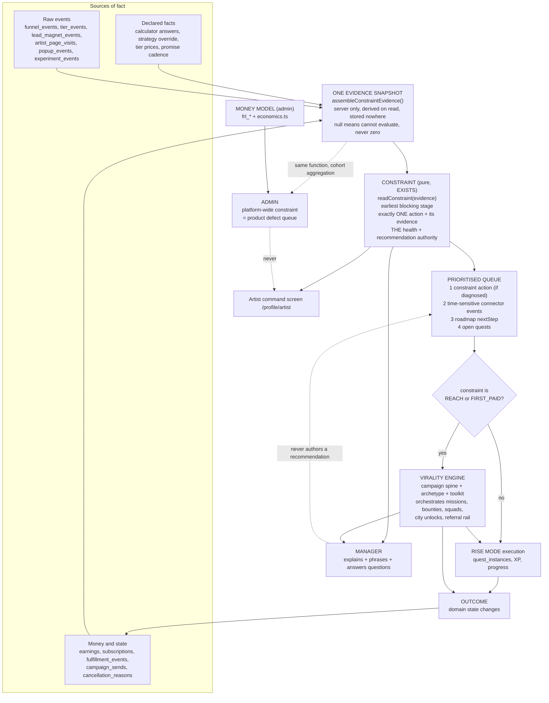
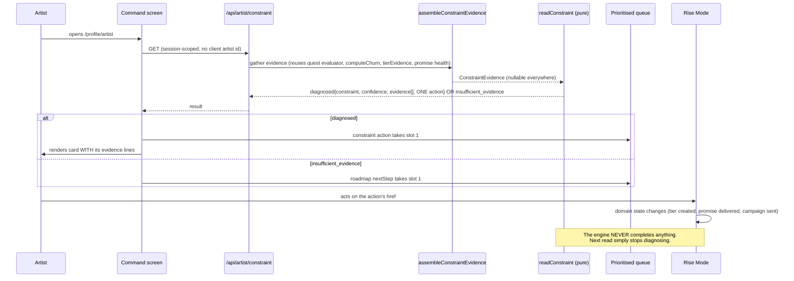
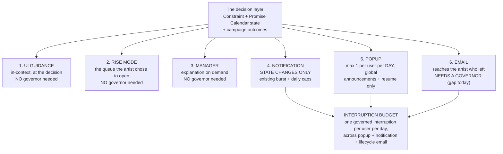
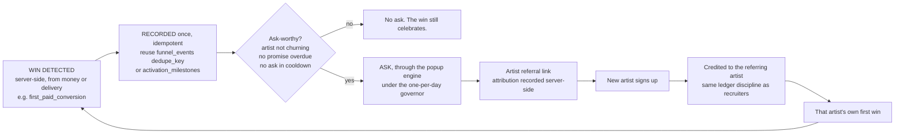
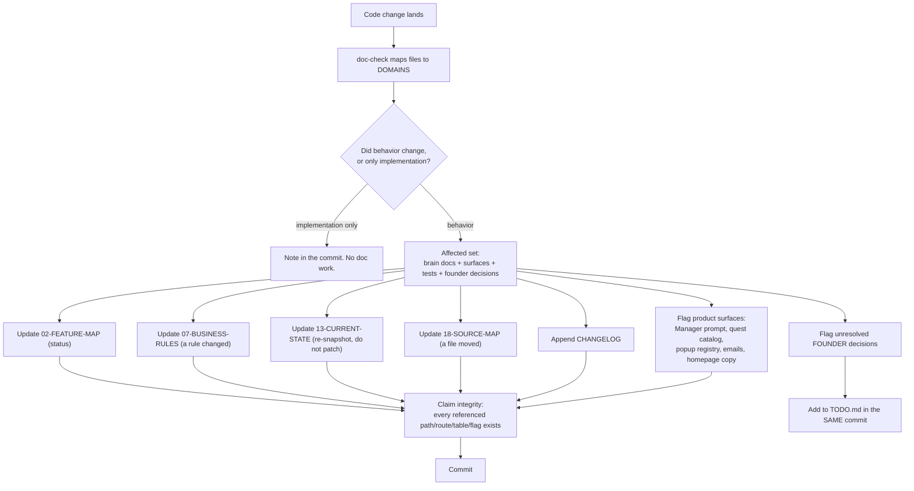
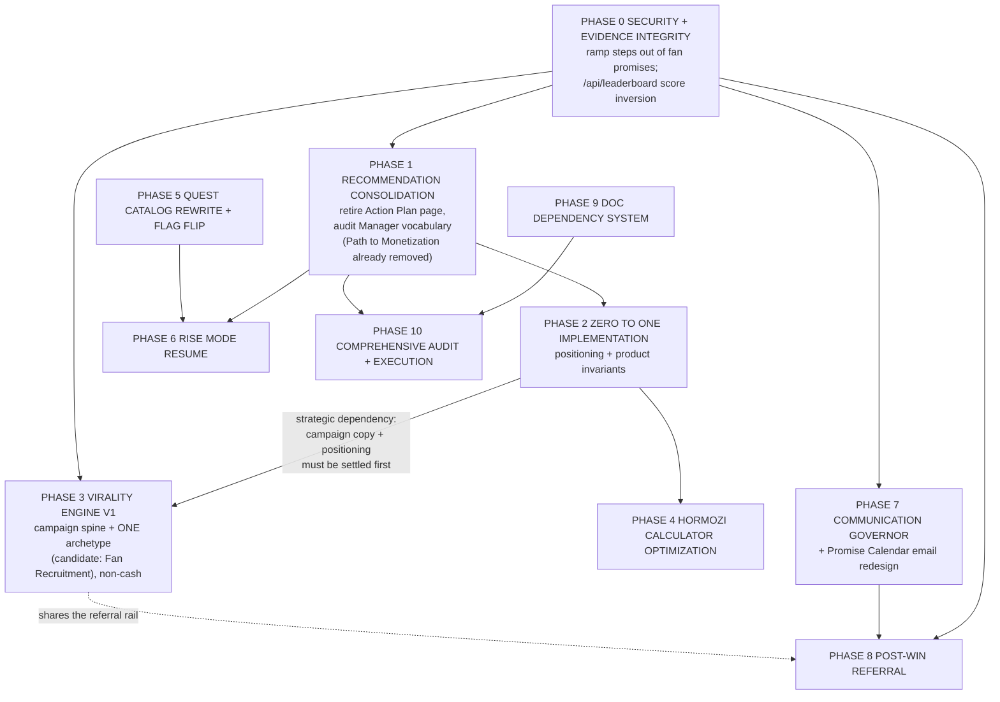

# CRWN Unified Product Intelligence and Growth Architecture Plan

Investigation date: 2026-08-10. Branch `claude/rise-mode-full-journey`.
**Implementation source of truth: the repository.** Where a doc and the code disagree, the code
wins and the disagreement is named.

**This document is a plan. No production code, migration, schema, UI, test, email, config or
business logic was changed.**

> ### RECONCILED 2026-08-10: "Vitality Engine" was a typo for **VIRALITY ENGINE**
>
> The original task brief asked for a "Vitality Engine" and described it as a business-health
> scoring layer. Mid-investigation the founder corrected this: the intended system is the
> **Virality Engine**, a fan-mobilization campaign system. That is a different product, not a
> rename, so this document was reconciled rather than search-replaced.
>
> **What changed:** the health-scoring engine is **not being built**, because the question it
> would answer ("how healthy is this artist's business and what is blocking it") is already
> answered by the **Constraint Engine**, which exists, is pure, tested and live. Building a second
> reader over the same evidence would have been a second definition of churn, capture and MRR.
> That analysis is preserved below as a **do-not-build** finding (section G), which is the honest
> outcome of the investigation.
>
> **What replaced it:** the Virality Engine now occupies that slot in the architecture, and has
> its own canonical document:
> [`docs/crwn-brain/22-VIRALITY-ENGINE-ARCHITECTURE.md`](crwn-brain/22-VIRALITY-ENGINE-ARCHITECTURE.md).
> Sections A.3, C.1, D, G, I.2, J, L, M, N and O below carry the reconciled position.
>
> **Everything else in this document survived reconciliation unchanged**, including the five-owner
> recommendation conflict, the Promise Calendar contamination finding, the Manager versus Action
> Plan decision, the communication precedence model and the documentation dependency system.

Labels used throughout, matching `docs/FEEDBACK_LOOPS.md` so the two reports can be read together:

| Label | Meaning |
|---|---|
| **IMPL** | Verified in the repository today, with a file cited |
| **DARK** | Built and wired, gated off by an `admin_settings` flag |
| **PLAN** | Written down as intended, not built |
| **REPO DRIFT** | The code contradicts itself |
| **DOC DRIFT** | A doc statement the code does not support |
| **REC** | My recommendation, not established fact |
| **FOUNDER** | Needs a decision only Josh can make |

### Source-of-truth notes, stated up front

1. **`CLAUDE_PROMPT_FRAMEWORK.md` does not exist.** Not in the working tree, not in git history
   (`git log --all -- '*PROMPT_FRAMEWORK*'` is empty). This is the second investigation to report
   that (`docs/FEEDBACK_LOOPS.md` section 0 found the same in August). I have used `CLAUDE.md`'s
   Problem-Solving Principles block and `AGENT_INSTRUCTIONS.md` as the operating framework
   instead. **Nothing in this document is derived from an imagined version of that file.**
2. **`CRWN_UPDATED_RELEASE_STRATEGY.md` does not exist either.** Not in the tree, not in history.
   `CLAUDE.md` cites it twice as the governing spec for `src/lib/membershipStrategy.ts`, and
   `TODO.md` cites it as the reason the quest catalog must be rewritten. The **code** exists and
   is good; the **spec it claims to implement is unverifiable**. See B.16 and O.7. **DOC DRIFT.**
3. **`docs/AGENT_INSTRUCTIONS.md` does not exist.** The file is at the repo root as
   `AGENT_INSTRUCTIONS.md` (13 lines, points at `CODEBASE.md` / `DEV_RULES.md`). The substantive
   agent operating manual is `docs/crwn-brain/15-AI-AGENT-INSTRUCTIONS.md`.
4. Read alongside this document: `docs/FEEDBACK_LOOPS.md` (2026-08-03) is still substantially
   correct and this plan **extends rather than replaces it**. Sections 5 to 21 of that report are
   the detailed design for the evidence and constraint layers; this plan settles the questions it
   left open (the Virality Engine, Manager vs Action Plan, communication precedence, referrals,
navigation)
   and adds one finding it did not have.

---

# A. Executive Summary

## A.1 The system in one paragraph

CRWN already has the hard half of an intelligence system: a genuinely good **evidence layer**
(20 funnel stages, tier events, refund-netted earnings, promise events, churn versus a platform
benchmark) and one **deterministic decision function** over it (`src/lib/constraint/engine.ts`)
that names the single thing blocking an artist and returns exactly one action, or honestly
returns nothing. What it does not have is **one place that owns recommendation**. Five separate
artist-facing surfaces currently decide what an artist should do next, three of them derive
"has this artist launched" independently, and one of them (the Promise Calendar) is being fed
private growth tasks that the system then scores as **broken promises to paying fans**. The
architecture below does not add an engine. It elects one, demotes the rest to renderers, and
fixes the one place where the evidence feeding the elected engine is contaminated.

## A.2 The shape

```
DECLARED FACTS + RAW EVENTS      (calculator answers, funnel_events, tier_events,
        |                         earnings, subscriptions, fulfillment_events)
        v
ONE EVIDENCE SNAPSHOT            assembleConstraintEvidence()   <- exists, extend
        |                         null means "cannot evaluate", never zero
        v
CONSTRAINT (the one blocker)     readConstraint()  <- exists, keep exactly as is
        |                         THIS is the business-health authority. No second one.
        v
ONE PRIORITISED QUEUE            "Action Plan" as a concept, not a page
        |
        +--> for REACH / FIRST_PAID constraints:
        |    VIRALITY ENGINE      campaign spine + archetypes + toolkits
        |                         <- NEW, orchestrates primitives that already exist
        v
RISE MODE (execution)            quests, missions, progress   <- exists, DARK
        |
        v
OUTCOME -> back into evidence
```

Around that spine sit four things that are **not** part of it and must stop behaving as if they
are: the **Manager** (explains and phrases, never decides), the **Promise Calendar** (obligations
owed to fans, never business-building work), the **Money Model** (admin evidence about CRWN's own
economics, never artist guidance), and the **communication channels** (popups, notifications,
email), which deliver what the spine decided and never author their own recommendation.

## A.3 The six decisions this plan makes

| # | Decision | One-line reason |
|---|---|---|
| 1 | **The Constraint Engine is the single recommendation and business-health authority.** | It already exists, is pure, tested, refuses to guess, and shows its evidence. Nothing else in the repo does all four. |
| 2 | **Do NOT build a second health-scoring engine over the same evidence.** | Every dimension such a score could honestly measure is already a field in `ConstraintEvidence`. A second assembler is a second definition of churn, capture and MRR, and this repo has paid for a second definition of "done" three times already. See section G. |
| 3 | **The Virality Engine is an orchestration layer over growth primitives that already exist, not a new growth platform.** | Missions, Clip Bounties, Squads, City Unlocks, Road To and Proof of Demand each independently implement a type catalog, a goal, participants and rewards. `/api/campaign-hub` itself says the missing piece is "no campaign entity". Full architecture: [`crwn-brain/22-VIRALITY-ENGINE-ARCHITECTURE.md`](crwn-brain/22-VIRALITY-ENGINE-ARCHITECTURE.md). |
| 4 | **The Action Plan page is retired; Manager stays as a page but stops deciding.** | Action Plan is a second deterministic recommender whose rules duplicate roadmap steps. Manager is a third (LLM) recommender that also renders a third completion oracle. |
| 5 | **The Promise Calendar holds obligations to fans only.** Revenue-ramp steps move out. | Today a private task like "message your top fans" becomes a `missed` promise after 14 days and fires the product's highest-priority diagnosis, which tells the artist they failed people who paid them. |
| 6 | **Post-Win Referral is a consumer of an existing win event, not a new engine.** | `first_paid_conversion` is already recorded once per artist across all six paid rails with attribution. That is the win. |

## A.4 The two things to fix first (Phase 0)

**1. Revenue-ramp steps are stored in the same table as fan promises and are scored as fan
promises.** The highest-severity finding in the investigation, and it is new (not in
`docs/FEEDBACK_LOOPS.md`). Full evidence in B.11. It has to be corrected before the Virality
Engine ships, because the campaign gate reads the constraint diagnosis and a contaminated
fulfillment input produces a wrongly suppressed or wrongly offered campaign.

**2. The public fan leaderboard's `score` is exactly invertible back to a fan's lifetime spend.**
The route already redacts `spent` and states the privacy intent in its own comment, but ships the
three fields that reverse the arithmetic. Full evidence in B.20. It gates any campaign leaderboard
or participant ranking surface.

---

# B. Current-State Findings

Each system: what exists, what works, what overlaps, what is stale, what is missing, dark-launch
status, and any doc conflict.

## B.1 Constraint Engine / feedback loop: IMPL, live, and the best thing in the codebase

**Exists.** `src/lib/constraint/{types,thresholds,engine,assembler,presentation}.ts`, tested
(`engine.test.ts`, `assembler.test.ts`, `presentation.test.ts`), served by
`/api/artist/constraint`, rendered by `src/components/artist/ConstraintCard.tsx` on
`/profile/artist` above the roadmap.

**What works, and must not be broken:**
- `readConstraint()` is **pure**: no DB, no network, no AI, no mutation
  (`engine.ts` header). Same evidence in, same answer out.
- **It reuses the existing owners of each fact rather than re-deriving them.** Launch state goes
  through the Quest Engine's `evaluateCondition` (the one completion oracle), churn through
  `computeChurn` (the same function `/api/analytics` uses), promise health through
  `summarizePromiseHealth`, tier behaviour through `readTierEvidence` (`assembler.ts` header).
  This is exactly the discipline the rest of the product needs.
- **Null is never zero.** Every field in `ConstraintEvidence` is nullable and null means "cannot
  evaluate this stage". A missing table reads as silence, not as a failing artist.
- **Below the minimum sample there is no diagnosis at all**, not a low-confidence one
  (`types.ts` ConfidenceLevel comment). `low` is reserved for categorical facts.
- **Evaluation order is deliberate and documented**: fulfillment and retention run before the
  acquisition funnel, because they protect revenue already collected (`engine.ts` header). This
  knowingly departs from the causal funnel order and from the original brief; the reasoning is
  written into the file.
- **It renders nothing on insufficient evidence**, so the default artist experience is unchanged
  (`presentation.ts` `decideNextAction`).
- It **never writes**: no quest completion, no XP, no roadmap mutation (`CorrectiveAction.verifiedBy`
  is explicitly read-only).

**Overlaps.** It is the fifth of five things telling an artist what to do next (see B.4, B.5, B.6).
It is currently rendered above four other cards on the same screen.

**Missing.** Its output reaches exactly one surface. `docs/FEEDBACK_LOOPS.md` section 15 ranked the
Monday email as placement #2; `/api/cron/weekly-report` does not read the constraint (grep for
`constraint` in that route is empty). **Placement #2 is unbuilt.**

**Cohort sibling exists.** `src/lib/avatars/cohortConstraint.ts` implements the platform-aggregate
version (`COHORT_MIN_SAMPLE = 30`, investigation-only copy, admin-only). This is the FEEDBACK_LOOPS
section 12 "blame separator" partially delivered: it is scoped to avatar cohorts on the acquisition
funnel, not to the eight per-artist constraint stages.

## B.2 Money Model Measurement System: IMPL (code live), DARK (tables unrun)

**Exists.** `src/lib/frl/{economics,checklist,server}.ts`, four admin tables in
`supabase/schema-phase2-frl-engagements.sql`, `/admin` Money Model tab
(`src/components/admin/MoneyModelView.tsx`), routes under `/api/admin/frl/*` (all `requireAdmin()`
plus service-role). Full spec: `docs/crwn-brain/21-MONEY-MODEL-MEASUREMENT.md`.

**What it measures, precisely** (this is section 5 of the task):
- Per premium engagement (`frl_engagements`, one open row per artist): commercial terms in integer
  cents, dates, scope, per-artist allocated acquisition cost, and four separate consent grants
  defaulting to `not_granted`.
- **Artist GMV** in a window = `sum(earnings.gross_amount)`, refund-netted because refund rows are
  negative. Same expression as the break-even popups.
- **CRWN platform-fee revenue** = `sum(earnings.platform_fee)`, snapshotted per row at the
  historical rate, never re-derived from the current tier.
- **CRWN plan-subscription revenue** = MODELED, one month of the active plan price, because no
  platform invoice table exists. Always labelled `modeled`.
- **Implementation revenue** = `fee_collected_cents`, typed in by the founder as the manual
  invoice is paid. A real $0 is a complete zero; unrecorded is missing.
- **Labor cost** = logged minutes times the founder hourly assumption in
  `admin_settings.frl_cost_assumptions`. **No default**: unset means the metric reads `missing`.
- **Contribution margin 30d** = revenue30 minus (labor30 + external30 + allocated acquisition).
- **CAC payback day**, and a **replication diagnostic** (can this engagement's 30-day contribution
  fund one or two more artists), which returns null with a stated reason when cost is unrecorded.
- Cohort aggregates at n=3, computed over known values only, each carrying its sample size.
- **Predictive LTV is unavailable by policy.** Lifetime figures are historical sums.

**Its discipline is the model for the rest of this plan.** Every money value is a
`MoneyMetric { cents | null, state: complete | modeled | missing, missing: [] }`. Null is never
rendered as zero and a missing input names itself. 43 tests in `economics.test.ts`.

**How its outputs should feed the architecture.** As **evidence about CRWN, not guidance to
artists**. Three specific consumers, and no others:
1. **Founder prioritisation.** Contribution margin and the replication diagnostic decide whether
   the First Revenue Launch offer scales. That is a business decision, not a product surface.
2. **The blame separator (FEEDBACK_LOOPS section 12 rule 2).** When a constraint reading is
   classified as a product problem, the founder queue is where it lands; the Money Model is the
   ledger that says whether fixing it is affordable.
3. **The derived half of the guarantee checklist**, which already runs through the same
   `evaluateCondition` the artist-facing `LaunchPartnerChecklist` uses, so admin and artist can
   never disagree (`src/lib/frl/server.ts` `computeGuaranteeChecklist`).

**Gaps that block downstream use** (small, and only two matter):
- **No engagement-to-constraint join.** The Money Model knows an engagement's GMV and cost but not
  which constraint that artist was sitting on during the service window. Adding the constraint
  reading (derived, not stored) to the engagement detail view would let the founder see "the two
  unprofitable engagements were both stuck on REACH", which is the single most useful thing this
  data could say. **REC, small, read-only.**
- **Plan revenue is modeled.** Named honestly in the doc. Only worth fixing if historical accuracy
  is ever needed.

**Do not extend it further.** It is not a recommendation engine and must never become one.

## B.3 Roadmap: IMPL, live, and the current default next-action

**Exists.** `src/lib/artistRoadmap.ts` (pure), `/api/artist/roadmap`,
`src/components/artist/RoadmapCard.tsx`. Five stages: Foundation, Private launch, Audience launch,
Deliver and retain, Expand. 22 steps.

**What works.** Step completion is **derived** through the Quest Engine's own DomainChecks plus
three Promise Calendar facts. Nothing is stored per step. It cannot disagree with the quests.

**What is stale / structurally limited.** `assembleRoadmap` picks the first stage with unfinished
steps; steps are monotone existence checks. **The roadmap cannot regress.** An artist in Expand
who is churning badly is told "Add a product or experience". This is exactly why the Constraint
Engine renders above it, and that mitigation is correct: the roadmap is the map, the constraint is
the interruption.

**Conflict.** It is one of three independent derivations of launch progress. See B.5.

## B.4 Action Plan: IMPL, live, and duplicative

**Exists.** `/action-plan` page plus `GET /api/action-plan` (285 lines, 8 deterministic rules,
no LLM, no writes). Linked from the Studio grid, the AccountHub "Grow" group, `/missions` and
`/campaign-hub`. Has its own tour (`src/lib/actionPlanTourSteps.ts`).

**What works.** It is honest about itself: the route header says "connector-aware, ADVISORY-ONLY",
"no LLM call, no new tables, no writes", and it is correctly scoped to the session user's artist
row with no client-supplied id. Rule 0 (personalised calculator missions) calls
`buildLeadMagnetMissions`, the **shared** generator Rise Mode also uses, precisely so the two do
not drift.

**What overlaps, concretely:**

| Action Plan rule | Duplicates |
|---|---|
| Rule 5, `no-offer-yet` | Roadmap `foundation-paid-offer` + `foundation-front-door`; quest `artist_has_paid_offer` |
| Rule 6, `promotion-off` | Roadmap `audience-share-to-earn`; quest `artist_referrals_on` |
| Rule 7, `no-demand-test` | Roadmap-adjacent; quest `artist_has_proof_of_demand` |
| Rule 0, lead-magnet missions | Rise Mode renders the same missions from the same generator |

**What it uniquely owns and must survive consolidation:** rules 1 to 4 are **time-sensitive
connector events** the roadmap and the constraint engine deliberately cannot see: a clipper-rate
step-down inside 3 days, pending fan mission suggestions, a proof-of-demand goal met, mission
momentum. These are **inbox items with a deadline**, not constraints.

**Assessment.** The page is a duplicate. The four connector rules are not.

## B.5 Manager (artist): IMPL, live, Pro-gated, and carrying a third completion oracle

**Exists.** `/studio/manager` renders `AiManagerCard`. Backed by DeepSeek
(`src/lib/ai/generateInsights.ts`, `generateActions.ts`), a daily cron
(`/api/cron/ai-manager`, `0 13 * * *`), an execute route
(`/api/ai-manager/execute`), the `artist_agent_actions` table, and outcome measurement
(`/api/cron/outcome-measure`, `0 1 * * *`) feeding `crossArtistPatterns.ts`.

**What works, and is genuinely rare.** This is **the only fully closed learning loop in the
codebase**: baseline metrics snapshotted at execution, `outcome_delta` measured 7 days later,
aggregated across artists, fed back into the next prompt. That is real and worth preserving.

**Problems, in order of severity:**

1. ~~**"Path to Monetization" is a third completion oracle.**~~ **RESOLVED 2026-08-10.**
   `MonetizationRoadmap.tsx` has been deleted and its render removed from `AiManagerCard`. It had
   maintained its **own** `RoadmapProgress` interface (17 fields) queried directly from the
   browser client, so it could disagree with the roadmap and the quest evaluator, and its copy
   contradicted live business rules (a "$5-10/mo" paid tier against the $10/$25/$100 ladder, and
   direct track gating against the content-class authoring path). Removed as a standalone
   correctness fix, independent of recommendation consolidation. **`evaluateCondition` and
   `artistRoadmap` are now the only derivations of launch progress.**
2. **The LLM decides WHAT, not just HOW.** `generateActions.ts` gives DeepSeek a
   `DECISION FRAMEWORK` and eight action types including `adjust_tier_price` and
   `gate_track` / `ungate_track`. Autonomous execution is correctly limited to
   `SAFE_ACTION_TYPES = ['toggle_sequence', 'send_reengagement']`, and everything else queues
   for artist approval, with a coordination lock and an ownership check. So this is **not** an
   AI writing prices unsupervised. It is still an AI **authoring** a price recommendation that a
   one-click approval executes, in a product that has a deterministic constraint engine sitting
   one screen away with a different opinion. `docs/FEEDBACK_LOOPS.md` section 13 named the fix:
   invert it. The rules decide; the LLM phrases.
3. **Stale advice risk is real and specific.** The prompt has no knowledge of: content classes,
   the release waterfall, the membership strategy, the Promise Calendar, the tier template ladder,
   the Launch Kit, or the Constraint Engine. It can and does recommend things CRWN now does
   automatically (for example telling an artist to gate a track, when `fieldsForClass()` is now
   the one authoring path and setting `is_free` / `allowed_tier_ids` directly is explicitly
   forbidden by `CLAUDE.md`). **`executeGateTrack` writes `is_free` and `allowed_tier_ids`
   directly, bypassing `fieldsForClass()`. REPO DRIFT against a documented house rule.**
4. **The loop is currently starved.** `TODO.md` records DeepSeek returning HTTP 402. A
   recommendation surface whose provider is down renders nothing useful.
5. **Copy claim.** The card subtitle says "Your 24/7 assistant analyzing your data and taking
   action". For a `starter` artist it is rule-based nudges and takes no action.

**Dark/gating.** Not dark-launched. Pro-gated: `starter` artists get
`generateStarterNudges` (rule-based) instead of DeepSeek.

## B.6 Admin intelligence: IMPL, live, correctly separated

`/admin` carries metrics, the artist CRM pipeline, the acquisition funnel, Avatars (with
`readCohortConstraint`), Experiments, Sequences, Lead Magnets, Support, Calls, and the Money
Model tab. There is a separate autonomous admin agent (`/api/admin/agent/*`, daily briefing at
`0 16 * * *`).

**What works.** Every route is `requireAdmin()` plus service-role. Nothing here reaches an artist.
`cohortConstraint.ts` deliberately produces investigations, never verdicts, because conversion
data cannot prove causation.

**What is missing.** The founder's five diagnostic metrics and the artist's five constraint stages
are supposed to be **the same computation at two aggregation levels**
(`docs/FEEDBACK_LOOPS.md` section 16). Today they are two different computations:
`readConstraint` (8 stages, per artist, money-first order) and `readCohortConstraint`
(acquisition funnel stages, per avatar cohort, largest-drop). They will drift.

## B.7 Rise Mode / Quest Engine: DARK, built, catalog pending rewrite

**Exists.** `src/lib/quests/*` (evaluator, templates, progression, recommend, builds,
destinationRegistry, fanRoles), `src/components/quests/*`, `RiseMode.tsx` (729 lines),
`/api/quests`, `POST /api/quests/complete` (guarded: refuses any non-manual quest), 71 to 74
quests, 43 DomainChecks, `npm run verify:quests` as an integrity gate.

**Flag.** `admin_settings.quest_engine = {"enabled": false}`. Consumers no-op gracefully.

**Blocking dependency, from `TODO.md`:** the catalog still describes the pre-strategy journey and
**quest progress is STORED**, so the catalog must be rewritten before the flag flips or artists
accumulate XP against content about to change.

**Resume behaviour today.** `recommendNextQuest` rule 1 already nudges the highest-progress
in-progress quest ("You're N% of the way through this"). That is the seed of a resume experience.
There is **no popup, no cross-session prompt, and no per-step state**: `quest_instances` stores
`progress_percent`, `current_step` and `total_steps`, so "resume the exact step" is representable,
but nothing reads it on return.

**Overlap.** `RiseMode.tsx:222` renders `StarterOfferCard` in its empty slot, which is a sixth
recommendation surface (`buildStarterOffer`, deterministic, derived on read).

## B.8 Calculator acquisition funnel: IMPL, live, and the strongest part of the funnel

**Exists.** 18 public tools under one registry (`src/lib/leadMagnets/registry.ts`) plus the
`opportunityFunnels` lifecycle layer. The **homepage IS the Opportunity Calculator**:
`src/app/page.tsx` renders `HomeFunnel`, which mounts the same `PublicToolClient` as
`/tools/opportunity-calculator` with `surface: 'homepage'`, so there is no duplicated homepage
funnel.

**What works.**
- `src/lib/opportunity/unifiedModel.ts` (`unifiedOpportunity@1`), 82 invariant tests. The
  disjoint-population rule (every dollar is paid by a member or a non-member, never both) is what
  makes the total provable.
- `recalcUnified.ts` re-runs the model on builder edits: the tightest loop in the product.
- One journey resolver (`src/lib/journey/resolveJourneyDestination.ts`).
- Attribution: one normalizer (`campaignAttribution.ts`), durable on
  `lead_magnet_results.input_data._attribution`, first-touch persisted, last-touch on the beacon.
- Claim binding at signup (`autoClaimForUser`) seeds `recommended_plan`, `tierProjections`, the
  roadmap goal and the ramp target.

**What is stale.** `getAssumptions()` constants (`reachRate` 0.15, `superfanRate` 0.03,
`clipConversionLift` 0.25) are frozen. Nothing reads real outcomes into them, and there is no code
path that could. This is the moat that is not yet being built.

**What must never happen.** Calculator answers are **declared**, not observed. They already
correctly feed sub-avatar assignment, the plan recommendation, the ramp target and tier
projections. They must never feed a price, a fee, an entitlement or a lead band that reaches an
authorization decision (`CLAUDE.md` campaign-attribution rules).

## B.9 Offer / launch journey: IMPL, complete

The nine-stage Artist Launch Wizard is done (`docs/ARTIST_LAUNCH_WIZARD.md`, `TODO.md` confirms
all nine shipped). `/setup` is 12 one-field screens; `applyTierTemplate.ts` is the ONE shared
ladder path used by both the wizard and Rise Level 3; `promisePlan.ts` is the ONE benefit-to-
obligation brain with dedup and inheritance; `LaunchReview` ends the wizard and
`POST /api/artist/complete-setup` is the ONE completion path.

`buildStarterOffer` (`src/lib/leadResults/starterOffer.ts`) derives one offer on read, storing
nothing. Correct pattern.

## B.10 Artist release strategy / membership strategy: IMPL, live, spec unverifiable

`src/lib/membershipStrategy.ts` is pure and deterministic (`recommendStrategy`), derived on read
at `/api/artist/strategy`, surfaced by `StrategyCard`. Only the artist's override is stored.
Content classes (`fieldsForClass` / `classifyTrack`) are the ONE track access control and fixed a
real gating bug. The waterfall (`src/lib/waterfall.ts`) is additive-only and never touches the
entitlement gate.

**Conflict.** The file header cites `CRWN_UPDATED_RELEASE_STRATEGY.md` for its vocabulary and its
tier-role mapping. **That file does not exist in the repo or its history.** The implementation is
self-consistent and well tested; the spec is not auditable. **DOC DRIFT, see O.7.**

**Missing.** The strategy is chosen and then never evaluated. Nothing asks whether the chosen
strategy is working (`docs/FEEDBACK_LOOPS.md` section 2 table).

## B.11 Promise Calendar: IMPL, live, and **structurally contaminated**

This is the new finding, and it is the most important one in this report.

**Exists.** `fulfillment_obligations` plus `fulfillment_events`, `src/lib/promisePlan.ts`,
`tierObligations.ts`, `calendarProjection.ts`, `fulfillment.ts`, `promiseSweep.ts`,
`promiseReminders.ts`, `calendarReminders.ts`, `/api/promise-calendar/*`, `PromiseCalendar.tsx`.

**The contamination, with the evidence chain:**

1. `src/lib/revenueRampSeed.ts` writes **30 business-building growth steps** into
   `fulfillment_obligations` and `fulfillment_events` on setup completion, tagged
   `benefit_type: 'ramp_step'` (`RAMP_BENEFIT_TYPE`). Its own header calls them
   "the artist's private growth plan, not a promise owed to supporters", and it correctly sets
   `auto_create_fan_items: false` so fans never see them.
2. `src/lib/promiseSweep.ts` `sweepMissedPromises()` selects
   `fulfillment_events WHERE status = 'pending' AND due_at < now - 14 days` with **no
   `benefit_type` filter** and marks them `missed`.
3. `src/lib/rampReconcile.ts` auto-completes ramp steps, but only the **13** of 30 that map to a
   DomainCheck (`RAMP_STEP_CHECKS`) plus `set_promises`. Its own comment says the coaching steps
   ("DM your top fans") "stay manual and are absent here". Those steps have dated due dates
   spread across 365 days.
4. `src/lib/constraint/assembler.ts` reads `fulfillment_events` filtered by `artist_id` and
   `due_at` only, with **no `benefit_type` filter**, and feeds the result to both
   `summarizePromiseHealth` and its own `overdueNow` count.
5. `src/lib/constraint/engine.ts` stage 1a fires on `overdueNow > 0` and tells the artist:
   *"These fans have already paid for something they have not received."*

**Consequence.** An artist who has never missed an actual fan promise, but who has not manually
ticked "Personally message your 50 most engaged fans", is shown the product's
**highest-priority diagnosis**, accusing them of failing paying fans, and is sent to the Promise
Calendar to fix it. Their promise completion rate is also depressed, which is stage 1b, and which
`docs/REVENUE_RAMP.md` names as the product's core retention claim.

**The codebase already knows this needs separating and does it inconsistently:**
- `rampReconcile.ts:48` excludes ramp steps: `.neq('benefit_type', 'ramp_step')`.
- `calendarProjection.ts:274` skips events carrying `metadata.ramp_step_key`.
- `promiseSweep.ts`, `constraint/assembler.ts`, `calendarReminders.ts` do **not**.

**REPO DRIFT, high severity, artist-facing, live today.**

**Two overlapping reminder systems, also live.** `sendPromiseReminders` (digest, obligation
`reminder_offsets`, on the 6am `scheduled-releases` cron) and `dispatchCalendarReminders`
(48-hour window, in-app plus email, on the 9am `sequences` cron) both email artists about pending
`fulfillment_events`. Neither filters ramp steps. An artist can receive two emails from two
systems about the same row on the same day.

## B.12 Email lifecycle and nurture: IMPL, live, and the most fragmented channel

Five distinct email lifecycles, all real, none aware of the others:

| Lifecycle | Table(s) | Cron | Audience |
|---|---|---|---|
| Prospect nurture (pre-signup) | `lead_magnet_leads`, `prospect_nurture_*` | `prospect-nurture` 10:30 | email-only calculator leads |
| Platform sequences (post-signup) | `platform_sequences`, `platform_sequence_enrollments` | `platform-sequences` 10:00 | artists |
| Activation nudges | same | `activation-nudges` 02:00 | artists |
| Onboarding reminder | n/a | `onboarding-reminder` 21:00 | artists mid-setup |
| Weekly report | n/a | `weekly-report` Mon 14:00 | artists |
| Promise reminders (x2) | `fulfillment_events` | `scheduled-releases` 06:00 and `sequences` 09:00 | artists |
| Artist-to-fan campaigns/sequences | `campaigns`, `sequences` | `sequences`, `scheduled-campaigns` | fans |

**What works.** One global suppression gate (`email_suppressions`), one sender (Resend),
per-step idempotency, one active prospect enrolment per email, exit on signup.

**What is missing.** There is **no cross-lifecycle precedence**. Nothing prevents an artist
receiving the onboarding reminder, an activation nudge, a promise digest, a calendar reminder and
the weekly report in the same 24 hours. Compare with popups, which have a hard one-per-day
governor. **The email channel is the only interruption channel with no governor.**

## B.13 Popup system: DARK by flag default, ON in production

`src/lib/popups/{registry,index}.ts`, `popup_events`, `popup_survey_responses`,
`/api/popups/*`. `TODO.md` states Josh flipped `admin_settings.popup_engine` on 2026-07-24.

**What works, and is the model for every other channel:**
- **Hard global governor**: at most one popup shown per user per calendar day, enforced centrally.
- Per-popup frequency (`once` / `max` / `everyN`), with terminal actions retiring a nudge.
- `announcedAt` centrally skips announcements for accounts created after the change shipped.
- Admins are never interrupted.
- Announcements gate on their own feature flag, so flipping the engine cannot announce a feature
  the user cannot reach.

**What is missing.** No popup consumes the Constraint Engine or Rise Mode state. There is no
mission-resume popup. `docs/FEEDBACK_LOOPS.md` section 15 explicitly reserves the one-per-day
budget for announcements and forbids turning a constraint reading into a popup.

## B.14 Notification system: IMPL, live, thin

`src/lib/notifications.ts` (10 typed helpers, artist-side, admin client), in-app bell plus
realtime, fan-side through `POST /api/notifications/notify-subscribers`. Rate governors exist on
both fan-facing paths (`notify-subscribers` burst plus daily cap; `messages/broadcast` hourly plus
daily cap).

**Stale.** `notifyNewPost` / `notifyNewComment` write `link: '/community'`, which 404s
(`13-CURRENT-STATE.md` confirms). **No web/push exists** (`public/sw.js` has no push listener).

**Missing.** Nothing notifies an artist of a **state change** in their own business: a promise
went overdue, churn crossed the benchmark, the constraint changed. That is precisely the gap
FEEDBACK_LOOPS section 15 rank 5 identified.

## B.15 Post-Win Referral Engine: PLAN, does not exist

**No such system.** What exists that it would be built from:

| Piece | Status |
|---|---|
| `first_paid_conversion` funnel stage, deduped per artist, all six paid rails, attribution-stamped | **IMPL**, `src/lib/analytics/paidConversion.ts` |
| `activationMilestones.ts` (`first_subscriber`, `stripe_connected`, ...) stored on `artist_profiles.activation_milestones` | **IMPL** |
| `milestones.ts` earnings/supporter milestones (`first_sale`, `$100 Club`, supporter counts) | **IMPL** |
| Quest Engine Empire milestones (25/50/100/250/500 supporters, $1k/$5k MRR), non-repeatable, gated on the prior rung | **IMPL**, DARK |
| Fan-to-fan referral (`referrals.ts`, `processReferral`, commission, `referral_earnings`) | **IMPL**, live |
| Artist-to-CRWN recruitment (`recruiters`, `partner_applications`, `/join/[code]`, qualification crons) | **IMPL**, live |
| Artist-refers-artist | **Does not exist** |
| Popup engine capable of delivering an ask under a governor | **IMPL** |

So there are **four independent milestone registries** and no artist-refers-artist path. That is
the shape of the work: not a new engine, a consumer plus one missing referral relationship.

## B.16 Onboarding: IMPL, complete, one open question

`/setup`, 12 one-field screens, DB-derived completion (`useArtistSetup`), hard gate in
`(main)/layout.tsx`, one stored flag (`setup_completed`), daily canary
(`/api/cron/onboarding-health`). `/welcome` is a redirect.

**What it collects that materially changes a recommendation:** artist name, slug, photo, ladder
confirmation with per-rung price edits, promise cadence and first-due dates, Stripe, content plan,
first track, first product.

**What it does NOT collect and arguably should** (each judged against the rule "only ask what
CRWN cannot derive and that materially improves the next action"):

| Candidate | Verdict |
|---|---|
| Unreleased track count, releases per year | **Ask.** `recommendStrategy` reads both, they cannot be derived, and they flip the Release Club vs Vault pick. Today they arrive only if the artist happened to answer them in the calculator. |
| Genre family | Already asked in the calculator (sub-avatar assignment). Do not re-ask. |
| Existing direct-sales platforms (Patreon, Shopify, ...) | **Ask, once.** It is the ICP's defining attribute, it drives the stack-replacement pitch (`src/lib/stackReplacement.ts` exists), and it cannot be derived. |
| Weekly hours available | **Do not ask.** `artistRoadmap.ts` header explicitly says no step pretends to use it, and `TODO.md` confirms it is uncollected. Asking without a consumer is friction. |
| Audience size per platform | Already in the calculator payload for claimed results. Derive, do not re-ask. |
| Phone | Correctly removed. Do not reintroduce. |

**Mistimed.** The wizard "assumes an artist with nothing (one free tier, first track free, no bulk
catalog import) which is the wrong first run for someone with 40 to 300 released songs"
(`TODO.md`, founder-acknowledged). The bulk/project path now exists but the defaults still lean
new-artist.

## B.17 Homepage and acquisition messaging: IMPL, live

The homepage is the Opportunity Calculator funnel with marketing sections below. Positioning
today, distilled from `01-PRODUCT-VISION.md` and `ICP.md`: **consolidation of a fragmented
direct-to-fan stack for artists who have already proven fans will pay them**, explicitly NOT
"streaming pays pennies".

**Dependency, not a copy task.** See section Q (17) below.

## B.18 Studio / navigation: IMPL, live, with real duplication

Three surfaces per `CLAUDE.md`: bottom tab bar (5 slots), AccountHub hamburger (complete index),
Studio grid (work destinations). Non-exclusivity is deliberate and documented.

**The "Manager listed twice" question, answered from code.** `/studio/manager` appears in:
`src/app/(main)/studio/page.tsx:69` (Studio grid, "Intelligence" row) and
`src/components/layout/AccountHub.tsx:189` (Grow group). Under the documented rule that is
**intentional, not a bug**.

**The real duplication is conceptual, and it is worse.** The Studio "Intelligence" row is:

```
/action-plan   Action Plan
/studio/manager Manager
/playbooks     Playbooks
```

and the AccountHub "Grow" group is:

```
Rise Mode, Studio, Manager, Action Plan, Playbooks, Analytics, Fan CRM, Messages, Promise Calendar
```

That is **three destinations that all answer "what should I do next"**, plus Rise Mode, which
also answers it, plus the constraint card on Rise Mode, which answers it more authoritatively than
any of them. An artist who opens all four gets four different answers from four different
computations. `AiManagerTeaser` also appears on `/studio/analytics`, adding a fifth entry point.

## B.20 `/api/leaderboard`: a defeated privacy control (P0 prerequisite for Virality)

Re-verified 2026-08-10 by reading the route in full. **Full write-up, including a correction to an
earlier overstated claim in this investigation, is in
[`crwn-brain/22-VIRALITY-ENGINE-ARCHITECTURE.md`](crwn-brain/22-VIRALITY-ENGINE-ARCHITECTURE.md)
section 19.2a.** Summary:

- The endpoint is **deliberately public** and renders the fan leaderboard on the public artist
  page (`FanLeaderboard` inside `ArtistProfileContent`). That is intended.
- `spent` was **already removed** from the response in commit `3266c54`. **An earlier claim in
  this document that the route "returns per-fan earnings" was wrong and is retracted.**
- **Residual defect:** `score = round(spent/100) + referralCount*50 + commentCount*5 +
  likeCount*2`, and all three multiplier fields are returned in the same response, so
  `spent` is recoverable to the nearest dollar. The redaction is defeated by its own siblings.
- No session or ownership check; service-role client; `artistId` from the query string. The
  artist UUID is in the public page payload, so there is no practical barrier.
- **Severity:** P1 privacy platform-wide by `CLAUDE.md`'s P0 definition (it does not block
  acquisition or break money flows), but a **P0 prerequisite for the Virality Engine**, because a
  campaign leaderboard would build on this endpoint and would add more money-derived fields to the
  same public response.
- Remediation is a product decision about what the leaderboard is for, not a mechanical fix. Three
  options, smallest first, in section 19.2a. **Not fixed in this task; it was outside authorized
  scope.**

## B.19 Documentation state

`docs/crwn-brain/` is 24 files and unusually good. Confirmed drift found in this pass:

| Doc claim | Reality |
|---|---|
| `CLAUDE.md` cites `CRWN_UPDATED_RELEASE_STRATEGY.md` twice | File does not exist anywhere |
| Task brief cites `CLAUDE_PROMPT_FRAMEWORK.md` | Does not exist (second confirmation) |
| Task brief cites `docs/AGENT_INSTRUCTIONS.md` | Lives at repo root, and is 13 lines |
| `01-PRODUCT-VISION.md` persona table says "17-tab dashboard `profile/artist/page.tsx`" | That page is Rise Mode only; the tabs became routes |
| `01-PRODUCT-VISION.md` section 8 mentions "founding-artist 5% override" in the "don't contradict" list of `15-AI-AGENT-INSTRUCTIONS.md` | `01-PRODUCT-VISION.md` itself says the override was retired 2026-07-15 and the code removed. `15-AI-AGENT-INSTRUCTIONS.md` still lists it as a rule to respect. **Two brain docs disagree.** |
| `13-CURRENT-STATE.md` snapshot is at commit `86e3e8c`, 2026-07-29 | Constraint Engine, Money Model, sub-avatars, interface v2 all landed after; the doc has been patched in place rather than re-snapshotted |

---

# C. Unified Architecture

## C.1 Product intelligence architecture



**The three rules this diagram encodes:**
1. **One evidence snapshot, ONE reader.** There is no second health engine. `readConstraint` is
   the authority, and anything wanting a health read consumes its output.
2. **Only Constraint writes into the queue.** Manager phrases. The Virality Engine executes.
   Neither ranks.
3. **The Virality Engine is gated by the constraint.** An artist whose blocker is FULFILLMENT or
   RETENTION is never offered a campaign, because acquisition into a leaking system makes the leak
   bigger. That is the same reasoning that sets `readConstraint`'s evaluation order.

## C.2 Artist lifecycle architecture

```mermaid
flowchart LR
    C["Content<br/>video, DM, organic"] --> CALC["Calculator<br/>18 tools, one model"]
    CALC --> RES["Result<br/>lead_magnet_results<br/>+ _attribution first touch"]
    RES --> BLD["Builder<br/>value before signup"]
    BLD --> SU["Signup<br/>autoClaimForUser binds result"]
    SU --> ONB["Onboarding /setup<br/>12 screens, DB-derived"]
    ONB --> STRAT["Strategy<br/>Release Club | Vault"]
    STRAT --> LAUNCH["Launch review<br/>complete-setup"]
    LAUNCH --> RISE["Rise Mode<br/>constraint + roadmap + quests"]
    RISE --> FPM["FIRST PAID MEMBER<br/>first_paid_conversion"]
    FPM --> DELIV["Deliver<br/>Promise Calendar"]
    DELIV --> RET["Retention<br/>churn vs benchmark"]
    RET --> REF["Post-Win Referral ask"]
    REF --> C

    FPM -.labels the calculator inputs.-> CALIB["Cohort calibration<br/>replaces frozen assumptions"]
    CALIB -.makes the NEXT artist's estimate better.-> CALC
```



The dashed loop is the moat. It is the only arrow in the diagram that does not exist yet.

## C.3 Recommendation-to-action flow



## C.4 Communication and channel architecture



Rule: **pull channels (1, 2, 3) are unlimited; push channels (4, 5, 6) share one budget.**

## C.5 Post-win growth loop



The gate is the design. An artist with an overdue promise or rising churn is not asked to
recruit, for the same reason the Constraint Engine puts fulfillment before reach.

## C.6 Proprietary intelligence feedback loop

```mermaid
flowchart TD
    L1["1 RAW EVENTS / DECLARED FACTS<br/>funnel_events, tier_events, earnings,<br/>calculator answers, sub-avatar"]
    L2["2 NORMALIZED EVIDENCE<br/>ConstraintEvidence snapshot<br/>versioned, nullable, derived on read"]
    L3["3 DERIVED METRICS<br/>capture rate, checkout rate, churn multiple,<br/>promise completion, premium MRR share"]
    L4["4 DIAGNOSIS<br/>readConstraint (per artist)<br/>readCohortConstraint (aggregate)"]
    L5["5 RECOMMENDATION<br/>exactly one CorrectiveAction"]
    L6["6 ACTION / MISSION<br/>Rise Mode quest, roadmap step, connector task"]
    L7["7 OUTCOME<br/>did the metric move, in what window"]
    L8["8 LEARNING / EVIDENCE<br/>cohort-calibrated priors, keyed by MODEL VERSION"]

    L1-->L2-->L3-->L4-->L5-->L6-->L7-->L8
    L8 -->|"replaces ONE frozen assumption at a time"| L1
    L8 -->|"raises or lowers a threshold in one file"| L4

    style L8 fill:#2A2A2A,stroke:#D4AF37
```



Layers 1 to 5 exist. Layer 6 exists but is dark. **Layer 7 exists only inside the AI Manager**
(`artist_agent_actions.baseline_metrics` plus `outcome_delta`). **Layer 8 does not exist.**

---

# D. Responsibility Matrix

## Virality Engine (proposed)
**Owns:** the campaign entity (the noun `/api/campaign-hub` says does not exist); campaign
archetypes as configuration data; the participant toolkit and the preflight that refuses to launch
with a required slot empty; participation and roles; campaign outcome measurement that reports
distribution, conversion AND cost together; the campaign evidence record.
**Does NOT own:** any attribution computation (it labels the existing referral chain, it never
recomputes it); any payout path; any commission rate, prize amount, attribution window,
eligibility rule or fraud threshold (each is an existing cited CRWN rule or a founder decision);
the decision of whether a campaign is appropriate (the Constraint Engine gates it); ranking or
payment on any metric CRWN cannot observe server-side; Share-to-Earn's name, rails or behavior.
Full architecture: [`crwn-brain/22-VIRALITY-ENGINE-ARCHITECTURE.md`](crwn-brain/22-VIRALITY-ENGINE-ARCHITECTURE.md).

## Constraint Engine
**Owns:** the diagnosis of the single earliest blocking stage; **the business-health read, which
means no second health engine exists**; the confidence rule (sample sufficiency only); the
thresholds (`thresholds.ts`, one file); the ONE corrective action and its `href`; the
`insufficient_evidence` refusal; the evidence lines shown with every diagnosis; the gate that
decides whether a growth campaign is even appropriate.
**Does NOT own:** launch readiness (the Roadmap owns it), any write of any kind, quest completion,
XP, roadmap state, price, tier, promise or campaign mutation, phrasing beyond its neutral default,
or delivery to any channel.

## Money Model
**Owns:** CRWN's own unit economics per premium engagement; labor, external and acquisition cost;
contribution margin; CAC payback; the replication diagnostic; consent state on evidence; the
derived-versus-manual checklist split.
**Does NOT own:** anything artist-facing; any recommendation; any predictive figure (LTV is
unavailable by policy); artist GMV counted as CRWN revenue; any default for a missing input.

## Feedback Loop (the evidence layer)
**Owns:** `funnel_events` (server-controlled stage names), `tier_events`, the shared
`paidConversion` recorder, `fulfillment_events` status transitions, `opportunity_ledger`,
`experiment_events`, attribution normalisation.
**Does NOT own:** any decision. It records. It must never gain a threshold.

## Manager
**Owns:** explanation of a decision the deterministic layer already made; artist-specific
phrasing; free-text interpretation (cancellation reasons, survey freeform, support chat), which is
the one place a model genuinely beats a rule; the conversational surface; the approval queue for
any action an artist chose to consider.
**Does NOT own:** what the artist should do; any completion oracle (delete
`MonetizationRoadmap`); direct writes to `tracks.is_free` / `allowed_tier_ids` (that is
`fieldsForClass()`); price authorship; the definition of any metric.

## Action Plan
**Owns (as a concept, not a page):** time-sensitive connector events with a deadline that no other
system can see: clipper rate step-down, pending fan suggestions, proof-of-demand goal met, mission
momentum.
**Does NOT own:** anything derivable from the roadmap or the constraint engine; a page of its own;
its own tour; a second copy of the lead-magnet mission generator.

## Rise Mode
**Owns:** execution. Quest instances, prerequisites, progress, completion, XP, levels, streaks,
celebration, the mission board, resume state.
**Does NOT own:** diagnosis; access control ("unlocks" are disclosure, never entitlement); the
constraint slot above the board; the roadmap's definition of done.

## Promise Calendar
**Owns:** obligations **owed to fans**, their cadence, dedup and inheritance
(`promisePlan.ts`), their due dates, their fulfillment events, lateness, the missed sweep, and
per-tier benefit health.
**Does NOT own:** business-building tasks, growth plans, revenue-ramp steps, launch checklists, or
anything a fan was never promised. **Nothing enters this table that a fan cannot be told about.**

## Popups
**Owns:** the interruption governor (one per user per day, global); per-popup frequency; the
`announcedAt` rule; the survey kind; feature-flag gating of announcements.
**Does NOT own:** recommendation content; anything a pull surface could carry; constraint
readings (those are the content of a screen the artist opened, not an interruption).

## Notifications
**Owns:** **state changes** the artist did not cause and would otherwise miss: a new subscriber, a
purchase, a cancellation, a promise crossing overdue, churn crossing the benchmark.
**Does NOT own:** advice, nudges, education, marketing, or anything with no state change behind it.

## Emails
**Owns:** reaching a user who is not in the app. Pre-signup nurture, post-signup activation,
onboarding reminders, the weekly report, promise digests, fan campaigns.
**Does NOT own:** authoring recommendations of its own (the weekly report should carry the
constraint the engine decided, not invent one), and it must not remain the only push channel
without a governor.

## Post-Win Referral Engine
**Owns:** the ask. When to ask, who to ask, the cooldown, the copy, the link, the attribution
record.
**Does NOT own:** the definition of a win (that is the evidence layer), commission economics
(that is the existing referral/recruiter ledger), or the right to bypass the interruption budget.

---

# E. System-of-Record Matrix

| Concept | Canonical owner | Status |
|---|---|---|
| Artist identity | `artist_profiles` (slug, banner, plan) + `profiles` (display_name, avatar) | **Clean.** `profiles.platform_tier` does not exist and must not return |
| ICP / sub-avatar | Derived by `src/lib/avatars/assignment.ts`; only `artist_profiles.sub_avatar_override` stored | **Clean** (migration unrun) |
| Onboarding progress | Derived by `useArtistSetup` from live DB; one stored flag `setup_completed` | **Clean** |
| Artist strategy | Derived by `recommendStrategy`; only `artist_profiles.membership_strategy` override stored | **Clean** |
| Release strategy / content gating | `fieldsForClass()` writes `is_free` / `allowed_tier_ids`; `tracks.waterfall` schedules | **CONFLICT.** `/api/ai-manager/execute` `executeGateTrack` / `executeUngateTrack` write those fields directly |
| Monetization state (plan) | `artist_profiles.platform_tier`, reconciled against **Stripe** by `platformPlanReconcile.ts` | **Clean.** Stripe is the authority; the row is a label |
| Offer (recommended) | `buildStarterOffer`, derived on read; the tier row is the persistence | **Clean** |
| Tiers | `subscription_tiers` + `tier_benefits`; `RECOMMENDED_LADDER` in `tierTemplate.ts` is the template source | **Clean** |
| First paid member | `funnel_events` stage `first_paid_conversion`, deduped per artist | **CONFLICT (3 registries).** Also `activation_milestones.first_subscriber`, also `milestones.first_sale`, also constraint's `earnings` count |
| Revenue | `earnings` (gross, platform_fee, net; refunds negative) | **Clean.** One ledger, read by analytics, Money Model, opportunity ledger and constraint |
| Fulfillment | `fulfillment_obligations` + `fulfillment_events` | **CONFLICT.** Also holds 30 revenue-ramp growth steps (B.11) |
| Retention | `computeChurn` in `src/lib/analytics/retention.ts` | **Clean.** Constraint and `/api/analytics` share it |
| Acquisition constraint (cohort) | `readCohortConstraint` | **Clean, but disjoint from the artist engine** |
| Business constraint (artist) | `readConstraint` | **Clean** |
| Recommendation | **CONTESTED, 5 owners.** `readConstraint`, `/api/action-plan`, `generateActions` (LLM), `recommendPlaybooks`, `buildRoadmapDefs` (+ `recommendNextQuest`, `buildStarterOffer`) | **The primary consolidation target** |
| Launch progress / "is this done" | `evaluateCondition` (43 DomainChecks) | **CONFLICT.** `MonetizationRoadmap.tsx` derives its own 17-field progress in the browser |
| Action plan | `/api/action-plan` (8 rules) | Should become a queue, not a store |
| Current Rise Mode mission | `quest_instances.status` + `recommendNextQuest` | **Clean** |
| Mission progress | `quest_instances.progress_percent` / `current_step` (STORED) | **Clean**, and the reason the catalog must be rewritten before the flag flips |
| Promise obligation | `fulfillment_obligations` | See fulfillment conflict |
| Lifecycle communication state | **NONE.** Split across `platform_sequence_enrollments`, `prospect_nurture_sends`, `calendar_reminders`, `fulfillment_events.metadata.reminded_offsets`, `campaign_sends` | **CONFLICT: no cross-channel owner** |
| Popup state | `popup_events` (+ `popup_survey_responses`) | **Clean, and the only governed channel** |
| Notification state | `notifications` | **Clean** |
| Referral win | Does not exist | To be built as a consumer, not a new store |
| Referral attribution (fan) | `referrals` + `referral_earnings` + `referral_clicks` | **Clean** |
| Referral attribution (artist recruiter) | `recruiters` + `partner_applications` | **Clean** |
| Campaign attribution | `campaignAttribution.ts` normalizer; durable on `lead_magnet_results.input_data._attribution` | **Clean** |

**Five concepts have competing sources of truth. In priority order: recommendation, fulfillment,
launch progress, first paid member, lifecycle communication state.**

---

# F. Manager vs Action Plan: decisive recommendation

## F.1 The evidence

They are **not** an "interpretation layer" and an "execution layer". Read side by side:

| | Manager (`/studio/manager`) | Action Plan (`/action-plan`) |
|---|---|---|
| Engine | DeepSeek LLM + rule fallback for `starter` | 8 hardcoded deterministic rules |
| Output | `diagnosis` + `severity` + up to 3 actions | up to N recommendations bucketed high/medium/low |
| Each item | label, description, risk, params | title, why, ctaLabel, href, icon |
| Can act | **Yes**, via `/api/ai-manager/execute` | **No**, advisory only, deep-links |
| Evidence shown | No | No |
| Refuses on thin data | No | No |
| Also renders | ~~`MonetizationRoadmap`~~ removed 2026-08-10; nothing now | nothing |
| Gating | Pro+ for LLM | none |

Both answer "what should I do next". Both do it without showing evidence and without the ability
to say "not enough data". The Constraint Engine answers the same question, shows its evidence, and
refuses when the sample is thin. **On the merits, the Constraint Engine wins outright.**

## F.2 The answers, explicitly

**Should Manager remain a page?** **Yes, but re-scoped.** Keep `/studio/manager`. Change what it
is: from "the thing that decides" to "the thing that explains, and that reads what rules cannot".
Concretely it keeps (a) the free-text interpretation job (cancellation reasons, survey freeform,
support chat), (b) phrasing the constraint reading in the artist's own context, (c) the approval
queue for actions, and (d) the closed outcome loop, which is the only one in the product and is
too valuable to discard. It loses authorship of the recommendation itself.

**Should Action Plan remain a page?** **No. Retire the page.** Its four unique rules become
**connector events in the Rise Mode queue**; its four duplicate rules are deleted because the
roadmap and quests already own them; its Rule 0 already calls the shared mission generator, so
Rise Mode loses nothing. Remove it from the Studio grid, the AccountHub Grow group, `/missions`
and `/campaign-hub`. Keep the route as a redirect to `/profile/artist` (there are inbound links
and a tour).

**Should one disappear?** The Action Plan **page** disappears. Neither concept does.

**Should Action Plan become Manager output?** **No.** That would put deterministic, time-sensitive
facts behind an LLM and a Pro gate. A clipper window closing in two days must render when DeepSeek
is returning 402.

**Should Action Plan become Rise Mode?** **Yes, as the queue.** Rise Mode is already the screen
artists land on and already has a slot structure.

**What is each uniquely responsible for?** See section D.

**What should the artist see?** One screen (`/profile/artist`) with a strict order:
1. The constraint action, with its evidence, when diagnosed.
2. Time-sensitive connector events (deadline-bearing only).
3. The roadmap's `nextStep` and stage map.
4. The strategy card (the why).
5. The Rise Mode board.
And, on demand only, Manager (explain this) and, when the constraint justifies it, a campaign.

**What should admins see?** The same constraint computation at platform and cohort aggregation
(the product-defect queue), the Money Model, and the experiments engine. Never an artist's
Manager conversation, and never an artist-identifying cohort comparison below the sample floor.

## F.3 The clean architecture, confirmed against the repo

The hypothesis in the brief was:

> Evidence → Diagnosis → Recommendation → Action Plan → Rise Mode execution, with Manager as an
> interface/explainer.

**Verified, with one correction.** "Recommendation" and "Action Plan" are not two layers in this
codebase: `readConstraint` already returns exactly one `CorrectiveAction` with an `href`. The
correct spine is:

**Evidence → Diagnosis (Constraint) → one Action → Queue → Rise Mode execution → Outcome →
Evidence**, with **Manager as a read-only explainer over Diagnosis** and the **Virality Engine as
one execution path, admitted only for campaign-shaped constraints**.

---

# G. Business health, and the Virality Engine's place

> **Reconciled.** The original brief asked for a "Vitality Engine" (a business-health scoring
> layer). The founder corrected this to the **Virality Engine**. This section now records both
> outcomes: the health engine is a **do-not-build**, and the Virality Engine's placement.

## G.1 Business health: do not build a second engine

**Recommendation: no separate health-scoring engine. `readConstraint` already is one.**

The determining evidence: every dimension such a score could honestly compute today is **already a
field on `ConstraintEvidence`** (`src/lib/constraint/types.ts`), and `readConstraint` already
reads all of them and returns a verdict with visible proof:

| Health dimension | Already in the snapshot as |
|---|---|
| Foundation / setup | `launch.*` (four DomainChecks + slug) |
| Reach | `reach.uniqueVisits` over `lookbackDays` |
| Fan capture | `membership.freeJoinsInWindow / reach.uniqueVisits` |
| Conversion to first paid | `membership.hasFirstPaidConversion`, `freeMembers`, `daysSinceFirstFreeMember` |
| Offer strength | `tiers.paidRungs[].views / checkoutStarts` |
| Checkout completion | `tiers.paidRungs[].joins / checkoutStarts` |
| Recurring revenue | `membership.mrrCents`, `paidMembers` |
| Depth | `membership.premiumMrrShare` |
| Fulfillment | `promises.completionRate`, `overdueNow` (correct only after Phase 0) |
| Retention | `retention.churnRatePct` vs `platformChurnRatePct` |

Building a second reader would mean a second assembler, which would mean a second definition of
churn, capture rate, MRR and promise completion. **This repo has already paid for a second
definition of "done" three separate times** (the roadmap, the quest evaluator, and
`MonetizationRoadmap`'s browser-side 17-field progress). Adding a fourth is the exact debt this
whole planning task exists to prevent.

**If a "where do I stand" view is wanted later**, it is a rendering of the existing snapshot with
three hard rules, not a new engine: it returns no action (the Constraint Engine's action is the
action); a dimension with no data renders as "not measured yet", never as 0; and nothing is
stored, because storing a derived score freezes a definition that will change. Not scheduled.

**Three dimensions the founder named are genuinely absent from the snapshot today** and would need
an assembler extension if ever wanted: release activity, fan-acquisition mix, and referral
activity. Engagement depth (`play_history`) should stay out permanently:
`docs/FEEDBACK_LOOPS.md` section 10 downgrades plays as a vanity proxy that must never feed a
recommendation.

## G.2 The Virality Engine's place in this architecture

Full architecture, including domain model, archetypes, participant roles, incentive layers, fraud
constraints and the V1 boundary:
**[`docs/crwn-brain/22-VIRALITY-ENGINE-ARCHITECTURE.md`](crwn-brain/22-VIRALITY-ENGINE-ARCHITECTURE.md).**

The four facts that matter to this document:

1. **It is orchestration, not a new platform.** CRWN has already built the primitives six times
   as six disconnected features (Missions, Clip Bounties, Fan Squads, City Unlocks, Road To
   campaigns, Proof of Demand), each with its own type catalog, goal, participants and rewards.
   `src/app/api/campaign-hub/route.ts` names the gap in its own header: "ARTIST-WIDE v1: **no
   campaign entity**, no per-campaign grouping or commission ladders (deferred to a later money
   phase)."

2. **It is gated by the Constraint Engine, and this is the load-bearing integration.** Of the
   eight constraint stages, only `REACH`, `FIRST_PAID` and partly `FREE_CAPTURE` are
   campaign-shaped. An artist diagnosed with `FULFILLMENT` or `RETENTION` must never be offered a
   campaign: that is the same reasoning that puts those two stages first in `engine.ts`.

3. **It adds a dimension to attribution, never a second attribution system.** The referral rail
   (`referrals`, `referral_earnings`, `insertHeldReferralEarning` with `PAYOUT_HOLD_DAYS = 7`,
   `atomic_fan_cashout`, the self-referral guard, the clipper rate cap) decides who earned what.
   The campaign only labels it. If the engine ever computes its own idea of who earned what, the
   two will disagree and one of them is paying real money.

4. **It is the best possible first citizen of the missing outcome layer.** Section P.2 identifies
   that CRWN measures the outcome of AI Manager actions and of nothing else. A campaign has an
   unambiguous start, end, participant set and money-labeled conversion, which makes it the
   cleanest thing in the product to close a deterministic learning loop around.

---

# H. Lifecycle Communication Rules

## H.1 Channel responsibilities, verified rather than assumed

The hypothesis in the brief ("Manager explains, Rise Mode executes, notifications alert, popups
interrupt, email re-engages, Promise Calendar reminds") is **correct in the code today for four
of the six**, and wrong for two:

- **Correct:** Rise Mode executes (quests only), popups interrupt under a hard governor,
  notifications alert on state change, Promise Calendar reminds about obligations.
- **Wrong today:** Manager does not explain, it decides (B.5). Email does not only re-engage: it
  is also the only unbudgeted push channel, and two systems send overlapping promise reminders.

## H.2 The precedence system

**Pull channels are unbudgeted. Push channels share one budget.**

```
PULL (artist chose to open the surface; no cap)
  1. In-context UI guidance    at the moment of the decision
  2. Rise Mode command screen  the constraint + the queue
  3. Manager                   explanation and Q and A, on demand
  4. Analytics                 reference, on demand

PUSH (interrupts; ONE per user per day, TOTAL, across all three)
  Priority 1  MONEY BLOCKED         Stripe not connected, payout failed
  Priority 2  FAN HARM IMMINENT     a promise crosses overdue, a purchased item undelivered
  Priority 3  STATE CHANGE          new subscriber, cancellation, first paid member
  Priority 4  RESUME                unfinished Rise Mode mission (see I.3)
  Priority 5  ANNOUNCEMENT          a shipped feature, gated on announcedAt + its flag
  Priority 6  LIFECYCLE EDUCATION   activation nudge, onboarding reminder, nurture
  Priority 7  ASK                   post-win referral, survey
```

Rules that resolve every conflict:
1. **One push per user per day, whatever the channel.** The popup engine already enforces this for
   popups; the budget must be extended to cover lifecycle email and non-transactional
   notifications. Transactional email (receipt, password reset, payout) is exempt and is not an
   interruption.
2. **Higher priority wins; the loser is not queued.** A deferred nudge is stale by the time it
   fires. It re-qualifies tomorrow or it does not.
3. **A constraint reading is never a push.** It is the content of a screen the artist opened
   (`docs/FEEDBACK_LOOPS.md` section 15, and this plan agrees). The **only** exception is a
   genuine state change: the constraint moved from X to Y, or a promise crossed overdue. Then it
   is a priority-2 or priority-3 notification, not a popup.
4. **The weekly report is the exception that proves the rule.** It is the one channel that reaches
   an artist who stopped opening the app, and it should carry **one constraint, one action, one
   link**, not a metrics digest. It sits outside the daily budget because it is weekly and
   opt-outable.
5. **No channel authors its own recommendation.** Every one of them renders what the decision
   layer decided. Five systems saying the same thing is a bug; five systems saying different
   things is worse.
6. **Promise Calendar emails cover obligations only.** After B.11 is fixed, they cannot mention a
   launch task, because a launch task will not be in the table.
7. **Deduplicate the two promise reminder senders.** `sendPromiseReminders` (digest, offset-based)
   and `dispatchCalendarReminders` (48-hour window) must become one, or one must be scoped to
   fans only.

## H.3 Which lifecycle owns which communication

| Message | Owner | Channel | Cap |
|---|---|---|---|
| "Connect Stripe or fans cannot pay you" | Constraint (launch gate) + popup registry | Popup | every 3 days, max 4 |
| "A promise is past due" | Promise Calendar | Notification (state change) + digest email | one per event |
| "Your promise is due in 7/3/1 days" | Promise Calendar | Email digest, one per artist per run | offset dedup |
| "Here is your one constraint this week" | Constraint | Weekly report email | weekly |
| "Almost nobody is seeing your page" | Constraint | Rise Mode card (pull) | no cap, no push |
| "Finish your setup" | Onboarding | Email (`onboarding-reminder`) | lifecycle |
| "You have not uploaded a track" | Activation nudges | Email (`platform_sequences`) | cancelled by `activationMilestones` |
| "We shipped X" | Popup registry | Popup | once, `announcedAt` gated |
| "You got your first paid member" | Win detector | Notification, then referral ask under cooldown | once ever |
| "Your fan bought something" | Notifications lib | Notification + email | transactional |
| Pre-signup nurture | Prospect nurture | Email | 25 emails / 12 months, exits on signup |

---

# I. UX and Navigation Recommendations

## I.1 The Manager duplication, resolved

The literal duplicate (`/studio/manager` in both the Studio grid and the AccountHub) is
**intentional per `CLAUDE.md`** and should stay. What must change is the **conceptual** duplication
in the Studio "Intelligence" row and the AccountHub "Grow" group.

**Recommended Studio "Intelligence" row after consolidation:**

```
BEFORE:  Action Plan | Manager | Playbooks
AFTER:   Manager | Playbooks
```

**Recommended AccountHub "Grow" group after consolidation:**

```
BEFORE: Rise Mode, Studio, Manager, Action Plan, Playbooks, Analytics, Fan CRM, Messages, Promise Calendar
AFTER:  Rise Mode, Studio, Manager, Playbooks, Analytics, Fan CRM, Messages, Promise Calendar
```

Plus: remove the `/action-plan` links from `/missions:169` and `/campaign-hub:493`; keep
`/action-plan` as a redirect; delete `src/lib/actionPlanTourSteps.ts` and its registration.

**Playbooks stays** because it is genuinely different: it is a **template library** the artist
picks from, not a recommendation about their state. Rename its Studio tile subtitle so that
difference reads at a glance.

## I.2 Where each intelligence surface belongs

| Surface | Belongs | Reason |
|---|---|---|
| Constraint card | Inside `/profile/artist`, slot 1 | It is the answer to "what now", which is why the artist opened the screen |
| Virality Engine (campaigns) | A connector page reached from the constraint action and from the hamburger, **not** a new Studio "Intelligence" tile | It is a work destination, and it must be entered from the diagnosis that justified it. A tile invites artists to run campaigns while their real blocker is fulfillment |
| Roadmap | Inside `/profile/artist` | The map |
| Strategy card | Inside `/profile/artist` | The why |
| Rise Mode board | Inside `/profile/artist` | The execution |
| Manager | Independent page `/studio/manager` | It is a conversation and an approval queue; both need room |
| Playbooks | Independent page | A library |
| Analytics | Independent page, hamburger only | Reference, correctly already pulled from the Studio grid |
| Promise Calendar | Independent page, hamburger only | A calendar |
| Action Plan | **Nowhere.** Merged into the Rise Mode queue | Duplicate |
| `MonetizationRoadmap` | **Deleted** | Third completion oracle |
| Money Model | `/admin` only | Founder economics |

`/profile/artist` carries five blocks today (Constraint, LaunchPartner, Roadmap, Strategy,
RiseMode, plus StarterOffer inside RiseMode). **Nothing new should be added as a sixth
always-open card.** Any future orientation view is progressive disclosure, matching the interface
v2 pattern already shipped in Rise Mode.

## I.3 Rise Mode resume, designed inside the popup architecture

Founder requirement: when an artist returns with an unfinished mission, CRWN should intelligently
offer to continue.

**Where the state already is.** `quest_instances` stores `status`, `progress_percent`,
`current_step`, `total_steps`, `started_at`. `recommendNextQuest` rule 1 already surfaces the
highest-progress in-progress quest with the reason "You're N% of the way through this". So
**resume-in-page exists**; only cross-session prompting does not.

**Design.**

| Question | Answer |
|---|---|
| **When it appears** | On the artist's first `(main)` page view of a calendar day, when there is exactly one quest with `status in (active, in_progress)` and `progress_percent` between 1 and 99, `started_at` within the staleness window, and no higher-priority push is eligible |
| **When it must NOT appear** | Priority 1 or 2 push eligible (Stripe missing, promise overdue); a constraint is diagnosed at `high` confidence and points somewhere else; the artist is inside a flow (`/setup`, checkout, upload); the quest engine flag is off; more than one candidate (ambiguity means no prompt); the artist dismissed it for this quest |
| **How often** | Registry `frequency: { type: 'everyN', days: 3, max: 3 }`, on top of the global one-per-day governor |
| **Dismissal** | A terminal action (`dismissed` / `clicked`) retires it for that quest, which the engine already implements. Dismissal is per quest, keyed via the popup key, so a different unfinished mission can prompt later |
| **Interaction with other popups** | It is an ordinary `PopupDef` with `priority` below announcements-that-block-money and above education. It competes and loses gracefully. **No bespoke modal.** |
| **How the artist resumes the exact step** | The CTA is `/profile/artist?quest=<id>`, and Rise Mode expands that quest at `current_step` using the existing `expandedQuestId` state. No new state, no new table |
| **Stale missions** | A quest untouched beyond the staleness window stops prompting (it does not expire: `expires_at` is a separate, existing concept and repurposing it would change quest semantics). **The staleness window is a FOUNDER number; 14 days is my suggestion, matching `MISSED_GRACE_DAYS`** |

**Dependency:** this ships **after** the quest catalog rewrite and the flag flip. Building a resume
prompt for a catalog about to be rewritten prompts artists to resume content that will not exist.

---

# J. Required Instrumentation

## J.1 Already available (use it, do not rebuild it)

- `funnel_events`, 20 server-controlled stages, DB-level dedup, attribution dimensions.
- `tier_events`: per-rung views and checkout starts, migration applied and probe-verified.
- `first_paid_conversion` from all six paid rails through one recorder, calculator-attributed.
- `earnings` with gross / platform_fee / net and negative refund rows.
- `fulfillment_events` with `missed` now actually written and lateness derivable.
- `computeChurn` plus the platform benchmark.
- `cancellation_reasons`, `survey_responses`, `popup_survey_responses`.
- `campaign_sends` (opens, clicks), `unsubscribe_events` with `source_id`, `sequence_conversions`
  with real attribution windows.
- `artist_page_visits` (daily unique per visitor hash).
- `experiments` / `experiment_events`, engine ON.
- `opportunity_ledger` (revealed / activated / captured / remaining, refund-netted).
- `artist_agent_actions` with `baseline_metrics` and `outcome_delta`: the only closed loop.
- 43 `DomainCheck`s through one evaluator.

## J.2 Missing but necessary

| # | Instrumentation | Why it is necessary | Cost |
|---|---|---|---|
| 1 | **A `benefit_type` / `metadata.ramp_step_key` filter on every fulfillment read that scores the artist** (constraint assembler, promise sweep, both reminder senders) | Today a private growth task becomes a "broken promise to a paying fan" (B.11) | No migration. Filter in 4 files |
| 2 | **`recommendation_events`: what was recommended, by which engine, at what confidence, and whether it was acted on** | Layer 7 of C.6 exists only inside the AI Manager. Without it, no threshold can ever be validated and the moat cannot start compounding | One small table, append-only, or reuse `funnel_events` with new server-controlled stages |
| 3 | **Constraint reading in the weekly report** | Placement #2 from FEEDBACK_LOOPS, unbuilt. It is the only channel reaching an artist who stopped opening the app | No migration |
| 4 | **A cross-channel interruption budget** | Email is the only push channel with no governor (B.12) | Reuse `popup_events` shape, or one shared `interruption_events` table |
| 5 | **A campaign dimension on participation-driven attribution** | Without it a conversion can answer "which fan referred" but not "which campaign, which participant, which role", so no campaign outcome can be measured. **Must be a label on the existing chain, never a second computation** | Dimension only |
| 6 | **Retention cohorted by acquisition source** | A campaign that acquires fans who churn in 30 days currently looks like a win. `computeChurn` exists; it is not cohorted | Derivation only, no new events |
| 7 | **`/api/leaderboard` authentication** | It takes `artistId` from the query string with no session or ownership check and returns per-fan earnings using the service-role client. A campaign leaderboard would build directly on it | Fix before any leaderboard ships |

## J.3 Useful later

- Release activity, referral activity and acquisition-mix fields in the evidence snapshot.
- Campaign conversion attribution windows (sequences already have real ones).
- Matched-cohort benchmarks generalised from `retentionBenchmark` to all eight constraint stages.
- Observed-input substitution into the Opportunity model (FEEDBACK_LOOPS section 5), gated per
  field by an observation count.
- Campaign audio assets and song-section metadata (BPM, key, hook window), which block every UGC
  campaign archetype.

## J.4 Unnecessary, and actively harmful

- **A stored health-score table.** Derive on read. Storing it freezes a definition that will
  change.
- **Play-count or listening-time as a scored dimension.** Named as a vanity proxy in
  FEEDBACK_LOOPS section 10; it will inflate a health score while the business does nothing.
- **External social view counts as a ranked or paid metric.** There is no social platform
  integration anywhere in the repo, so any view count is self-reported. It may be displayed and
  labeled; it may never rank, pay or feed a recommendation.
- **Fan ratings of an artist's delivered promise.** Explicitly rejected in FEEDBACK_LOOPS
  section 10: gameable, demoralising, and it makes CRWN the judge of the artist's work. Retention
  is the quality measure.
- **A per-artist churn prediction model.** Every relationship here is monotone with an obvious
  threshold, and an unexplainable score breaks the rule that the artist must be able to see the
  evidence and disagree.
- **A separate "Insights" navigation destination.** It would violate the three-surface rule and
  add a sixth place to look for "what now".

---

# K. Documentation Dependency Architecture

## K.1 The problem, stated precisely

Two documents that `CLAUDE.md` and the task brief treat as authoritative do not exist. Two brain
docs disagree with each other about a retired fee override. `13-CURRENT-STATE.md` is a snapshot at
a commit from twelve days before the systems it now describes. Nobody noticed, because nothing
checks.

## K.2 The design

**A dependency map plus a review gate, not an auto-editor.** Blindly rewriting docs after every
commit produces confident, wrong documentation, which is worse than stale documentation because it
reads as verified.

**Layer 1: a machine-readable dependency map** at `docs/DOC_DEPENDENCIES.json` (or YAML). It maps
**code domains to documentation and product surfaces**, not files to files:

```
domain: "tier-ladder"
  code:      [src/lib/tierTemplate.ts, src/lib/applyTierTemplate.ts, src/components/artist/TierLadderTemplate.tsx]
  docs:      [CLAUDE.md#stock-tier-ladder, 02-FEATURE-MAP, 07-BUSINESS-RULES, 19-ONBOARDING-FLOW]
  surfaces:  [setup wizard ladder screen, Rise L3, /worth, calculator result email, offer builder]
  tests:     [src/lib/tierTemplate.test.ts]
  founder:   [tier names are a founder decision]
```

**Layer 2: a repo script**, `npm run doc-check`, that takes a diff (or `git diff --name-only
origin/master...HEAD`), maps changed files to domains, and prints:
- which docs are in scope,
- which of them were **not** touched in the same diff,
- which product surfaces in that domain may now contradict the code,
- which founder decisions in that domain are unresolved.

It **reports**. It does not edit.

**Layer 3: an agent instruction** in `CLAUDE.md` (a short rule) and in
`docs/crwn-brain/15-AI-AGENT-INSTRUCTIONS.md` (the detail): "run `npm run doc-check` before you
commit; for each flagged doc, either update it or state in the commit message why it did not
change."

**Layer 4: a claim-integrity check**, and this is the part that catches the failures actually
observed. Three assertions, all cheap:
1. **Every doc path referenced by `CLAUDE.md`, the brain docs, or a source-file header exists.**
   This alone would have caught `CRWN_UPDATED_RELEASE_STRATEGY.md`,
   `CLAUDE_PROMPT_FRAMEWORK.md` and `docs/AGENT_INSTRUCTIONS.md`.
2. **Every route, table and flag named in a brain doc exists in the repo.** Catches
   `link: '/community'` style rot and dead-flag claims.
3. **Money and pricing claims are checked against `TIER_LIMITS` / `TIER_PRICING`.** The repo has
   already been burned by stale fee claims in three docs and the legal pages.

**Layer 5: CI, last.** Only after the script is quiet on a clean branch, wire it as a
**non-blocking** report. It must never block a deploy: `npm run build` is the gate.

## K.3 Where each piece lives

| Piece | Home | Why |
|---|---|---|
| The rule ("run doc-check, justify skips") | `CLAUDE.md`, short | It is a working rule, and CLAUDE.md is the file agents actually read |
| The detail and rationale | `docs/crwn-brain/15-AI-AGENT-INSTRUCTIONS.md` | Already the operating manual |
| The map | `docs/DOC_DEPENDENCIES.json` | Data, reviewable in a diff, not prose |
| The checker | `scripts/doc-check.mjs`, zero dependencies | Same pattern as `scripts/verify-quest-catalog.mjs`, which already works |
| Claim integrity | Same script, separate mode | Cheapest and highest-value half |
| CI | Non-blocking report | Blocking would make it get disabled |

## K.4 Propagation



**The one surface that must always be in the affected set and is easiest to forget: the Manager's
system prompt.** It is prose describing the product, embedded in `generateActions.ts` and
`generateInsights.ts`. It is documentation that executes, and nothing currently updates it.

---

# L. Implementation Dependency Graph



## L.1 Founder priority versus dependency-corrected order

> **Corrected 2026-08-10 by founder direction.** An earlier revision of this table placed the
> Virality Engine ahead of Zero To One. That silently reprioritized founder-directed product
> work on technical grounds, which was wrong: **production Virality behavior should be built
> against the finalized Zero To One strategy.** The architecture can exist first (it does, as
> Brain doc 22); the shipped behavior should not. No repository evidence identifies a technical
> blocker running the other way, so the strategic dependency governs.

| Founder rank | Item | Recommended rank | Why |
|---|---|---|---|
| n/a | **Security + evidence integrity** | **Phase 0, new** | Two live defects that corrupt what comes after: revenue-ramp steps scored as broken fan promises (B.11), and the `/api/leaderboard` score inversion (B.20). The first poisons the constraint diagnosis the Virality Engine gates on; the second blocks any campaign leaderboard |
| 3, 5 | Manager update / Manager vs Action Plan consolidation | **Phase 1** | One piece of work, not two. Settles who is allowed to recommend anything. The Path to Monetization half was split out and shipped separately on 2026-08-10 as Phase 0.5, because it was a correctness bug rather than an architecture change |
| 1 | **Zero To One implementation** | **Phase 2** | **Restored to founder position.** Campaign copy, positioning, and what CRWN claims fan mobilization does all depend on the settled contrarian truth. Building Virality first means writing that copy twice and risks encoding an unsettled position into product logic |
| 2 | Virality Engine V1 | **Phase 3** | Follows Zero To One by strategic dependency, and Phase 0 by technical dependency (it is gated by the constraint diagnosis) |
| 4 | Hormozi calculator | **Phase 4** | Follows Zero To One, which settles the offer framing it optimizes |
| 6 | Rise Mode resume | **Phase 6** | Hard-blocked on the quest catalog rewrite (Phase 5), which `TODO.md` already lists as next up |
| 7 | Promise Calendar / email redesign | **Phase 7** | Phase 0 is the prerequisite that makes it correct |
| 8 | Post-Win Referral | **Phase 8** | Depends on one win definition (Phase 0) and on the governor (Phase 7). Shares the referral rail with Phase 3, so Phase 3 first reduces its cost |
| 11 | Doc consistency system | **Phase 9** | Ahead of the audit: the audit is exactly when you want the checker to exist |
| 9, 10 | Comprehensive audit + execution | **Phase 10** | Follows the doc system so it has a checker to run |

**Final order: Phase 0 (security + evidence integrity) → Phase 1 (recommendation consolidation) →
Phase 2 (Zero To One) → Phase 3 (Virality Engine V1) → Phase 4 (Hormozi calculator) → Phase 5 →
Phase 6 → Phase 7 → Phase 8 → Phase 9 → Phase 10.**

The Virality Engine's own internal phasing (V1a spine, V1b outcome measurement, V1c evidence
record and recommendation, V1.5 second archetype, V2 roles and geography, V3 blocked on founder
decisions) is in
[`crwn-brain/22-VIRALITY-ENGINE-ARCHITECTURE.md`](crwn-brain/22-VIRALITY-ENGINE-ARCHITECTURE.md)
section 26.

---

# M. Recommended Implementation Phases

Each phase is independently shippable, independently reversible, and leaves the product correct if
the next phase never happens.

## Phase 0: Security and evidence integrity

**Two independent items, both blocking, both listed here because neither ships product on its own.**

### 0a. `/api/leaderboard` score de-identification (security)
- **Objective.** A fan's lifetime spend is no longer recoverable from the public leaderboard
  response. See B.20 and Brain doc 22 section 19.2a.
- **Dependencies.** None. **Blocked on a founder decision** about which of the three remediations
  fits the product (drop `score`, bucket it, or remove the spend term).
- **Repository areas.** `src/app/api/leaderboard/route.ts`, and `FanLeaderboard.tsx` if the
  rendered fields change.
- **Migrations.** None.
- **Tests.** A regression asserting `spent` cannot be algebraically recovered from the response.
- **Risk.** **Low mechanically.** The endpoint stays public; only the shipped fields change.
- **Acceptance.** Given a full response body, lifetime spend is not derivable. **No campaign
  leaderboard, ranking surface or participant standing ships before this.**

### 0b. Evidence integrity (separate growth work from fan promises)

- **Objective.** A revenue-ramp step can never be counted as a promise owed to a fan, in any read
  that scores the artist or emails them.
- **Dependencies.** None.
- **Systems affected.** Constraint Engine, Promise Calendar, promise sweep, both reminder senders,
  Revenue Ramp.
- **Repository areas.** `src/lib/constraint/assembler.ts`, `src/lib/promiseSweep.ts`,
  `src/lib/calendarReminders.ts`, `src/lib/promiseReminders.ts`, possibly
  `src/lib/fulfillment.ts` (a shared `isFanPromise(event)` predicate so the rule lives once).
- **Migrations.** **None.** `benefit_type` and `metadata.ramp_step_key` already exist and are
  already written. This is a filter, not a schema change.
- **Tests.** Extend `assembler.test.ts`: an artist with only overdue ramp steps produces
  `overdueNow = 0` and `promises.resolved` excluding ramp rows. Extend `promiseSweep.test.ts`: a
  ramp step past grace is **not** marked `missed`. Add a predicate unit test.
- **Documentation.** `07-BUSINESS-RULES.md` section 15b (state the exclusion),
  `docs/REVENUE_RAMP.md` (the ramp reuses the table but is not a promise),
  `13-CURRENT-STATE.md`, `CHANGELOG.md`.
- **Risk.** **Low mechanically, high value.** The only behaviour change is that fewer artists see a
  FULFILLMENT diagnosis and fewer reminder emails go out. Both are corrections.
- **Acceptance.** (a) An artist with 6 overdue ramp steps and zero overdue fan promises gets no
  FULFILLMENT diagnosis. (b) `sweepMissedPromises` marks zero ramp rows. (c) A fan promise still
  behaves exactly as today. (d) Ramp steps still render on the calendar (they are the artist's
  plan) and still auto-complete via `rampReconcile`.
- **Also in this phase (small, same theme):** decide the ONE definition of "first paid member" and
  make the other three read it. Recommended canonical: the `first_paid_conversion` funnel event
  (deduped per artist, attribution-stamped, six rails).

## Phase 1: Recommendation consolidation

- **Objective.** One recommendation authority. Three surfaces stop giving independent answers.
- **Dependencies.** None (can run alongside Phase 0).
- **Systems affected.** Manager, Action Plan, Rise Mode, Studio, AccountHub.
- **Repository areas.**
  - ~~**Delete** `src/components/artist/MonetizationRoadmap.tsx` and its render in
    `AiManagerCard.tsx`.~~ **DONE 2026-08-10** as standalone Phase 0.5, ahead of this phase,
    because its copy contradicted live business rules. The `onSwitchTab` prop and the manager
    page's `TAB_ROUTES` wiring died with it. Nothing else in this phase was started.
  - **Retire** `/action-plan`: keep the route as a redirect; move rules 1 to 4 (clip window,
    fan suggestions, proof-of-demand met, mission momentum) into the Rise Mode queue as
    "time-sensitive" items; delete rules 5 to 7 (duplicated by the roadmap); Rule 0 already uses
    the shared generator.
  - **Remove** the Action Plan tile from `studio/page.tsx:68` and the AccountHub Grow link
    (`AccountHub.tsx:190`), plus the links in `missions/page.tsx:169` and
    `campaign-hub/page.tsx:493`.
  - **Audit the Manager action vocabulary.** At minimum: remove `gate_track` / `ungate_track`
    (they write `is_free` / `allowed_tier_ids` directly, which `CLAUDE.md` forbids; content
    classes are the one authoring path), and re-point `adjust_tier_price` at a **draft** rather
    than an execution. Refresh both system prompts to know about content classes, the waterfall,
    the membership strategy, the Promise Calendar and the Constraint Engine, so the Manager stops
    recommending what CRWN now does automatically.
  - **Invert the Manager.** Feed it the constraint reading and let it phrase, per
    FEEDBACK_LOOPS section 13. Keep the DeepSeek outcome loop.
  - Fix the Manager card subtitle for `starter` artists (it currently claims it takes action).
- **Migrations.** None.
- **Tests.** A queue-assembly unit test asserting order (constraint, then deadline items, then
  roadmap `nextStep`); a test asserting no queue item duplicates a roadmap step key.
- **Documentation.** `02-FEATURE-MAP`, `07-BUSINESS-RULES` (add a "one recommendation authority"
  rule), `13-CURRENT-STATE`, `18-SOURCE-MAP`, `CHANGELOG`, `CLAUDE.md` navigation section.
- **Risk.** **Medium.** It removes surfaces artists may have bookmarked. Mitigation: redirects, and
  nothing an artist could previously see is lost, only relocated or de-duplicated.
- **Acceptance.** (a) Exactly one screen answers "what should I do next". (b) No component derives
  launch progress outside `evaluateCondition`. (c) The Manager cannot write a track's gating
  fields. (d) `/action-plan` redirects and every internal link is updated.

## Phase 2: Zero To One (positioning made structural)

> **Moved ahead of the Virality Engine on 2026-08-10 by founder direction.** An earlier revision
> of this plan had Virality at Phase 2 and Zero To One at Phase 3, which reprioritized
> founder-directed product work on technical grounds. Production Virality behavior is built
> against the finalized Zero To One strategy, not before it.

- **Objective.** One founder-approved contrarian truth, expressed as **product invariants**, not as
  hardcoded copy.
- **Dependencies.** Phase 0b (the product must stop contradicting itself before it is named).
- **Systems affected.** Positioning docs, homepage, calculator hero, nurture, Manager prompts.
- **Repository areas.** A new `docs/POSITIONING.md` as the single source; **no** copy constant in
  `src/lib`. See section P for the full treatment.
- **Migrations.** None.
- **Tests.** None beyond existing copy-rule guards.
- **Documentation.** `01-PRODUCT-VISION`, `docs/ICP.md`, `docs/POSITIONING.md` (new).
- **Risk.** **Low technically, high strategically.** The risk is hardcoding a marketing phrase into
  product logic, which is explicitly forbidden below.
- **Acceptance.** The truth is stated in one doc, cited by copy surfaces, and referenced by zero
  business-logic files.

## Phase 3: Virality Engine V1

- **Objective.** An artist whose diagnosed constraint is REACH or FIRST_PAID can launch ONE
  archetype of campaign, participants can join in a role with a toolkit and their existing
  referral link, and the artist sees distribution, conversion and cost together.
  **The archetype is a recommended candidate (Fan Recruitment), not an approved choice.**
- **Dependencies.** Phase 0 (both items: clean fulfillment evidence, and the `/api/leaderboard`
  fix if any ranking surface is in scope), Phase 0b (only one system may recommend), **Phase 2
  (Zero To One), by strategic dependency**. Plus founder resolution of the qualifying-conversion
  and multi-participant-attribution decisions **if and only if** the phase attaches a monetary
  entitlement to a campaign goal.
- **Systems affected.** A new thin campaign spine; the referral rail (read and label only); Rise
  Mode queue entry point; the Campaign Hub view.
- **Repository areas.** New `src/lib/virality/*` (pure archetype and toolkit resolution, tested);
  a campaign API scoped to the session artist; a campaign page and a participant page; a
  `HubBackControl` back control if it is hamburger-reachable; the AccountHub link.
- **Migrations.** Likely one (campaign spine plus participation). RLS enabled explicitly, owner
  override on SELECT, self-verify assertion block, not auto-run, listed in `TODO.md` in the same
  commit.
- **Tests.** Archetype and toolkit-completeness resolution; the preflight refuses to launch with a
  required toolkit slot empty; campaign creation is refused when the diagnosed constraint is
  FULFILLMENT or RETENTION.
- **Documentation.** `crwn-brain/22-VIRALITY-ENGINE-ARCHITECTURE.md` (exists, update status);
  `02-FEATURE-MAP`; `07-BUSINESS-RULES` (the campaign gate rule); `13-CURRENT-STATE`; `CHANGELOG`.
- **Risk.** **Medium.** It touches money-adjacent surfaces. Mitigated by: no new cash-reward
  mechanism beyond the existing commission rails, zero new attribution computations, zero new
  payout paths, and no invented economics.
- **Acceptance.** (a) No new attribution computation exists. (b) No commission rate, prize amount,
  attribution window, qualifying-conversion definition or eligibility rule is invented in code.
  (c) Every campaign money figure carries `complete | modeled | missing` and null never renders as
  zero. (d) Ranking uses only server-observed Stripe-derived outcomes. (e) The campaign spine is
  not a second source of truth for attribution, earnings, payouts, balances, participant events or
  evidence. Full criteria: that document's section 27.

## Phase 4: Calculator conversion pass

- **Objective.** Conversion optimisation of the public calculator surfaces.
- **Dependencies.** Phase 2 (Zero To One), which settles the offer framing it optimizes.
- **Systems affected.** Public tool pages only.
- **Repository areas.** `src/components/lead-magnets/*`, `src/lib/leadMagnets/registry.ts` copy
  fields, `HomeFunnel`. **The mathematical models are out of scope.**
- **Migrations.** None.
- **Tests.** `homepageFunnel.test.ts`, `registry.test.ts` and the deliverable-completeness guards
  must stay green.
- **Documentation.** `docs/UNIFIED_OPPORTUNITY.md` if any assumption is surfaced differently.
- **Risk.** **Low**, but it touches the top of the funnel: route it through the existing
  experiments engine rather than shipping a blind change.
- **Acceptance.** No change to `unifiedModel.ts`; every claim still points at a real CRWN feature
  (the `marketing-can-ship-ahead-of-the-product` rule).

## Phase 5: Quest catalog rewrite and flag flip

Already specified in `TODO.md` ("NEXT UP"). Listed here because Phase 6 depends on it. One session,
no migrations beyond the flag-flip file. **Acceptance:** `npm run verify:quests` clean; every
retained template key preserved; the catalog speaks the membership-strategy vocabulary.

## Phase 6: Rise Mode resume

- **Objective.** An artist returning with one unfinished mission is offered the exact step.
- **Dependencies.** Phase 5 (catalog), Phase 1 (queue).
- **Systems affected.** Popup registry, Rise Mode, `/api/quests`.
- **Repository areas.** One `PopupDef` in `src/lib/popups/registry.ts`; a `?quest=<id>` param
  handler in `RiseMode.tsx` reusing `expandedQuestId`; the eligibility predicate needs the
  candidate quest in `PopupContext`.
- **Migrations.** None (`popup_events` already exists).
- **Tests.** Eligibility unit tests for every "must NOT appear" condition in I.3.
- **Documentation.** `07-BUSINESS-RULES` (popup rules), `02-FEATURE-MAP`, `CHANGELOG`.
- **Risk.** **Low**, because it is a registry entry under an existing governor. The risk of a
  bespoke modal is exactly what the registry prevents.
- **Acceptance.** Never appears when a promise is overdue or Stripe is missing; never appears twice
  in a day; dismissal is per quest; the CTA lands on the exact step.

## Phase 7: Communication governor and Promise Calendar email redesign

- **Objective.** One interruption budget across push channels; promise emails cover obligations
  only; the weekly report carries the constraint.
- **Dependencies.** Phase 0.
- **Systems affected.** Popups, notifications, all lifecycle emails, both promise reminder senders,
  weekly report.
- **Repository areas.** A shared `canInterrupt(userId, priority)` helper; merge
  `promiseReminders.ts` and `calendarReminders.ts` (or scope the second to fans);
  `/api/cron/weekly-report` reads `/api/artist/constraint`'s pure function directly.
- **Migrations.** Possibly one small `interruption_events` table, or reuse `popup_events` with a
  channel column. **Prefer reuse.**
- **Tests.** Precedence unit tests; a test that a transactional email is exempt.
- **Documentation.** `07-BUSINESS-RULES` (the precedence table from H.2), `02-FEATURE-MAP`,
  `CHANGELOG`, `CLAUDE.md` interruption section.
- **Risk.** **Medium.** Under-sending is the failure mode. Mitigation: transactional exemption is
  explicit, and the weekly report sits outside the daily budget.
- **Acceptance.** No user receives more than one governed push per day across all channels; no
  promise email mentions a launch task; the weekly report contains one constraint, one action, one
  link.

## Phase 8: Post-Win Referral Engine

- **Objective.** A verified win, under a cooldown, produces one referral ask.
- **Dependencies.** Phase 0 (one win definition), Phase 7 (the budget).
- **Systems affected.** Win detection, popups, referral attribution.
- **Repository areas.** A pure `isAskWorthy(win, evidence)` predicate; one `PopupDef`; an
  artist-referral link and its attribution record (the recruiter ledger is the pattern to copy,
  not to fork).
- **Migrations.** Likely one, for artist-to-artist referral attribution, unless the existing
  `recruiters` model can carry an artist as a referrer. **Investigate reuse first.**
- **Tests.** Ask-worthiness: never asked while a promise is overdue or churn is above benchmark;
  cooldown; idempotent win recording.
- **Documentation.** New rules in `07-BUSINESS-RULES`; `02-FEATURE-MAP`; `CHANGELOG`; `TODO.md` for
  the commission decision.
- **Risk.** **Medium**, because it touches attribution and money. No commission economics may be
  invented in code: they are a founder decision (O.4).
- **Acceptance.** A win is recorded exactly once; an artist with an overdue promise is never asked;
  attribution is server-recorded and cannot be set by a client.

## Phase 9: Documentation dependency system

- **Objective.** `npm run doc-check` reports the affected doc and surface set for a diff, and
  verifies that every referenced path, route, table and flag exists.
- **Dependencies.** None, but most valuable before Phase 10.
- **Repository areas.** `scripts/doc-check.mjs`, `docs/DOC_DEPENDENCIES.json`, a `package.json`
  script, short rules in `CLAUDE.md` and `15-AI-AGENT-INSTRUCTIONS.md`.
- **Migrations.** None.
- **Tests.** The script is its own test: it must run clean on a no-op diff and must flag the three
  known-missing docs on day one.
- **Risk.** **Low.** Non-blocking by design.
- **Acceptance.** It reports the missing `CRWN_UPDATED_RELEASE_STRATEGY.md` reference; it flags the
  `01-PRODUCT-VISION` versus `15-AI-AGENT-INSTRUCTIONS` founding-fee contradiction.

## Phase 10: Comprehensive audit and execution

- **Objective.** Re-snapshot `13-CURRENT-STATE.md` at a current commit; reconcile every brain doc;
  clear the drift the checker finds.
- **Dependencies.** Phase 9, Phase 1.
- **Risk.** **Low.**
- **Acceptance.** `doc-check` is clean; `13-CURRENT-STATE.md` names a current commit; every
  contradiction found in B.19 is resolved or explicitly labelled.

---

# N. "Do Not Build" List

| Proposed thing | Verdict | Reason |
|---|---|---|
| A business-health engine that assembles its own evidence | **Do not build** | `assembleConstraintEvidence()` already exists and already reuses the canonical owner of every fact. A second assembler is a second definition of churn. See section G.1 |
| A health layer that ranks actions | **Do not build** | That is `readConstraint`, whose ordering is deliberate and documented |
| A stored health-score table or daily snapshot | **Do not build** | Violates derive-on-read, which is the property that lets a definition be corrected retroactively |
| A general-purpose campaign platform | **Do not build** | CRWN is an artist-specific operating system. Nine capabilities serve all 15 named archetypes; a generic platform serves none of them well |
| A Virality Engine attribution system | **Do not build** | The referral rail decides who earned what. The campaign is a label on it, never a second computation |
| A Virality Engine payout path | **Do not build** | `insertHeldReferralEarning` with its 7-day hold and `atomic_fan_cashout` are the money rail. A second way to owe a fan money is a second way to owe them wrongly |
| A Virality Engine finance module | **Do not build** | `src/lib/frl/economics.ts` is described in its own doc as "the ONLY place the formulas live". Campaign economics reuse its `MoneyMetric` contract, not a parallel one |
| A Virality Engine intelligence subsystem | **Do not build** | Constraint Engine, cohort constraint, sub-avatar assignment, the experiments engine and the `outcome-measure` pattern already exist |
| Social platform view-count integration | **Do not build (V1)** | No social integration exists anywhere. Self-reported views may be displayed and labeled; they may never rank, pay or recommend |
| Renaming Share-to-Earn to Ecosystem-to-Earn | **Do not build** | Founder direction is that this is a strategic direction, not a product name. Renaming live functionality needs explicit approval |
| A new "constraint" table | **Do not build** | Derived on read, stored nowhere, by design |
| A new recommendations table | **Do not build yet** | A `recommendation_events` **log** (what was said, was it acted on) is worth it; a recommendation **store** is not |
| A second constraint engine for cohorts | **Already exists** | `src/lib/avatars/cohortConstraint.ts`. Generalise it rather than forking |
| A "business health dashboard" page | **Do not build** | `/studio/analytics` exists and is rich; FEEDBACK_LOOPS section 15 explains why adding insight to a screen artists visit when already curious does nothing |
| A new "Insights" navigation destination | **Do not build** | Sixth place to look for "what now"; violates the three-surface rule |
| A separate Post-Win milestone registry | **Do not build** | There are already four (`funnel_events`, `activation_milestones`, `milestones.ts`, quest Empire tier). Elect one |
| A new referral commission system | **Do not build** | `referrals` / `referral_earnings` / `recruiters` already exist with a payout path |
| A bespoke resume modal | **Do not build** | It must be a `PopupDef` under the existing governor, or it escapes the interruption budget |
| A second promise reminder sender | **Already built twice** | Merge `promiseReminders.ts` and `calendarReminders.ts` |
| Predictive churn / LTV / next-best-action ML | **Do not build** | Every relationship is monotone with an obvious threshold; at this artist count a model fits noise and cannot show its evidence. `21-MONEY-MODEL` already makes predictive LTV unavailable by policy |
| Per-artist email subject-line learning | **Do not build** | The per-artist sample will never support it |
| Fan ratings of delivered promises | **Do not build** | Gameable, demoralising, makes CRWN judge the artist's work. Retention is the quality measure |
| Play counts as a health or recommendation input | **Do not build** | Vanity proxy; explicitly downgraded in FEEDBACK_LOOPS section 10 |
| An LLM that decides what an artist should do | **Do not build (and unwind)** | It exists today in `generateActions.ts` and should be inverted: rules decide, the model phrases |
| An LLM path that writes prices, gating or entitlement | **Do not build (and remove)** | `executeGateTrack` bypasses `fieldsForClass()` today; `adjust_tier_price` should draft, not execute |
| Cohort benchmarks below a stated sample floor | **Do not build** | `crossArtistPatterns` uses n>=2, which is not a pattern. FEEDBACK_LOOPS recommends 8 for anything reaching an artist |
| The contrarian truth as a hardcoded string in `src/lib` | **Do not build** | Marketing language in business logic cannot be changed without a deploy and will be quoted by an LLM as a fact |
| Auto-editing every doc after every commit | **Do not build** | Produces confident, wrong docs. Report and require justification instead |
| Weekly-hours or availability questions in onboarding | **Do not build** | Nothing consumes them; `artistRoadmap.ts` says so explicitly |

---

# O. Open Founder Decisions

Only decisions that materially change product behaviour, financial logic, pricing, permissions,
destructive changes, or irreversible architecture. Everything resolvable from the repo has been
resolved above.

1. **Should CRWN ever tell an artist to promise LESS, or to drop a tier?**
   Carried over from `docs/FEEDBACK_LOOPS.md` section 20 and still unanswered. It is the most
   differentiated recommendation in the design and it **reduces the artist's short-term revenue to
   protect retention**, which also reduces CRWN's fee revenue in the same month. It needs an
   explicit yes before any phase implements it. **Blocks:** any workload or
   ladder-simplification recommendation.

2. **The Virality Engine's economic and attribution decisions.** Enumerated with their blocking
   scope in
   [`crwn-brain/22-VIRALITY-ENGINE-ARCHITECTURE.md`](crwn-brain/22-VIRALITY-ENGINE-ARCHITECTURE.md)
   section 25. Two were **settled by founder direction on 2026-08-10**: V1 introduces no new
   cash-reward mechanism beyond the existing commission rails (25.1), and the spine is a new thin
   generic Campaign entity rather than a generalization of `clip_bounties` (25.9).
   **Two remain explicitly held open and must not be inferred by an implementation prompt:**
   **(a)** what counts as a qualifying conversion for a campaign (free join, paid member,
   transaction, revenue, or another outcome), noting that any event creating a monetary
   participant entitlement requires an explicitly approved business rule; and **(b)**
   multi-participant collision and precedence when several participants influence the same fan or
   conversion. Existing referral-rail behavior is documented factually in that document's section
   11.3 and is not a recommendation. **Blocks:** any monetary entitlement in Phase 3. Does not
   block a non-cash measure-and-rank V1.

2b. **Which remediation the public fan leaderboard should take** (B.20). The endpoint is
   deliberately public and `spent` is already redacted, but `score` is exactly invertible back to
   lifetime spend. Drop `score`, bucket it, or remove the spend term: the choice depends on what
   the leaderboard is for. **Blocks:** Phase 0a, and therefore any campaign ranking surface.

3. **The Rise Mode resume staleness window.** How many days of inactivity before an unfinished
   mission stops prompting. I suggest 14, matching `MISSED_GRACE_DAYS`. **Blocks:** Phase 6.

4. **Post-win referral economics.** Does an artist who refers another artist earn anything, and if
   so, is it the recruiter schedule (flat plus recurring) or something else? This is money and
   cannot be inferred from the repo: the `recruiters` table exists for industry influencers, not
   for artists. **Blocks:** Phase 8 (the ask can be built without it, the payout cannot).

5. **Which wins deserve a referral ask.** `first_paid_member` is the obvious one. Are revenue
   milestones (`$100 Club`, `$1K`) or supporter milestones (10, 25, 50) also ask-worthy, and at
   what cooldown? Inventing thresholds here would put a growth ask on an arbitrary trigger.
   **Blocks:** Phase 8 targeting.

6. **The interruption budget's scope.** Does lifecycle email count against the same one-per-day
   budget as popups and notifications, or does email get its own (looser) budget? This changes how
   often an artist hears from CRWN and is a judgement about tolerance, not a technical question.
   My recommendation: one shared budget, transactional exempt. **Blocks:** Phase 7.

7. **`CRWN_UPDATED_RELEASE_STRATEGY.md`: does it exist outside the repo?**
   `CLAUDE.md` treats it as the governing spec for the membership strategy and the tier-role
   mapping, and `TODO.md` blocks the quest catalog rewrite on it. It is not in the tree or in git
   history. If it exists in Notion, a doc, or a chat, **it should be committed**, because the
   catalog rewrite is about to be executed against it. If it does not exist, `CLAUDE.md` should
   stop citing it and `membershipStrategy.ts` is the de facto spec. **Blocks:** Phase 5's fidelity.

8. **The Zero To One contrarian truth itself.** Section P below sets out what the evidence
   supports and what it does not. The final wording is a founder call by definition and this
   document deliberately does not invent it. **Blocks:** Phase 3 and the homepage rewrite.

9. **Cohort comparison consent.** Carried over and still open. Matched-cohort benchmarks mean
   showing an artist how they compare to peers; narrower cohorts get closer to identifying
   individuals. The line should be drawn before the feature exists. **Blocks:** any
   cross-artist campaign or cohort benchmark claim.

10. **Manager scope after the inversion.** Keeping the DeepSeek loop costs money and the account is
    currently at HTTP 402. Is the Manager (a) funded and re-scoped to explanation, (b) reduced to
    the deterministic `starterNudges` path for everyone, or (c) retired? The architecture works in
    all three cases, which is the point of the inversion, but the answer determines whether Phase 1
    ends with a prompt rewrite or a deletion. **Blocks:** the last third of Phase 1.

---

# P. Zero To One: what the evidence supports (task section 3)

## P.1 A. The one contrarian truth

**Not invented here.** The documentation does not establish a founder-approved wording, so this
section states only what CRWN's own evidence supports.

**What the repository actually proves, and can defend:**
1. **Direct sales, not audience size, predict success.** `docs/ICP.md` weights direct monetization
   history at 40% versus audience size at 25%, and `leadScoring.ts` implements it.
2. **Summing single-opportunity estimates is dishonest, and CRWN is the only one that says so.**
   `docs/UNIFIED_OPPORTUNITY.md`: at 500k followers the individual calculators sum to ~$550k/mo
   and 23,500 payers, while one honest model says 2,250 people ever pay. `unifiedModel.ts` refuses
   to add them, with 82 tests pinning the disjoint-population rule.
3. **A kept promise is a renewed subscription.** `docs/REVENUE_RAMP.md` makes it the retention
   thesis, and the Promise Calendar makes promises first-class objects. **No competitor models an
   artist's obligations as data.**
4. **The whale tier fills last.** `RAMP_PHASES` encodes `mrrPct` trailing `payerPct` in every
   phase but the last, which is why "I launched tiers" plateaus at about half the number.
5. **The right advice is often to do less.** `promisePlan.ts` computes recurring workload before
   anything is created, and the wizard shows it. Telling an artist to promise less is the most
   differentiated thing in the product and is currently blocked on O.1.

**Any of 1 to 5 could carry the positioning. All five are provable from CRWN's own code.**

**Where it should influence the product** (as invariants, not copy):
- The constraint ordering (fulfillment and retention before acquisition) already **is** truth 3,
  expressed as code.
- The Opportunity model's refusal to sum already **is** truth 2.
- The lead scorer's weights already **are** truth 1.

**Which systems should consume it:** `docs/POSITIONING.md` (new, the single source), the homepage,
the calculator heroes, the nurture sequences, the Manager's phrasing prompt, the sales
conversation.

**Which areas must NOT hard-code marketing language:** `src/lib/constraint/*`,
`src/lib/opportunity/*`, `src/lib/platformTier.ts`, `src/lib/quests/*`, the Manager's **decision**
prompt, any email template that states a number, and any evaluator. A slogan in business logic
cannot be revised without a deploy, and an LLM given a slogan in its system prompt will restate it
to an artist as a fact.

## P.2 B. The proprietary intelligence layer

The seven-layer separation the task asked for, mapped to what exists:

| Layer | What it is | Owner today | Gap |
|---|---|---|---|
| 1 Raw events / declared facts | funnel, tier, page-visit, earnings, calculator answers | Evidence layer | None |
| 2 Derived metrics | capture rate, checkout rate, churn multiple, promise completion, premium share | `assembleConstraintEvidence` + `computeChurn` + `summarizePromiseHealth` | None |
| 3 Diagnoses | the earliest blocking stage | `readConstraint` | None per artist; cohort version is disjoint |
| 4 Recommendations | one `CorrectiveAction` | `readConstraint` | **Contested by 4 other producers** |
| 5 Actions / missions | quests, roadmap steps, connector tasks | Rise Mode (dark), Roadmap | Queue not unified |
| 6 Outcomes | did the metric move | **Only `artist_agent_actions.outcome_delta`** | **The main gap** |
| 7 Learning / evidence | cohort-calibrated priors keyed by model version | **Does not exist** | **The moat, unbuilt** |

**The single change that starts the moat:** record layer 6 for **deterministic** recommendations,
not just LLM ones. Today CRWN measures the outcome of an AI Manager action and nothing else. If
`readConstraint`'s recommendations carried the same treatment (what was recommended, at what
confidence, was the `verifiedBy` DomainCheck subsequently satisfied, did the diagnosed metric
move in the window), then every threshold in `thresholds.ts` becomes validatable and every
frozen calculator assumption becomes replaceable. That is instrumentation item J.2 #2.

## P.3 C. The default operating system for artist businesses

CRWN becomes the operating system when the artist's answer to "what do I do today" comes from
CRWN and nowhere else. Three properties make that true, and **all three are consolidation, not
new features**: one answer (Phase 1), an honest one (Phase 0 and 2), and one that reaches them
where they are (Phase 7). No feature expansion is required or recommended.

## P.4 D. Network effects, separated from growth loops

**True network effects** (each new participant makes the product better for existing ones):
1. **Cohort-calibrated priors.** Every launched artist labels a set of pre-launch calculator inputs
   with a post-launch outcome, and the next artist runs the same calculator. This is the only
   genuine, defensible network effect in the design. **Unbuilt (layer 7).**
2. **Matched-cohort benchmarks.** Churn versus benchmark already exists and is used; generalising
   it to all eight stages makes every artist's diagnosis sharper as artist count rises.
3. **Fan overlap across artists.** A fan already on CRWN converts more cheaply for the next artist
   (one account, saved card, existing library). Real but modest at current scale.

**Ordinary growth loops, not network effects** (they add users; they do not improve the product):
- Fan-to-fan referrals and Share-to-Earn.
- Clip-to-Earn.
- Recruiter and partner programs.
- The proposed post-win artist referral.

**Naming the difference matters** because the roadmap should not spend network-effect language on
a referral program. The referral loop lowers CAC. The calibration loop is the moat.

## P.5 E. Category ownership

**Supported by the code:** CRWN observes the entire chain from a stranger's follower count to a
fan's recurring charge, on one platform, with money as the label. Patreon sees conversion but not
the pre-launch audience; distributors see audience but not conversion. That observation span is a
defensible categorical claim.

**Also supported:** promises as first-class objects. No adjacent product models what an artist owes
their fans as data with due dates, completion rates and lateness.

**NOT supported, and must not be claimed:** anything about AI, prediction or "intelligence" beyond
what is deterministic today; multi-artist or label functionality (org accounts do not exist);
any claim that the recommendations are personalised by machine learning.

---

# Q. Homepage and positioning dependencies (task section 17)

**No copy is written here.** These are the decisions that must be settled before the homepage is
rewritten, in the order they block:

| # | Decision | Blocks | Owner |
|---|---|---|---|
| 1 | The contrarian truth (O.8) | The hero, and every calculator hero beneath it | Founder |
| 2 | Whether the product's category claim is "artist operating system" or "direct-to-fan monetization" | Nav labels, the fold, the comparison section | Founder |
| 3 | O.1 (does CRWN tell artists to do less) | Whether "we will tell you to promise less" can be a headline claim, which is the most differentiating line available | Founder |
| 4 | The Virality Engine economics (O.2) | Whether the homepage can claim fan-powered growth as a product capability, and at what strength | Founder |
| 5 | The First Revenue Launch offer's public status | Whether the homepage sells self-serve, the premium offer, or both. `docs/crwn-brain/20` says the premium offer layers on top and must never gate the open funnel | Founder |

**Two hard architectural constraints on any future homepage work:**
1. **The homepage IS the Opportunity Calculator funnel** (`HomeFunnel.tsx`). There is deliberately
   no homepage copy of the calculator, result, transition, builder or save boundary. Any rewrite
   must preserve that reuse or it forks the funnel.
2. **Every claim must point at a real CRWN feature.** The repo has already shipped a calculator
   selling a feature that did not exist. Copy makes claims in six fields, not one.

---

*Companion documents: [`docs/FEEDBACK_LOOPS.md`](FEEDBACK_LOOPS.md) (evidence and constraint
design), [`docs/crwn-brain/21-MONEY-MODEL-MEASUREMENT.md`](crwn-brain/21-MONEY-MODEL-MEASUREMENT.md)
(CRWN's own economics), [`docs/UNIFIED_OPPORTUNITY.md`](UNIFIED_OPPORTUNITY.md) (the one honest
model), [`docs/ICP.md`](ICP.md) (who this is for).*
