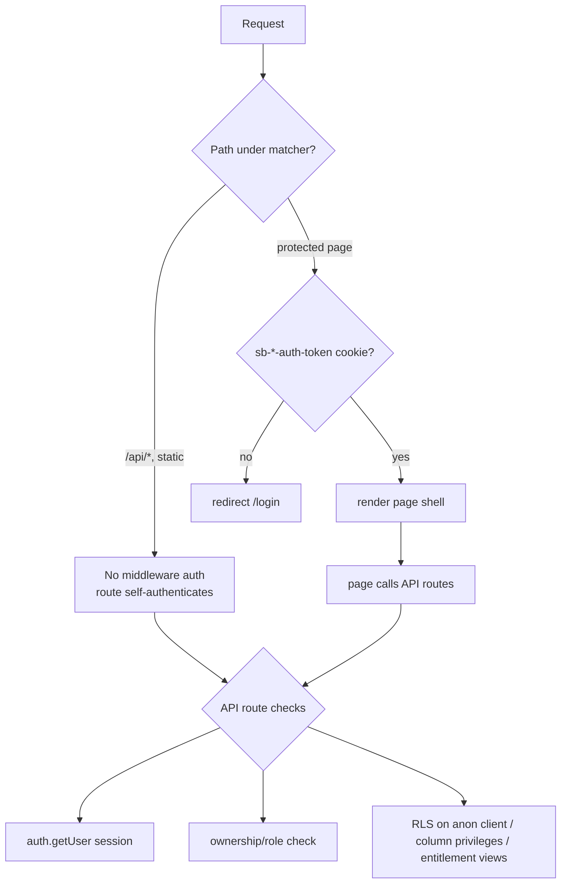

# 03 — User Roles & Permissions

> How CRWN models identity and enforces authorization. `Confirmed` unless noted. Enforcement detail is grounded in `src/middleware.ts`, `src/lib/supabase/*`, `src/lib/auth/requireAdmin.ts`, `src/lib/apiAuth.ts`, and the RLS migrations.

## 1. Roles

There are **three stored roles** on `profiles.role` (`UserRole = 'fan' | 'artist' | 'admin'`, `src/types/index.ts:3`):

| Role | Meaning | How you become it |
|---|---|---|
| `fan` | Default for every new signup | Auto-set by `handle_new_user()` trigger on `auth.users` insert |
| `artist` | Can publish + monetize | Server-side promotion when an `artist_profiles` row is inserted (`trg_promote_to_artist`) |
| `admin` | CRWN internal operator | Set manually in DB (no self-serve path) |

**Additional "roles" that are NOT `profiles.role`** (they are relationship/records, not identity roles):
- **Recruiter / Partner** — a `recruiters` / `partner_applications` record; a user who refers artists. Gated by having the record + Stripe Connect, not by `profiles.role`.
- **Collaborator** — a `team_split_deals.collaborator_user_id`; a user on a specific artist's revenue-share deal. Authorization is per-deal via `getDealForUser()`.
- **Fan referrer / clipper** — any fan with referral/clip activity; a `referrals` row with `source='fan'|'clipper'`.

These overlay a base role (usually `fan` or `artist`) and are checked per-resource, not globally. `Confirmed`.

## 2. How roles are stored & read
- `profiles.role` is the single identity column. `AuthProvider` (`src/hooks/useAuth.tsx`) loads `profiles` and exposes `isArtist()`/`isAdmin()` — **UI-only convenience**, not a security boundary.
- **The client cannot change its own role.** `schema-phase2-rls-column-restrictions.sql` pins `role`, `is_active`, `stripe_connect_id` via a `WITH CHECK` that forces them to current values. A client `profiles.update({role})` is silently rejected by RLS. `Confirmed`.
- **"Is an artist" for gating is derived from the `artist_profiles` row existing**, not `profile.role`, because the auth context lags a token refresh right after promotion (`useArtistSetup.ts`, `(main)/layout.tsx`). `Confirmed`.

## 3. Enforcement layers

- **Middleware** (`src/middleware.ts`) protects *pages* only (`protectedPaths`): `/home, /explore, /community, /library, /profile, /setup, /offers, /proof-of-demand, /missions, /my-missions, /earn, /impact, /command, /clip-controls, /action-plan, /campaign-hub, /studio, /recruit/dashboard, /admin, /squads, /my-squads, /bounties, /my-bounties, /city-unlocks, /playbooks, /campaigns`. Redirects to `/login` if no auth cookie. `authPaths` (`/login`,`/signup`) redirect authed users to `/home`.
- **⚠️ The matcher EXCLUDES `api/`** — every API route must self-authenticate. This is by design but means missing a check = an unprotected endpoint. `Confirmed`.
- **API routes** call `supabase.auth.getUser()` then an ownership/role check before using the RLS-bypassing admin client.
- **Database** enforces via RLS policies, column privileges (Stripe ids, track audio, frozen columns), and SECURITY DEFINER entitlement views.

## 4. Admin authorization
- `/admin` **page** does a client-side `role==='admin'` check → UX gate only.
- The **real boundary** is server-side: `requireAdmin.ts` (identity from session, never a client id) on 8 routes; equivalent inline `profiles.role==='admin'` checks on the others (`approvals`, `crm`, `funnel`, `notes`, `partners`, `pipeline`, …). Cron-internal admin routes use `CRON_SECRET`; `admin/track` uses `INTERNAL_TRACK_SECRET`. **Every `/api/admin/*` route reviewed enforces admin server-side.** `Confirmed`.
- Naming nit: `/api/admin/milestone` is actually self-service (any authed user, self-scoped), despite the path. `Confirmed`.

## 5. Artist authorization
- Ownership pattern: `requireArtistOwner(artistId)` (`apiAuth.ts`) — session user must own `artist_profiles.id = artistId AND user_id = user.id`. ⚠️ Only ~3/195 service-role routes use the shared helper; most hand-roll `getOwnedArtistIds`/`getDealForUser`. No inconsistency found in sampled routes, but low adoption is a latent risk. `Confirmed`.
- Feature gates by platform tier (`canUseFeature`, `checkArtistLimit`): DMs, live, clipper, bundles, scheduling, extra fan tiers, discount codes are Pro+. (SMS was a Pro+ gate until the feature was removed 2026-07-31.)

## 6. Fan authorization
- Fans read/write only their own rows (subscriptions, favorites, purchases, playlists, DMs) — routes scope to `fan_id = user.id`; an IDOR on another fan's id → 404, not exposure. `Confirmed`.
- Content entitlement (paid audio, gated posts, live access) is proven server-side via the RLS-scoped client / entitlement views, never a client flag. `Confirmed`.

## 7. Permission matrix (representative)

| Capability | Fan | Artist | Admin | Enforced by |
|---|---|---|---|---|
| Read own profile | ✅ | ✅ | ✅ | RLS |
| Change own `role`/tier/stripe id | ❌ (RLS-frozen) | ❌ | via DB only | column WITH CHECK |
| Publish artist page (→ becomes artist) | ✅ (self-serve) | — | ✅ | `trg_promote_to_artist` |
| Create tiers/tracks/products | ❌ | ✅ (tier limits) | ✅ | route ownership + `checkArtistLimit` |
| Subscribe / buy | ✅ | ✅ | ✅ | checkout routes (auth) |
| Play paid audio | only if entitled | own always | — | `tracks_public` view / `can_play_track` |
| View an artist's fan list/emails | ❌ | ✅ own only | ✅ | `/api/audience` ownership check |
| DM an artist | ✅ if subscribed & artist is Pro | ✅ own fans | — | `messaging.ts` gating |
| Go live | ❌ | ✅ Pro + agreement | — | `/api/live/session` |
| Cash out referral balance | ✅ ($25 min) | ✅ | — | atomic RPC + auth |
| Team-split release | ❌ | ✅ (deal artist) | — | `getDealForUser` + `isArtist` |
| Admin metrics/pipeline/funnel | ❌ | ❌ | ✅ | `requireAdmin` |
| Toggle platform sequences / run agent | ❌ | ❌ | ✅ | `requireAdmin` + coordination lock |
| Invoke cron endpoints | ❌ | ❌ | via `CRON_SECRET` | bearer check |

## 8. Role-escalation & authorization risks (see 11-SECURITY for full grading)
- **`NEXT_PUBLIC_CRON_SECRET`** client-bundled, gates a cron-secret code path (HIGH).
- **Unauthenticated webhooks** mutate suppression/opt-in state (HIGH).
- **Low ownership-helper adoption** — future routes could omit the check (MEDIUM).
- **`/api/platform/limits`** unauthenticated (MEDIUM).
- **`booking-checkout`** trusts client `artistId` for the record (MEDIUM).
- **Frontend-only gates** (e.g. `/admin` page shell) are backed by server checks — not a real risk as long as every data route re-checks (currently true). `Confirmed`.
- **RLS is enabled table-by-table**, not globally — a new table without an explicit `ENABLE ROW LEVEL SECURITY` + policies would be wide open. Money tables were retrofitted after being created directly in prod. `Confirmed`.

---

*See also: [11-SECURITY-AND-PRIVACY.md](11-SECURITY-AND-PRIVACY.md) · [05-DATABASE.md](05-DATABASE.md) · [04-ARCHITECTURE.md](04-ARCHITECTURE.md)*
