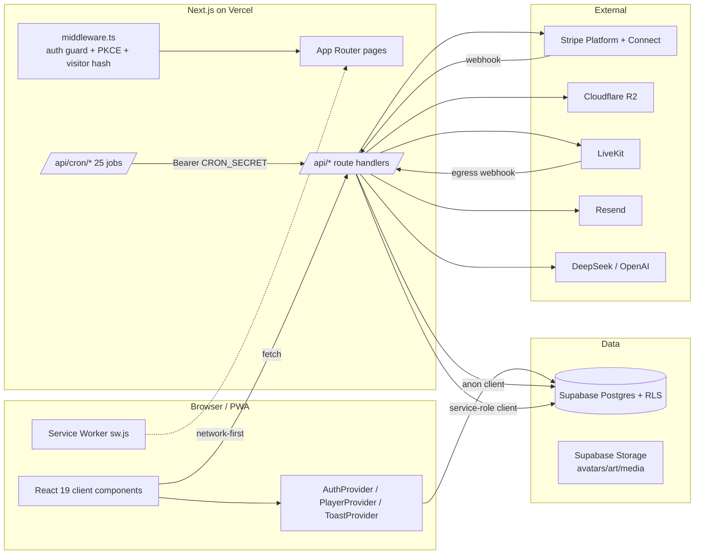

# 04 — Architecture

> Grounded in `package.json`, `next.config.ts`, `vercel.json`, `src/`. `Confirmed` unless noted.

## 1. Stack
| Layer | Tech |
|---|---|
| Framework | **Next.js 16** (App Router + Turbopack), React 19.2, TypeScript 5 |
| Styling | **Tailwind CSS v4** (CSS-first, no `tailwind.config.*`) + `neumorphic.css` |
| DB / Auth / Storage / Realtime | **Supabase** (Postgres) via `@supabase/supabase-js` + `@supabase/ssr` |
| Payments | **Stripe Connect** (`stripe` v20, `@stripe/stripe-js`) |
| Media storage | **Cloudflare R2** via `@aws-sdk/client-s3` + presigner |
| Live video | **LiveKit** (`livekit-client`, `livekit-server-sdk`, `@livekit/components-react`) |
| Email | **Resend** |
| SMS | None. Twilio was removed 2026-07-31 (founder decision, A2P 10DLC compliance cost); founder alerts are email, optionally via a carrier email-to-SMS gateway (`FOUNDER_ALERT_SMS_EMAIL`, plain Resend) |
| AI | **DeepSeek** (via `openai` SDK) + narrow **OpenAI** `gpt-4o-mini` |
| UI libs | `lucide-react` (icons), `recharts` (charts), `@dnd-kit` (drag), `driver.js` (tours), `react-easy-crop`, `react-calendly` (unused) |
| Hosting / cron | **Vercel** (Hobby plan — cron ≤ daily) |

## 2. High-level architecture


## 3. Server / client boundary
- Root `layout.tsx` = server component wrapping client context providers.
- Most pages are **client components** (`'use client'`, 63/89 pages) fetching Supabase directly through hooks — RSC data-fetching is not the primary pattern.
- **Business logic lives in `/api/` route handlers** (service-role, RLS-bypassing) and `src/lib/*`. Middleware excludes `/api/`, so each route self-authenticates. `Confirmed`.

## 4. Data flow: a fan subscription (representative)
```mermaid
sequenceDiagram
    participant Fan
    participant Checkout as /api/stripe/checkout
    participant Stripe
    participant WH as /api/stripe/webhook
    participant DB as Supabase (admin client)
    Fan->>Checkout: POST {tierId} (session-authed, rate-limited)
    Checkout->>DB: read tier, derive artist_id + fee
    Checkout->>Stripe: create Checkout Session (platform acct,<br/>transfer_data.destination, application_fee_percent)
    Checkout-->>Fan: {url} -> redirect to Stripe
    Stripe->>WH: checkout.session.completed (signed)
    WH->>DB: claim event (processed_webhook_events, idempotent)
    WH->>DB: upsert subscriptions, insert earnings, milestones, referral, sequence
    WH->>Resend: welcome/receipt email; notify artist
```

## 5. Directory map
```
src/
  app/
    (auth)/        login, signup, onboarding(dead)
    (main)/        home, explore, library, messages, profile(+artist dashboard),
                   earn, impact, command, my-missions, my-calendar, recruit, studio
    (public)/      welcome, worth, survey, link/[slug], legal pages, getting-started
    [slug]/        canonical public artist pages (track/album/post/playlist/live/book/demand/r)
    artist/[slug]/ LEGACY redirect + dead dupes
    setup/         artist setup wizard
    admin/         admin dashboard + team-splits
    + top-level:   offers, missions, squads, bounties, campaigns, campaign-hub,
                   city-unlocks, city, playbooks, proof-of-demand, clip-controls,
                   action-plan, team, embed, join, verify
    api/           ~190 route handlers incl. cron/ (25), stripe/ (~20), admin/, live/
  components/      24 feature folders + ui/ + shared/ + layout/
  hooks/           useAuth, usePlayer, useSubscription, useArtistSetup, ...
  lib/             ai/ auth/ emails/ livekit/ quests/ r2/ storage/ stripe/ supabase/
                   teamSplits/ utils/ + platformTier, webhookHandlers, notifications,
                   referrals, apiAuth, rateLimit, uploadValidation, navigation, ...
  types/           index.ts (+ community.ts, live.ts)
  middleware.ts
supabase/          134 *.sql migrations (manual) + seeds
public/            sw.js, manifest.json, icons
(root)             *.mjs content-gen scripts (NOT app code), videos/, handoff .md docs
```

## 6. Cross-cutting subsystems
- **Auth:** Supabase cookie sessions; PKCE exchange in middleware; server-side role promotion trigger.
- **Payments:** platform-account subscriptions/prices; Connect for payouts; idempotent signed webhook; atomic cashout RPCs.
- **Entitlement:** SECURITY DEFINER functions + redacting views (`tracks_public`, `community_posts_feed`, `artist_profiles_public`); column privileges on sensitive columns.
- **Background jobs:** Vercel crons (≤ daily, 24 after `sms-reset` was deleted with the SMS removal 2026-07-31), each `CRON_SECRET`-gated. Cover payouts, sequences, activation nudges, lead scoring, AI, health canaries, team-split accrual, releases.
- **Storage:** R2 for audio masters/art/VOD (signed URLs); Supabase Storage for avatars/community media; `audio` bucket is private.
- **Realtime:** Supabase Realtime for live chat + notification bell.
- **Feature flags:** one real flag store — `admin_settings` KV. Current keys: `acquisition_engine`, `experiments`, `live_tips`, `popup_engine`, `producer_sessions`, `quest_engine`, `royalty_readiness`, plus `artist_gate` and `frl_cost_assumptions`. Production VALUES are only knowable by probe, never from code defaults (a code default of false has masked a live flag more than once).
- **AI:** DeepSeek for AI Manager + autonomous agent (actions behind approval + coordination lock); degrade-gracefully on failure.
- **Caching:** `admin_metrics_cache` table for expensive KPI aggregation; service worker HTTP cache. No Redis/CDN app cache. `Confirmed`.
- **Error handling / logging:** `try/catch` → `console.error` + 500; no Sentry/structured logging.
- **Monitoring:** first-party canaries (`onboarding-health`, `rls-canary`, `agent-health`, `cron_heartbeat`) + email alerts to the founder. No third-party APM.
- **Testing:** vitest, `npm test`, 820 tests across 50 files (a moving figure: run it), covering the **pure business layers only** (`src/lib/opportunity`, `acquisition`, `opportunityDrafts`, `opportunityFunnels`, `leadResults`, `journey`, `experiments`, `prospectNurture`, `analytics`, `revenueRamp`). No component/integration/e2e test, so the build gate + canaries still carry everything else.

## 7. Important patterns to preserve
- Two Supabase clients (anon+RLS vs service-role in API only).
- Server-side truth for role, entitlement, tier limits, live access.
- Build-safe env fallbacks; no `!` on env vars.
- Cents everywhere; platform-vs-Connect Stripe discipline.
- Self-verifying migrations; manual apply.
- `smartBack` / `?returnTo` navigation; `OptionSelect` dropdowns; no em dashes.

## 8. Anti-patterns / technical debt / fragile areas
- **No shared admin-client factory** (copy-pasted per route); **low ownership-helper adoption**. `Medium`.
- **Fee-calc formula duplicated 8+ times**; two Stripe client instantiations.
- **Legacy `access_level` still in types + columns**; **duplicate `artist/[slug]` routes** drifting. (The dead `empire` tier was deleted from the type union 2026-07-31; `resolveTierKey()` aliases stray strings to `scale`.)
- **Undefined `bg-crwn-card`** token in 56 files; color/font token mismatches.
- **Money tables lack CREATE TABLE migrations** — repo can't rebuild prod schema. `Critical` for portability.
- **RLS is per-table opt-in** — a new table is wide open until policies are added.
- **Tests cover the pure business layers only** (820 vitest tests as of 2026-08-03; run it for the current figure); the huge surface (241 API routes) is otherwise unguarded, so regression risk stays high everywhere a route, component or DB path is involved.
- **Unauthenticated webhooks / client-bundled cron-secret pattern** (see `11-SECURITY`).

## 9. Boundaries future agents should preserve
1. Never use the service-role client outside `/api/`; never skip the ownership/session check.
2. Never add a client-side `profiles.update({role})` — RLS rejects it.
3. Keep subscriptions/prices on the Stripe **platform** account; use `transfer_data.destination` for Connect.
4. Read fees only from `getArtistFeePercent()`/`TIER_LIMITS`.
5. Gate content via `is_free`/`allowed_tier_ids` + entitlement views — never re-derive entitlement in TypeScript.
6. End every migration with a self-verify block; keep the onboarding + RLS canaries in sync when touching publish/entitlement.

---

*See also: [05-DATABASE.md](05-DATABASE.md) · [09-CODING-CONVENTIONS.md](09-CODING-CONVENTIONS.md) · [10-INTEGRATIONS.md](10-INTEGRATIONS.md) · [18-SOURCE-MAP.md](18-SOURCE-MAP.md)*
