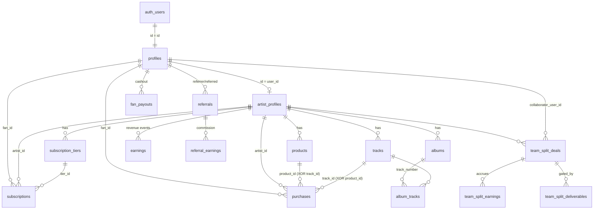

# 05 — Database

> Postgres via Supabase. Project ref `ecpqtuidtsncjfwtkvwc` (US East). Migrations live in `supabase/*.sql` (117 files) and are **applied manually** in the Supabase SQL Editor, never auto-run. `schema.sql` is the base; `schema-ticket*.sql`, `schema-phase2-*.sql`, `schema-phase3-*.sql` are incremental; `seed-*.sql` seed demo data. `Confirmed`.
>
> Source of truth for column locations is the SQL, not the app types (`src/types/index.ts` lags in places). Every claim here is traceable to a named `supabase/*.sql` file.

---

## ⚠️ Read this first — schema reconstruction is incomplete

**Several core money tables have NO checked-in `CREATE TABLE` migration.** `earnings`, `referrals`, `referral_earnings`, `fan_payouts`, `processed_webhook_events`, and `recruiters` were, per a verbatim comment in `schema-phase2-money-ledger-rls.sql`, *"created directly in prod and never had a checked-in migration."* You cannot fully reconstruct the production schema from this repo alone. Columns below for those tables are only what *later* migrations touch. `Confirmed`. → `Needs founder confirmation` for full column lists / a schema dump.

---

## 1. Entity relationship diagram (core money + content path)

Ownership is almost always expressed in RLS as `auth.uid() IN (SELECT user_id FROM artist_profiles WHERE id = <fk>)` because **`artist_profiles.id ≠ artist_profiles.user_id`**. `Confirmed`.

## 2. Table inventory (by domain)

### Users / Artist identity
| Table | Migration | Purpose | Key columns |
|---|---|---|---|
| `profiles` | `schema.sql` (+ many ALTERs) | One row per person; extends `auth.users` | `id`(PK=auth.users.id), `role` (CHECK `fan\|artist\|admin`), `display_name`, `avatar_url`, `bio`, `social_links` jsonb, `username`, `phone`, `is_approved`, `platform_tier`, `last_active_at`, `onboarding_completed`, `stripe_connect_id` (fan/recruiter payouts) |
| `artist_profiles` | `schema.sql` → `schema-ticket3.sql` + ALTERs | Artist's public/business identity | `id`(PK), `user_id`→profiles.id, `slug`(UNIQUE), `banner_url`, `tagline`, `stripe_connect_id`, `platform_tier`, `platform_stripe_customer_id`, `platform_subscription_status`, `is_founding_artist`, `founding_fee_expires_at`, `referral_commission_rate`, `clipper_commission_rate`, `clipper_rate_schedule`, `acquisition_source` (CHECK `organic\|recruiter\|partner\|founding`), `activation_milestones` jsonb, `setup_completed` |

### Content
| Table | Migration | Key columns / notes |
|---|---|---|
| `tracks` | `schema-ticket3.sql` (+ metadata/purchase ALTERs) | `artist_id`, `title`, `audio_url_128/320`, `is_free`, `allowed_tier_ids` jsonb, `price`(cents), `access_level`(**legacy**), `album_id`, `genre`, `isrc`, `explicit`, `ai_generated`, `public_release_date`, `position` |
| `albums` | `schema-phase2-albums.sql` | `artist_id`, `title`, `is_active`, `is_free`/`allowed_tier_ids`, `access_level`(legacy). No `slug` in the live table (a second def in `schema-albums-feature.sql` never applied). |
| `album_tracks` | `schema-phase2-albums.sql` | ordering via **`track_number`** (NOT `position`) — confirmed canonical |
| `playlists` | `schema-ticket3.sql` (+ `schema-artist-playlists.sql`) | `artist_id`, `track_ids` uuid[], `is_artist_playlist`, `is_free`/`allowed_tier_ids`. ⚠️ conflicting historical def (see Risks) |
| `playlist_tracks` | `schema-artist-playlists.sql` | ordering via **`position`** |
| `favorites`, `play_history`, `user_queues` | `schema-ticket4.sql` | player state |

### Shop
| Table | Migration | Notes |
|---|---|---|
| `products` | `schema-phase2-shop.sql` | `type` (`digital\|experience\|bundle`; app type adds `physical`), `price`, `delivery_type`, `max_quantity`, `quantity_sold`, `variants`, `is_active` |
| `bundle_items` | `schema-phase2-shop.sql` | bundle → product mapping |
| `purchases` | `schema-phase2-shop.sql` + `-track-purchases.sql` | `fan_id`, `product_id` **XOR** `track_id` (CHECK), `artist_id`, `amount`, `status` (`pending\|completed\|refunded` — no `failed`) |

### Subscriptions / Tiers
| Table | Migration | Notes |
|---|---|---|
| `subscription_tiers` | `schema-ticket5.sql` (+ annual ALTER) | `artist_id`, `name`, `price`(cents), `access_config` jsonb (`{benefits:[]}`), `stripe_price_id`, `stripe_product_id`, `is_active`, `offers_annual`, `annual_discount_percent` |
| `tier_benefits` | `schema-phase2-*` / `benefitCatalog.ts` | per-tier structured benefits, `benefit_type`, `config` jsonb, `sort_order` |
| `subscriptions` | `schema-ticket5.sql` | `fan_id`, `artist_id`, `tier_id`, `stripe_subscription_id`(UNIQUE), `status` (`incomplete\|active\|past_due\|canceled\|paused`), period fields, `cancel_at_period_end`, `pending_tier_id`/`pending_change_date` (deferred downgrade). **UNIQUE(fan_id, artist_id)** → resubscribe = upsert |

### Payments / payouts / ledger — ⚠️ mostly no CREATE TABLE migration
| Table | Migration touching it | Purpose |
|---|---|---|
| `earnings` | first touched `schema-phase2-earnings-type-check.sql` | Unified revenue-event log written by `webhookHandlers.ts`; `type` CHECK `subscription\|purchase\|booking\|live_ticket\|refund\|dispute`, `gross_amount`/`platform_fee`/`net_amount`, `source_campaign_id`/`source_sequence_id` (UTM attribution) |
| `referrals` | `schema-phase2-money-ledger-rls.sql`, `-clipper-attribution.sql` | Fan/clipper attribution; `source` CHECK `fan\|clipper` |
| `referral_earnings` | `schema-phase2-attribution-hardening.sql` | Commission ledger; `referrer_fan_id`, `commission_amount`, `cleared_at` |
| `fan_payouts` | `schema-phase2-money-ledger-rls.sql` | Fan/clipper cashout records |
| `processed_webhook_events` | `schema-phase2-money-ledger-rls.sql` | Stripe idempotency; **UNIQUE(event_id)** |
| `recruiters` | `schema-phase2-funnel-tracking.sql` | Partner/recruiter accounts; `referral_code`, `is_partner` |
| `booking_sessions`, `booking_purchases` | `schema-booking.sql` | 1:1 booking sales (legacy Calendly path) |
| `booking_tokens` | `booking-tokens-migration.sql` | Booking redemption tokens (`unused\|used\|expired`) — the live booking flow |
| `discount_codes`, `discount_code_uses` | `schema-phase2-discount-codes.sql` | `discount_type` `percent\|fixed` |
| `abandoned_checkouts` | `schema-phase2-abandoned-cart.sql` | recovery; `checkout_type` `subscription\|product\|booking` |
| `live_ticket_purchases` | `schema-phase2-live-tickets.sql` | `status` `pending\|paid\|refunded` |
| `release_credits` | `schema-phase2-release-credits.sql` | release promo credits |

### Team Splits (collaborator revenue-share — distinct from referrals)
`schema-phase2-team-splits.sql`: `team_split_deals`, `team_split_deal_versions`, `team_split_deliverables`, `team_split_earnings`, `team_split_payouts`, `team_split_disputes`, `team_split_audit_events`. Deal has self-dealing CHECK (`collaborator_user_id <> created_by`), a 13-value `status` state machine, `deal_type` (7 values), `revenue_source_type` (`tier\|product\|track\|live_session\|booking\|road_campaign\|all_earnings\|custom\|none`). Cashout RPC `atomic_team_split_cashout` (`schema-phase2-team-splits-cashout-rpc.sql`). **Zero client write policies by design** — all writes via service-role routes. `Confirmed`.

### Community / messaging
| Table | Migration | Notes |
|---|---|---|
| `community_posts`, `community_post_likes`, `community_comments`, `community_comment_likes` | `schema-community.sql` | Artist feed; tier-gated via `is_free`/`allowed_tier_ids` |
| `community_channels`, `community_channel_messages` | `schema-phase2-community-channels.sql` | Discord-style channels; gated **in RLS** (Realtime replays RLS per row) |
| `posts`, `comments`, `likes` | `schema-ticket7.sql` | **Legacy** generic social layer (superseded — see Risks) |
| `dm_conversations`, `dm_messages` | `schema-phase2-direct-messages.sql` (+ voice/broadcast ALTERs) | Tier-gated 1:1 DMs, voice notes (private `audio` bucket), UNIQUE(artist_id, fan_id) |
| `artist_phone_numbers`, `sms_subscribers`, `sms_consent_log` | `schema-phase2-sms*.sql` | Twilio SMS/MMS |

### Notifications
`notifications` (`schema-phase2-notifications.sql`) — in-app feed. **`type` CHECK was dropped** (`schema-phase2-direct-messages.sql`), so `type` is now unconstrained free text (typos not caught by DB). `Confirmed`.

### Gamification / growth
`missions`, `mission_participants`, `mission_suggestions`; `artist_squads`, `artist_squad_members`, `artist_squad_missions`; `fan_badges`, `fan_badge_awards`; `clip_bounties`, `clip_bounty_submissions`, `clip_bounty_awards`; `city_unlocks`, `city_unlock_contributions`; `road_campaigns`, `road_campaign_contributions`; `proof_of_demand`, `proof_of_demand_responses`. Quest Engine: `quest_templates`, `quest_instances`, `user_progression`, `quest_unlocks`, `xp_ledger` (`schema-phase2-quest-engine.sql`; **dark-launched** via `admin_settings.quest_engine`). `missions.type` CHECK has 11 values; `quest_templates.quest_type` has 14. `Confirmed`.

### Marketing / CRM / attribution
`campaigns`, `campaign_sends`, `fan_communication_prefs`; `sequences`, `sequence_steps`, `sequence_enrollments`, `sequence_sends`, `sequence_conversions`, `unsubscribe_events`; `platform_sequences`, `platform_sequence_steps`, `platform_sequence_enrollments`, `artist_notes` (platform CRM on artists); `crm_lists`, `crm_contacts`, `crm_outreaches`, `crm_outreach_sends`, `crm_outreach_unsubscribes`; `fan_contacts`; `fan_growth_notes`, `fan_growth_actions`; `saved_segments`; `smart_links`, `smart_link_captures` (+ pre-save `link_type`); `referral_clicks` (funnel); `email_suppressions`; `artist_marketing_costs`. `Confirmed`.

### Live / VOD / fulfillment
`live_sessions`, `live_session_participants`, `live_session_messages` (+ VOD ALTERs `schema-phase3-vod*.sql`: `vod_status`, `vod_key`, `vod_url`, `source_type`, `visibility`), `vod_markers`, `live_agreement_acceptances`; `fulfillment_obligations`, `fulfillment_events` (Promise Calendar), `calendar_reminders`; `cancellation_reasons`, `survey_responses` (retention). `Confirmed`.

### Analytics / admin / agent
`fan_events` (activity log, feeds quest evaluator), `artist_page_visits` (hashed-fingerprint visits), `site_visits`, `admin_settings` (generic KV, reused as feature-flag store: `artist_gate`, `quest_engine`, `experiments`, `royalty_readiness`, `producer_sessions`, `live_tips`, `popup_engine`), `admin_metrics_cache`, `cron_heartbeat`; `artist_agent_actions`, `artist_agent_runs`, `agent_action_log`, `agent_coordination` (server-only lock), `autonomous_run_log`; view `artist_action_outcomes`. Plus `invite_codes` (artist-gate), `partner_applications`. `Confirmed`.

### Opportunity Funnel / lead-magnet analytics + experiments
`lead_magnet_leads` (email + UTM), `lead_magnet_results` (public tool results AND anonymous value-before-signup drafts: `public_token` + `public_token_expires_at`, nullable `user_id`/`artist_id`, `status IN (draft,completed,converted,archived)`; owner-RLS by `artist_id`, deny-public, service-role token reads), `lead_magnet_events` (append-only beacon sink; also carries the 7 `opportunity_*` + 16 journey + 9 personalized-journey event names). `funnel_events` (15-stage deduped acquisition funnel, 6 reporting dims, admin-read RLS). `opportunity_ledger` (revealed[projection]/activated/captured[actual, refund-netted] money per artist/feature/month). Experiments: `experiments` (operational state — status/allocation/conclusion — for a **code-defined** config in `src/lib/experiments/registry.ts`) + `experiment_events` (measurement sink: `aid`/variant/event, admin-only READ RLS, **no insert policy** so only the service-role track route writes). `schema-phase2-{funnel-events,opportunity-ledger,experiments}.sql`. `Confirmed`.

### Redacting views (entitlement layer)
| View | Migration | Purpose |
|---|---|---|
| `tracks_public` | `schema-phase2-tracks-audio-view.sql` | nulls `audio_url_*` unless `can_play_track(id, auth.uid())` |
| `artist_profiles_public` | `schema-phase2-artist-profiles-public-view.sql` | public artist read excluding Stripe id columns |
| `community_posts_feed` | `schema-phase2-community-posts-rls.sql` | redacted feed with `can_view` flag |

## 3. Enums / CHECK constraints (representative)

`profiles.role`: fan\|artist\|admin · `subscriptions.status`: incomplete\|active\|past_due\|canceled\|paused · `tracks.access_level` (legacy): free\|subscriber\|purchase · `products.type`: digital\|experience\|bundle · `purchases.status`: pending\|completed\|refunded · `earnings.type`: subscription\|purchase\|booking\|live_ticket\|refund\|dispute · `referrals.source`: fan\|clipper · `discount_codes.discount_type`: percent\|fixed · `sms_subscribers.status`: pending\|active\|unsubscribed · `artist_profiles.acquisition_source`: organic\|recruiter\|partner\|founding · `live_sessions.status`: scheduled\|live\|ended. `artist_profiles.platform_tier` values (`starter\|pro\|label`) are **not** a DB CHECK, only convention. `Confirmed`.

## 4. RLS, functions, triggers

- **RLS is enabled table-by-table** (explicit `ENABLE ROW LEVEL SECURITY` per migration), not globally. Money tables were **retrofitted** with RLS in `schema-phase2-money-ledger-rls.sql` after being created directly in prod. `Confirmed`.
- **Column-privilege lockdowns** (revoke table grant, re-grant per-column) protect: track audio urls (`-tracks-audio-column-privs.sql`), Stripe ids on `artist_profiles` (`-stripe-id-column-privs.sql`), and frozen self-service columns `role`/`platform_tier`/`stripe_connect_id`/`is_founding_artist`/clipper rates (`-rls-column-restrictions.sql`, `-freeze-clipper-rate-columns.sql`). Note: `profiles.stripe_connect_id` is **deliberately deferred** (leaks via `useAuth` `select('*')`) — flagged in the migration. `Confirmed`.
- **Entitlement oracles** (SECURITY DEFINER): `can_play_track()`, `can_read_community_post()`. A migration (`-revoke-entitlement-oracle-execute.sql`) **caused a production outage** by revoking EXECUTE on these from `authenticated` (views check the querying role's EXECUTE); fixed by `-fix-entitlement-oracle-via-authuid.sql` (functions now derive `auth.uid()` internally). `Confirmed`.
- **RPC lockdowns:** `atomic_fan_cashout`, `atomic_team_split_cashout` — EXECUTE revoked from anon/authenticated (were callable to freeze arbitrary balances). `Confirmed`.
- **Agent-tables write hole** (`-agent-tables-rls.sql`): `agent_coordination`/`artist_agent_actions` had `FOR ALL TO public USING(true)` (any anon-key holder could forge the AI log); fixed to server-only. `Confirmed`.
- **Key triggers/functions:** `handle_new_user()` (auto-create profile, role `fan`), `trg_promote_to_artist`/`promote_to_artist_on_publish()` (server-side fan→artist on publish — client role writes are RLS-blocked), `artist_gate_enabled()`/`redeem_invite()` (invite gate), `update_updated_at_column()`, `notify_new_artist()` (skips `__canary*` slugs), plus player/like/subscription utility RPCs. `Confirmed`.
- **Self-verify convention:** nearly every phase2 migration ends with a `DO $$ … RAISE EXCEPTION …$$` block asserting its objects exist (per `CLAUDE.md` Onboarding Safety Net). `Confirmed`.

## 5. Timestamps / soft-delete / ownership

- `created_at`/`updated_at TIMESTAMPTZ DEFAULT NOW()` on nearly every table (`updated_at` trigger-maintained). `Confirmed`.
- **Soft-delete = `is_active = false`** on `tracks`, `albums`, `playlists`, `products`, `community_posts/comments`, `live_sessions`. SELECT policies must add an owner override or a deactivated row disappears from its own owner (`CLAUDE.md` RLS gotcha; present in `tracks_public`). `Confirmed`.
- **Account-level `profiles.is_active`** is separate from the content soft-delete above. `/api/account/deactivate` sets it `false`; that flag is now READ on public artist read paths to hide a deactivated artist: `src/app/[slug]/page.tsx` returns `notFound()` when `profile.is_active === false`, and home discovery (`src/app/(main)/home/page.tsx`) filters deactivated artists out. Enforcement is app-layer, not RLS; only `is_active === false` hides (null/true = active). Next login resets it to `true` via `useAuth` calling `/api/account/reactivate`. `Confirmed`.

## 6. Confirmed column locations (verified against SQL)

`display_name`, `avatar_url`, `role` → **`profiles`** only. `slug`, `banner_url`, `stripe_connect_id`, `tagline`, `setup_completed`, `platform_tier` → **`artist_profiles`** only. `album_tracks.track_number` (not position); `playlist_tracks.position` (not track_number). To get an artist's display name: query `profiles WHERE id = artist_profiles.user_id`. `Confirmed`.

## 7. Seed data

`seed-demo-data.sql` populates test artist `m3rcey` (hardcoded UUIDs) with ~20 demo fans (12 active + 8 churned for the cohort heatmap) and subscriptions across the three real fan tiers (The Wave $10 / Inner Circle $50 / Throne $200); **does not touch Stripe or real users**. `seed-demo-admin.sql`, `seed-platform-sequences.sql`, `seed-autonomous-history.sql` seed the admin/CRM/agent demos. `cleanup-test-onboarding-accounts.sql`, `schema-phase2-remove-demo-recruiters.sql`, `-remove-stock-artists.sql` are one-off cleanups. `Confirmed`.

## 8. Data-integrity risks (Confirmed observations)

1. **Money tables have no CREATE TABLE migration** (`earnings`, `referrals`, `referral_earnings`, `fan_payouts`, `processed_webhook_events`, `recruiters`) — repo cannot rebuild prod schema. `Critical` for schema portability.
2. **`playlists` has two conflicting historical definitions** (artist-owned `track_ids[]` vs a later never-applied fan-owned `user_id` shape). Audit any code assuming a `user_id` playlist. `Medium`.
3. **Three overlapping social layers:** legacy `posts/comments/likes` (ticket7) vs `community_posts/*` vs `community_channels/*`. Confirm which are live before reuse. `Medium`.
4. **Dual content-access models coexist:** legacy `access_level` enum vs current `is_free` + `allowed_tier_ids`; old columns never dropped, so stale reads possible. `Medium`.
5. **`notifications.type` is unconstrained** (CHECK dropped) — no DB guard against typos. Also `notifyNewPost`/`notifyNewComment` write `link:'/community'`, a route that does not exist (dead link). `Low`.
6. **`purchases.status` lacks a `failed` state** — a failed one-time attempt is indistinguishable from `pending`. `Low`.
7. **Two commission systems share the `referrals`/`referral_earnings` tables** via a `source` discriminator (fan vs clipper); changing one payout path risks the other. `Medium`.
8. Prose docs / migration comments carry **stale pricing** (`schema-platform-tiers.sql` says $49/$149). `Informational`.

---

*See also: [04-ARCHITECTURE.md](04-ARCHITECTURE.md) · [07-BUSINESS-RULES.md](07-BUSINESS-RULES.md) · [11-SECURITY-AND-PRIVACY.md](11-SECURITY-AND-PRIVACY.md) · [18-SOURCE-MAP.md](18-SOURCE-MAP.md)*
