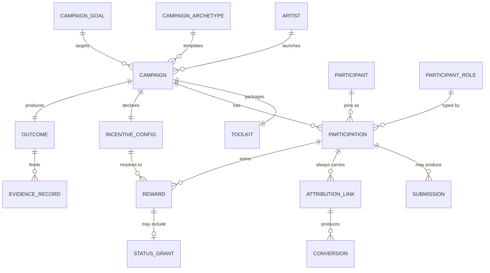
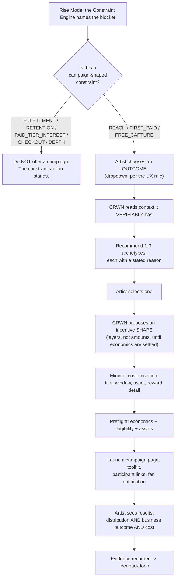
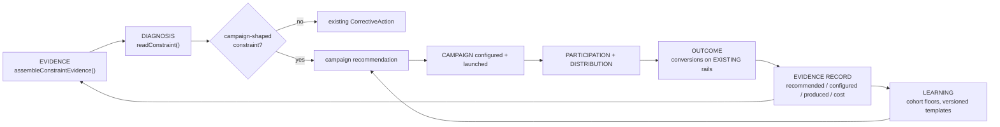

# VIRALITY ENGINE: Canonical Architecture

> **Status: V1 LIVE IN PRODUCTION 2026-08-11 (Z11). Migration applied to `ecpqtuidtsncjfwtkvwc`
> and verified against the real database. Everything beyond V1 in this document remains
> architecture only.** What is live, and what is explicitly not, is section 28. Read that first
> if you are about to build on this.
>
> V1 is: the thin Campaign spine (`fan_campaigns` + `fan_campaign_participants`), ONE archetype
> (Fan Recruitment Drive), a required participant toolkit, a server-side constraint gate, results
> derived from the existing referral rail, and a non-cash badge. **No attribution change, no payout
> change, no commission change, no new cash mechanism, no leaderboard, no UGC archetype, no social
> API, no Rise Mode wiring and no Manager change** were made. The V1 boundary in section 23 was
> revalidated against the live repository before implementation and held, with one correction
> recorded in section 28.2.
>
> Authored 2026-08-10 on branch `claude/rise-mode-full-journey`.
> Founder-approved product direction, reconciled against the live repository.

**Naming.** This document follows the CRWN Brain's numbered convention (`00-` to `21-`), as
document **22**. It was briefly created as `VIRALITY_ENGINE_ARCHITECTURE.md` and renamed by
founder direction on 2026-08-10; no copy remains at the old path.

**Source-of-truth order used:** founder instruction, then CRWN Brain, then repository
implementation, then existing conventions, then earlier strategy documents. Where the Brain and
the repository differ, both are stated.

**Missing framework file.** `CLAUDE_PROMPT_FRAMEWORK.md` does not exist in the working tree or
in git history (`git log --all -- '*PROMPT_FRAMEWORK*'` is empty). This is the third
confirmation (`docs/FEEDBACK_LOOPS.md` section 0 and
`docs/CRWN_UNIFIED_PRODUCT_ARCHITECTURE_PLAN.md` both report it). `docs/AGENT_INSTRUCTIONS.md`
also does not exist; the file is at the repo root as `AGENT_INSTRUCTIONS.md` (13 lines), and the
substantive manual is `15-AI-AGENT-INSTRUCTIONS.md`. This document follows `CLAUDE.md`'s
Problem-Solving Principles instead.

Evidence labels: **Existing** / **Partial** / **Missing** / **Decision required**.

---

## 1. Executive Summary

### 1.1 What the Virality Engine is

The Virality Engine gives an artist a **repeatable system for mobilizing their fans to grow the
artist's business, rewarding the people who create measurable value, and learning which growth
mechanics work best for that artist.**

It is not a TikTok challenge tool. A challenge is one archetype among many, and content creation
is one participation role among several.

### 1.2 The finding that determines the architecture

**CRWN has already built the Virality Engine's primitives six separate times, as six
disconnected features.** Every one of them independently implements a type catalog, a goal, a
participant relationship, a reward vocabulary and a status lifecycle:

| Existing feature | Table(s) | What it already is |
|---|---|---|
| Missions | `missions`, `mission_participants`, `mission_suggestions` | 11 mission types incl. `share`, `clip`, `referral`, `city`, `presave`; audience targeting; reward types |
| Clip Bounties | `clip_bounties`, `clip_bounty_submissions`, `clip_bounty_awards` | 10 bounty types, deadline, eligibility, approval, submissions with **attributed subscribers, revenue and clicks per submission**, ranking, awards |
| Fan Squads | `fan_squads` (+ members) | 13 squad types, 4 visibility models, scoped roles (member/captain/mod/manager) |
| City Unlocks | `city_unlocks` | 6 unlock types, 5 goal types, contribution types |
| Road To campaigns | `road_campaigns` | 7 goal types incl. money, contribution types, status lifecycle |
| Proof of Demand | `proof_of_demand` | Demand testing with `response_count` / `goal_count` |

Plus the rails those features sit on: `referrals`, `referral_earnings` (with a 7-day payout hold
and an atomic cashout), `referral_clicks`, `smart_links` + `smart_link_captures`, `fan_badges`,
the clipper rev-share ramp, the Quest Engine's XP and progression, `fan_events`, `funnel_events`
and the earnings ledger.

**And the missing piece is named in the code itself.** `src/app/api/campaign-hub/route.ts` header:

> "Campaign Hub aggregation, the artist's whole promotion engine, read-only, in one payload.
> **ARTIST-WIDE v1: no campaign entity, no per-campaign grouping** or commission ladders
> (deferred to a later money phase)."

So the Virality Engine is not a new growth platform. **It is the campaign entity, the templates,
the participant toolkits, the outcome measurement and the learning layer over primitives that
already exist and already move real money.**

### 1.3 What it is NOT

- **Not a new attribution system.** `referrals` / `referral_earnings` / `referral_clicks` and
  the clipper rail already attribute fan-driven conversions to real money. The engine reads them.
- **Not a new payout system.** `insertHeldReferralEarning` (7-day hold, `cleared_at`) and
  `atomic_fan_cashout` are the money rail. The engine never inserts a payout.
- **Not a new analytics or learning subsystem.** The evidence layer, the Constraint Engine and
  the Money Model already exist. Campaign results become inputs to those, not a parallel stack.
- **Not a new recommendation engine.** The Constraint Engine is the recommendation authority
  (`docs/CRWN_UNIFIED_PRODUCT_ARCHITECTURE_PLAN.md` section F). Campaign recommendation is a
  campaign-selection function invoked when the diagnosed constraint is one a campaign can move.
- **Not a virality guarantee.** No CRWN surface, copy, doc or model output may promise that a
  campaign goes viral. The engine improves **probability, repeatability and measurability**.
- **Not a rename of Share-to-Earn.** Share-to-Earn keeps its production name and behavior.
  "Ecosystem-to-Earn" is a strategic direction in this document, not a product name.

### 1.4 The one-paragraph architecture

A **Campaign** is the durable spine: one artist, one goal, one archetype, a window, a participant
set, an incentive configuration and an outcome. An **Archetype** is a template that configures the
spine and declares which capabilities it needs (does it take submissions, does it need a
referral link, does it need assets, is it ranked, is it judged). A **Toolkit** is the packaged
materials a participant receives so they never face a blank page. A **Participation** records
that a fan joined in a specific **role**, of which creating content is only one. Distribution and
conversion are measured through the **existing** referral, smart-link and earnings rails, never
through view counts alone. Results become **evidence** in the existing feedback loop, and
campaign economics become inputs to the **existing** Money Model concepts. Recommendation starts
as explicit heuristics over data CRWN verifiably has, and earns the right to become personalized
only once outcome-labeled campaigns exist.

---

## 2. Product Thesis

### 2.1 Why CRWN builds this

CRWN's ICP (`docs/ICP.md`) is an artist who has **already proven fans will pay them directly** but
whose stack is fragmented. That artist does not need to be taught that fans will spend money. They
need two things CRWN is uniquely positioned to give:

1. **Mobilization without invention.** They should not have to design a growth mechanic from
   scratch each time. `CLAUDE.md`'s copy rule already frames the loss: "'Please support me' is
   why your fans do nothing." A campaign is the structured alternative to "please support me".
2. **Proof that mobilization produced business results.** CRWN is the only system in the artist's
   stack that sees the whole chain from a fan's share to a recurring charge, on one platform, with
   money as the label. Every other tool in their stack sees one segment.

### 2.2 How it fits the operating-system strategy

`docs/CRWN_UNIFIED_PRODUCT_ARCHITECTURE_PLAN.md` argues that CRWN becomes the artist's operating
system when the answer to "what do I do today" comes from CRWN and nowhere else. The Constraint
Engine names the blocker. **For several blockers, the correct action is a campaign.** Specifically,
of the eight constraint stages in `src/lib/constraint/engine.ts`:

| Constraint | Can a campaign move it? |
|---|---|
| `FULFILLMENT` | **No.** Deliver the promise. A campaign here makes the leak bigger |
| `RETENTION` | **No.** Fix why people leave first |
| `REACH` | **Yes.** This is the campaign-shaped constraint |
| `FREE_CAPTURE` | Partly. A campaign brings traffic; the page converts it |
| `FIRST_PAID` | **Yes**, for recruitment and advocacy archetypes |
| `PAID_TIER_INTEREST` | **No.** That is an offer problem |
| `CHECKOUT_COMPLETION` | **No.** That is a friction problem |
| `DEPTH` | **No.** That is a benefit problem |

**That table is the engine's admission gate.** The Virality Engine is not a general-purpose
campaign platform an artist can run at any time regardless of state. It is the execution layer for
two or three specific constraints, and it must decline when the constraint says otherwise. An
artist with three overdue promises being handed a viral campaign is the exact failure the
Constraint Engine's evaluation order exists to prevent.

### 2.3 The contribution to Zero To One

CRWN's provable, contrarian assets are catalogued in
`docs/CRWN_UNIFIED_PRODUCT_ARCHITECTURE_PLAN.md` section P. The Virality Engine adds one more,
and it is the strongest of them: **outcome-labeled fan-mobilization data.** See section 22.

---

## 3. Core Growth Loop

```mermaid
flowchart TD
    A["ARTIST picks an OUTCOME<br/>(not a mechanic)"] --> B["CRWN reads artist context<br/>constraint, sub-avatar, catalog,<br/>audience, prior campaigns"]
    B --> C["CRWN recommends high-fit ARCHETYPES<br/>heuristics first, evidence later"]
    C --> D["Artist selects + minimally configures"]
    D --> E["CAMPAIGN launches with a TOOLKIT<br/>rules, assets, examples, prompts,<br/>referral path, submission spec"]
    E --> F1["PARTICIPATION<br/>creator | recruiter | clipper |<br/>community builder | ambassador | curator"]
    F1 --> G["DISTRIBUTION<br/>posts, clips, shares, invites,<br/>local organizing"]
    G --> H["DISCOVERY<br/>new people reach the artist page<br/>smart_links + referral_clicks"]
    H --> I["CONVERSION<br/>free join, paid member, ticket, product<br/>measured on the EXISTING rails"]
    I --> J["REWARD<br/>participation | performance |<br/>competition | status"]
    J --> K["EVIDENCE<br/>what the campaign cost,<br/>what it produced, who produced it"]
    K --> L["LEARNING<br/>archetype x artist x asset x incentive<br/>-> better next recommendation"]
    L --> C
    J --> F1

    style I fill:#2A2A2A,stroke:#D4AF37
    style K fill:#2A2A2A,stroke:#D4AF37
```



**Two arrows carry the whole product.** `G -> H -> I` is the difference between a campaign that
made noise and a campaign that made money. `K -> L -> C` is the difference between a campaign tool
and an operating system. Everything else is table stakes that already partly exists.

---

## 4. Existing CRWN Capabilities (evidence-backed reuse map)

### 4.1 Distribution, attribution and money

| Capability | Status | Evidence |
|---|---|---|
| Fan referral links per artist | **Existing** | `src/lib/referrals.ts` `buildReferralUrl(artistSlug, code)` giving `/{slug}/r/{code}`; `generateReferralCode` |
| Referral attribution to a paid subscription | **Existing** | `processReferral()` called from the Stripe webhook after subscription creation; writes `referrals` + `referral_earnings` |
| Clipper vs fan attribution split | **Existing** | `processReferral` reads `?src=clipper`; `schema-phase2-clipper-attribution.sql` |
| Commission payout hold | **Existing** | `src/lib/attribution.ts` `PAYOUT_HOLD_DAYS = 7`, `insertHeldReferralEarning`, `cleared_at` |
| Atomic fan cashout with concurrency lock | **Existing** | `atomic_fan_cashout` in `schema-phase2-attribution-hardening.sql`, advisory lock, `cleared_at <= now()` filter, min amount |
| Self-referral rejection | **Existing** | `src/lib/referrals.ts:72-73` |
| Referral code injection guard | **Existing** | `src/lib/referrals.ts` rejects any code outside `[a-zA-Z0-9_-]` before interpolating into a PostgREST `.or()` filter |
| Clipper rev-share ramp (high cut at launch, stepping down) | **Existing** | `src/lib/clipperRate.ts`, `CLIPPER_RAMP_PRESETS`, resolved lazily from the calendar, capped at `100 - platformFeePercent` and locked into Stripe metadata at checkout |
| Clipper rate columns frozen against client writes | **Existing** | `schema-phase2-freeze-clipper-rate-columns.sql` |
| Link-level click tracking | **Existing** | `referral_clicks`; `smart_links` + `smart_link_captures` |
| Campaign-tagged inbound attribution | **Existing** | `src/lib/analytics/campaignAttribution.ts` (one normalizer, eight allowlisted slugs), durable on `lead_magnet_results.input_data._attribution` |
| First paid conversion, all six paid rails, deduped per artist | **Existing** | `src/lib/analytics/paidConversion.ts` |
| Refund-netted earnings ledger | **Existing** | `earnings` with negative refund rows; used identically by analytics, Money Model and the constraint assembler |

### 4.2 Campaign-shaped primitives already built

| Capability | Status | Evidence |
|---|---|---|
| Typed challenge entity with deadline, eligibility, approval, reward vocabulary | **Existing, scoped to clips** | `supabase/schema-phase2-clip-bounties.sql`; `src/lib/bounties.ts` `BOUNTY_TYPES` (10), `BOUNTY_REWARDS` (5) |
| Submission entity with per-submission attributed subscribers, revenue, clicks and rank | **Existing, scoped to clips** | `clip_bounty_submissions` columns `subscribers_attributed`, `revenue_attributed`, `clicks`, `rank`, `status IN (pending, approved, rejected, winner)`, `UNIQUE (bounty_id, clipper_id, clip_url)` |
| Award entity with reserved payout linkage | **Existing, non-cash in v1** | `clip_bounty_awards.payout_id` "reserved for future cash bounties (null in v1)"; the migration header states v1 is non-cash on purpose so no payout obligation exists before revenue clears |
| Fan-facing mission with participants and audience targeting | **Existing** | `supabase/schema-phase2-missions.sql`, `schema-phase2-mission-participants.sql`; `src/lib/missions.ts` 11 types, 6 reward types, 3 audiences |
| Role-scoped fan teams | **Existing** | `src/lib/squads.ts`: 13 types, `SquadRole = member | captain | mod | manager`, `SquadVisibility = private | invite_only | application | public`. Roles are explicitly squad-scoped, never app-level |
| Goal-with-progress campaigns including money goals | **Existing** | `src/lib/roadCampaigns.ts` `CAMPAIGN_GOALS` (7), status `draft | active | reached | archived` |
| Geographic mobilization with contribution goals | **Existing** | `src/lib/cityUnlocks.ts` `GOAL_TYPES` (5), `CONTRIBUTION` types |
| Demand testing before building | **Existing** | `proof_of_demand` with `response_count` / `goal_count` |
| Status and recognition | **Existing** | `src/lib/fanBadges.ts` `awardFanBadge` (idempotent per fan+artist+badge_key), 6 global badges incl. `promoter`, `top_clipper`, `city_captain`, `bounty_winner`; `source` enum already includes `squad | city_unlock | bounty | mission | milestone | manual` |
| XP / levels / progression | **Existing, LIVE** | `src/lib/quests/*`, `user_progression`, `xp_ledger`. `admin_settings.quest_engine` is ON in production (verified 2026-08-11); the CODE default is off, which is what this row was reading |
| Per-artist promoter leaderboard | **Partial** | `/api/leaderboard` exists but takes `artistId` from the query string with **no session or ownership check**. See section 19 |
| Cross-feature promotion rollup | **Existing, read-only** | `/api/campaign-hub` aggregates referral earnings, promoters, missions, clipper timeline. Explicitly states there is **no campaign entity** |

### 4.3 Assets, submissions and content

| Capability | Status | Evidence |
|---|---|---|
| Private file upload by a FAN, signed, fan-scoped key | **Existing** | Executive Producer Sessions: `session_submissions`, `/api/producer/submissions/upload-url`, private R2 signed PUT under a fan-scoped key |
| Versioned fan submission agreement, enforced server-side | **Existing** | `src/lib/producer/consent.ts` `PRODUCER_SUBMISSION_AGREEMENT_VERSION = '2026-07-24.v1'`; the submit route rejects a submission unless the client echoes the exact version; `/submission-agreement` is founder-approved. **A submission transfers nothing: no license, no guarantee of use, credit or pay; the fan warrants originality and clears samples** |
| Artist review queue with feature / shortlist / pass | **Existing** | `SubmissionReviewPanel` |
| Artist audio hosting | **Existing** | R2, private bucket, signed URLs, `audio_url_*` treated as locators not links |
| Upload validation by category | **Existing** | `src/lib/uploadValidation.ts`: image, audio (100MB), product (image + pdf + zip) |
| **Stems / instrumentals / campaign asset packs as a first-class object** | **Missing** | No stem, instrumental or asset-pack concept exists. Products can be zip files, which is adjacent but is a sales object, not a campaign asset |
| **Song section markers (hook start/end, open-verse window), BPM, key** | **Missing** | `vod_markers` exists for live VOD only. No track-level section metadata, BPM or key anywhere |
| **Tutorial / example / caption / prompt packaging** | **Missing** | The Launch Kit (`src/lib/launchCampaign.ts`) generates artist-facing launch copy as drafts. There is no participant-facing equivalent |

### 4.4 Intelligence, learning and measurement

| Capability | Status | Evidence |
|---|---|---|
| Deterministic constraint diagnosis with evidence and exactly one action | **Existing** | `src/lib/constraint/*`, live, rendered by `ConstraintCard` |
| One evidence snapshot assembler reusing canonical owners | **Existing** | `assembleConstraintEvidence()` reuses the quest evaluator, `computeChurn`, `readTierEvidence`, `summarizePromiseHealth` |
| Cohort-level constraint with sample floors and investigation-only copy | **Existing** | `src/lib/avatars/cohortConstraint.ts`, `COHORT_MIN_SAMPLE = 30` |
| Closed outcome loop (baseline, delta at 7 days, cross-artist aggregation) | **Existing, LLM-scoped** | `artist_agent_actions.baseline_metrics` + `outcome_delta`, `/api/cron/outcome-measure`, `crossArtistPatterns.ts`. Sample floor is `n >= 2`, which `docs/FEEDBACK_LOOPS.md` says is too low |
| Server-controlled funnel stages, DB-level dedup | **Existing** | `src/lib/analytics/funnelEvents.ts` `FUNNEL_STAGES` (20) |
| Opportunity ledger (revealed / activated / captured / remaining) | **Existing** | `src/lib/analytics/opportunityLedger.ts`, refund-netted |
| Experiment framework, prebuilt-code variants only | **Existing, ON** | `src/lib/experiments/*`, `admin_settings.experiments` |
| Artist archetype / sub-avatar assignment, deterministic | **Existing** | `src/lib/avatars/assignment.ts`, four segments, no LLM, precedence-resolved |
| Money Model unit economics with `complete | modeled | missing` states | **Existing, admin, tables unrun** | `src/lib/frl/economics.ts`, `supabase/schema-phase2-frl-engagements.sql` |
| **Campaign-level outcome measurement** | **Missing** | No campaign entity exists to attach an outcome to |
| **Per-participant conversion quality (do their referrals retain)** | **Missing** | `referrals.status` exists; retention of referred fans is not computed anywhere |

### 4.5 Delivery and workflow

| Capability | Status | Evidence |
|---|---|---|
| Governed interruption channel | **Existing** | Pop-up Engine: max one per user per day, per-popup frequency, `announcedAt`, feature-flag gating |
| Fan notifications with rate governors | **Existing** | `/api/notifications/notify-subscribers` (burst + daily cap), `messages/broadcast` (hourly + daily) |
| Email campaigns and sequences to fans | **Existing** | `campaigns`, `sequences`, `campaign_sends`, Resend webhook, suppression gate |
| Fan-facing earn surfaces | **Existing** | `/earn`, `/impact`, `/command`, `EarnWithArtist`, `ShareEarnWrapper` |
| Release strategy brain | **Existing** | `src/lib/membershipStrategy.ts`, `/api/artist/strategy`, `StrategyCard` |
| Release waterfall scheduling | **Existing** | `src/lib/waterfall.ts` + the daily `scheduled-releases` cron; additive only, never touches the entitlement gate |
| Rise Mode execution layer | **Existing, DARK** | `src/lib/quests/*`, `RiseMode.tsx` |
| Manager (LLM) with approval queue and coordination lock | **Existing, Pro-gated** | `/api/ai-manager/*`, `artist_agent_actions`, `buildLockKey`/`acquireLock` |
| Playbooks: rule-based multi-step templates that CREATE real rows | **Existing** | `src/lib/playbooks.ts`: 6 playbooks; `generatePlaybookSteps` returns `create_squad`, `create_bounty`, `create_city_unlock`, `create_mission`, `draft_message`, `draft_post`; every asset requires artist approval and messages are drafts, never auto-sent |

**`src/lib/playbooks.ts` is the single most important reuse discovery in this investigation.**
It is already a campaign-template engine: it takes an `ArtistSnapshot`, recommends templates with
a stated reason, and generates approvable, prefilled steps that create rows in the existing
growth features. The Virality Engine's template layer should **extend Playbooks, not replace it.**

---

## 5. Domain Model (conceptual only, not schema permission)



### Entity definitions

**Campaign.** One artist, one goal, one archetype, one time window, one incentive configuration.
The durable spine. Everything else hangs off it. **This is the entity `campaign-hub` says does not
exist.**

> ### The Campaign spine boundary (founder-directed, 2026-08-10)
>
> The spine is a **thin generic orchestrator**. It is deliberately NOT a generalization of
> `clip_bounties` into a universal campaign entity, and it is deliberately NOT a new source of
> truth for anything that already has one.
>
> **The Campaign spine must never become a second source of truth for:**
>
> | Concept | Its one source of truth stays |
> |---|---|
> | Referral attribution | `referrals`, written by `processReferral` at the Stripe webhook boundary |
> | Subscriber attribution | `subscriptions` plus the referral join |
> | Earnings | `earnings` (gross, platform_fee, net; refunds as negative rows) |
> | Payouts | `referral_earnings` with `cleared_at`, `fan_payouts`, `atomic_fan_cashout` |
> | Revenue calculations | `earnings` read through the existing analytics and `src/lib/frl/economics.ts` conventions |
> | Financial balances | `atomic_fan_cashout` (advisory-locked, cleared-only, minus pending) |
> | Existing participant events | `fan_events`, `mission_participants`, `clip_bounty_submissions`, squad membership |
> | Existing evidence | `funnel_events`, `opportunity_ledger`, `tier_events`, `artist_page_visits` |
>
> **Compose and reference; do not copy.** A campaign READS these systems and may carry a
> campaign label into them as a dimension. It may not recompute, mirror, cache as truth, or
> shadow-write any of them. The test: if a campaign row and the underlying rail can ever
> disagree about who earned what, the boundary has been violated, and one of the two is paying
> real money.
>
> **Clip Bounties become one archetype/integration, not the conceptual foundation.**
> `clip_bounties` keeps its tables, its RLS and its live Clip-to-Earn behavior. The spine
> references it through an adapter (section 26, phase V1.5). Repurposing its meaning is
> irreversible in a way that referencing it is not, and it carries real money today.

**Campaign Archetype (template).** Configuration data, not a table of behaviours. An archetype
declares: which goals it serves, which participant roles it accepts, which capabilities it
requires (`needsSubmission`, `needsAssets`, `needsReferralLink`, `isRanked`, `isJudged`,
`needsGeo`), what its toolkit contains, and a default incentive shape. **An archetype must never
be a code branch.** If archetype logic starts appearing as `if (type === 'dance')`, the
abstraction has failed.

**Campaign Goal.** The business outcome. Deliberately drawn from vocabulary the repo already
uses (`roadCampaigns.CAMPAIGN_GOALS`, `cityUnlocks.GOAL_TYPES`, and the constraint stages):
paying subscribers, awareness/reach, release promotion, UGC volume, ticket sales, livestream
attendance, merch sales, city expansion, advocate recruitment.

**Participant.** A `profiles` row. Not a new user type.

**Participant Role.** **Conceptual, and deliberately NOT a rigid schema yet.** Creator,
Recruiter, Clipper, Community Builder, Local Ambassador, Curator, and open-ended others
(photographer, designer, translator). See section 7 for why this should start as configuration
on the archetype rather than as an enum column.

**Participation.** A fan joined a campaign in a role. Carries their attribution link. Analogous to
the existing `mission_participants`.

**Toolkit.** The packaged materials the participant receives: rules, instructions, examples,
prompts, caption suggestions, downloadable assets, the required content spec, the submission spec,
and the participant's own attribution link. **The toolkit is what makes an archetype real.**

**Submission.** An optional artifact. Only archetypes with `needsSubmission` produce them.
Modeled on `clip_bounty_submissions` and `session_submissions`, both of which already exist.

**Attribution Link.** **Not a new concept.** The participant's existing referral link
(`/{slug}/r/{code}`) or a smart link, scoped to the campaign. This is the load-bearing decision
that keeps the engine out of the money layer: campaign attribution is referral attribution with a
campaign tag, not a second attribution system.

**Conversion.** Read from the existing rails: `referrals`, `referral_earnings`, `earnings`,
`subscriptions`, `first_paid_conversion`.

**Incentive Config.** Which of the four incentive layers this campaign uses, and their
parameters. Parameters are **Decision required** (section 10).

**Reward.** A resolved grant to a participation. Non-cash rewards resolve to badges, access,
XP or status. Cash rewards resolve to the **existing** referral-earnings rail with its hold, or
are **Decision required** if they are prize-shaped.

**Status Grant.** `awardFanBadge` already exists and already accepts a `source`.

**Outcome.** The campaign's measured result. Distribution metrics AND business metrics AND cost.

**Evidence Record.** The campaign's contribution to the learning layer: what was recommended, what
was configured, what happened, keyed by a **model/template version** so history stays usable
(the `unifiedOpportunity@1` lesson from `docs/UNIFIED_OPPORTUNITY.md` section 8).

---

## 6. Campaign Archetype Architecture

### 6.1 The rule

**Durable primitives are code. Archetypes are data.** Adding the 15th archetype must not touch
the campaign engine.

```
Campaign spine (code, stable)
  |
  +-- capabilities (code, stable, small set)
  |     participation, attribution link, submission intake, ranking,
  |     judging, asset delivery, geo scoping, leaderboard, reward resolution
  |
  +-- archetype definitions (DATA)
        which goals, which roles, which capabilities, toolkit contents,
        default incentive shape, eligibility defaults
```

This is exactly the shape `src/lib/bounties.ts` already uses (`BOUNTY_TYPES` with an
`autoRankable` capability flag), `src/lib/squads.ts` uses (`SQUAD_TYPES` with
`suggestedVisibility` and `badgeKey`), and `src/lib/playbooks.ts` uses (`PLAYBOOKS` plus
`generatePlaybookSteps`). **The pattern is proven in this repo three times.**

### 6.2 The 15 archetypes mapped to capabilities

| # | Archetype | Primary role(s) | Submission | Assets | Ranked | Judged | Geo | Nearest existing primitive |
|---|---|---|---|---|---|---|---|---|
| 1 | Dance Challenge | Creator | Yes | Yes (song section) | Optional | Optional | No | none |
| 2 | Open Verse / Freestyle | Creator | Yes | **Yes (instrumental)** | Optional | Usually | No | `session_submissions` |
| 3 | Remix / Producer | Creator | Yes | **Yes (stems)** | Optional | Usually | No | `session_submissions` |
| 4 | Cover Challenge | Creator | Yes | Yes | Optional | Optional | No | `session_submissions` |
| 5 | Story Challenge | Creator | Yes | Prompt only | Optional | Optional | No | none |
| 6 | POV Challenge | Creator | Yes | Prompt + section | Optional | Optional | No | none |
| 7 | Meme / Comedy | Creator | Yes | Prompt + section | Optional | Optional | No | none |
| 8 | Cinematic / Edit | Creator | Yes | Yes | Optional | Usually | No | none |
| 9 | Transformation | Creator | Yes | Prompt + section | Optional | Optional | No | none |
| 10 | Hook Challenge | Creator | Yes | Yes (hook window) | Optional | Optional | No | none |
| 11 | **Live Clip Challenge** | Clipper | Yes | VOD source | **Yes, by attributed subs/revenue/clicks** | Optional | No | **`clip_bounties` end to end** |
| 12 | **Fan Recruitment** | Recruiter | **No** | No | **Yes, by attributed conversions** | No | No | **`referrals` + `referral_earnings` end to end** |
| 13 | Local Ambassador | Local Ambassador, Community Builder | Optional | Optional | Yes | Optional | **Yes** | `city_unlocks` + `fan_squads.city_captains` |
| 14 | Treasure Hunt / Interactive | Curator, Community Builder | Optional | Yes | Optional | No | Optional | `missions` |
| 15 | Fan Lore / World-Building | Creator, Curator, Community Builder | Yes | Prompt | No | Optional | No | `missions` + `community_posts` |

**Capability set required to serve all 15: nine capabilities.** Not fifteen features.

### 6.3 What this tells us about sequencing

Archetypes 11 and 12 need **zero** new capabilities that do not exist. Archetype 13 needs one
(geo scoping), and `city_unlocks` already has it. Archetypes 1 to 10 all need submission intake
plus asset delivery, and both carry unresolved founder decisions (content ownership, music
licensing, contest legal terms, moderation). That is the V1 boundary, derived from evidence rather
than preference. See section 23.

---

## 7. Participant Architecture

### 7.1 The principle

**Most fans will not create content.** Equating participation with UGC is the single most likely
way this product fails. A campaign in which the only way to help is to make a video excludes the
large majority of an artist's fanbase, including the fans most likely to spend money.

CRWN already encodes this insight in `src/lib/squads.ts`, which ships 13 squad types of which only
one (`top_clippers`) is about content creation. The others are recruitment (`street_team`),
geography (`city_captains`, `college_reps`), curation (`playlist_pushers`), moderation
(`live_mods`), governance (`fan_council`) and status (`first_100`, `true_regulars`).
**The roles already exist as squads. What is missing is the campaign that mobilizes them.**

### 7.2 The roles

| Role | Contribution | Measured by (existing rails) | Nearest existing artifact |
|---|---|---|---|
| **Creator** | Makes original content featuring the artist | Submission plus attributed conversions from their link | `session_submissions`, `clip_bounty_submissions` |
| **Recruiter** | Brings people directly | `referrals` / `referral_earnings` attributed to their code | `referrals`, `promoter` badge |
| **Clipper** | Cuts and distributes existing content | `clip_bounty_submissions.subscribers_attributed`, clipper rate rail | `clip_bounties`, `top_clipper` badge |
| **Community Builder** | Keeps the space alive, welcomes, answers, moderates | Community activity plus retention of the fans they touch. **Retention half is Missing** | `fan_squads.live_mods`, `fan_council` |
| **Local Ambassador** | Organizes a city or campus | City-scoped contributions and conversions | `city_unlocks`, `city_captains`, `college_reps`, `city_captain` badge |
| **Curator** | Places the music where new listeners are | Link clicks and conversions from their placements. **Placement verification is Missing** | `fan_squads.playlist_pushers`, `smart_links` |
| **Open others** (photographer, designer, translator, transcriber) | Campaign-specific | Artist acknowledgement plus, where applicable, attributed conversions | none |

### 7.3 How to represent roles WITHOUT premature schema

**Recommendation: roles are archetype configuration plus a string on the participation record,
not an application-level enum or a new permissions concept.** Three reasons, all grounded:

1. **The repo already made this call once and was right.** `src/lib/squads.ts` states squad roles
   are "scoped to the squad, never app-level". Copy that discipline exactly.
2. **The open-ended tail is real.** Photographer, designer, translator cannot be enumerated in
   advance. A closed enum would force a migration for every artist's imagination.
3. **A role must never grant a permission.** The moment a role affects what a user can read or
   write, it becomes a security surface and needs RLS. Roles here are **descriptive** (what kind
   of value did you contribute) and **economic-adjacent** (which incentive rules apply), never
   authorizing.

A campaign's archetype declares its accepted roles; the participation records which one the fan
took; the incentive config keys off it. That is enough for V1 and defers the schema question until
there is evidence about which roles artists actually use.

### 7.4 Ecosystem-to-Earn as a strategic direction

Share-to-Earn today pays commission on **subscriptions referred by a share link**
(`src/app/offers/new/page.tsx:225`: "Share-to-Earn / Clip-to-Earn pay commission on SUBSCRIPTIONS
only"). The strategic direction is that **multiple forms of measurable contribution can create
value**, of which sharing is one.

**Explicitly: this is a direction, not a rename.** Share-to-Earn and Clip-to-Earn keep their
production names, their rails and their behavior. Nothing in this document renames them, and no
future implementation should without founder approval and a Brain doc update. The architecture
simply avoids designs that assume "contribution == share link".

---

## 8. Artist Campaign Creation Flow (future ideal)



### 8.1 What context CRWN verifiably has for step S3

Investigated rather than assumed. **Available today:**

| Input | Source | Status |
|---|---|---|
| Diagnosed constraint | `readConstraint` | **Existing** |
| Sub-avatar / artist archetype | `src/lib/avatars/assignment.ts` (+ override) | **Existing** |
| Membership strategy (Release Club vs Vault) | `recommendStrategy` | **Existing** |
| Catalog size, albums, playlists | `tracks`, `albums`, `artist_playlists` | **Existing** |
| Free and paid member counts, MRR, premium share | constraint evidence snapshot | **Existing** |
| Unique page visitors (30d) | `artist_page_visits` | **Existing** |
| Whether referrals / clipper program are on and at what rate | `artist_profiles.referral_commission_rate`, `clipper_commission_rate`, `clipper_rate_schedule` | **Existing** |
| Existing promoter roster and their attributed earnings | `/api/campaign-hub` promoters | **Existing** |
| Whether a live session / VOD exists | `live_sessions` | **Existing** |
| Whether squads / missions / city unlocks exist | those tables | **Existing** |
| Declared audience size per platform, genre family | claimed calculator result (`lead_magnet_results`) | **Existing, only when claimed** |
| Prior campaign performance for THIS artist | **Missing** (no campaign entity) | **Missing** |
| Which songs generate UGC | **Missing** (no song-level UGC signal anywhere) | **Missing** |
| Song section markers, BPM, key | **Missing** | **Missing** |
| Where the artist's audience actually is (platform mix) | **Partial**: `profiles.social_links` presence only, no follower counts per platform except declared calculator answers | **Partial** |

**Therefore step S4 must be honest.** On day one the recommendation is a heuristic over
constraint, sub-avatar, catalog and existing-program state, and it should say so. It may not claim
"artists like you do best with X" until outcome-labeled campaigns exist. That claim is section 13.

### 8.2 Boundaries on the recommendation

1. **It may not override the Constraint Engine.** If the constraint is fulfillment or retention,
   no campaign is recommended, full stop.
2. **It may not recommend a campaign whose assets do not exist.** Recommending an Open Verse
   challenge to an artist with no instrumental is the blank-page problem moved upstream.
3. **It may not invent an incentive amount.** Until economics are settled (section 10), it
   proposes layers and leaves numbers to the artist or to an existing configured rate.
4. **It must state its evidence**, matching the Constraint Engine's rule that an artist who can
   see the evidence and disagree is being coached rather than managed.

---

## 9. Participant Experience: killing the blank page

**The failure mode:** "Join campaign, then make something."

**The architecture:** a campaign is never launched without a resolved **Toolkit**. The toolkit is
assembled from archetype-declared slots, and the campaign cannot go live with a required slot
empty. That preflight check is the whole mechanism.

### Toolkit slots (archetype declares which are required)

| Slot | Example (Dance) | Example (Open Verse) | Example (Fan Recruitment) | Build status |
|---|---|---|---|---|
| What to do, in one sentence | "Learn the 8-count and post it" | "Write 16 bars over the beat" | "Invite three people who would actually like this" | Missing (content) |
| Rules and window | deadline, eligibility | deadline, length, format | deadline | **Existing** (`clip_bounties` pattern) |
| Reference material | tutorial video | instrumental, reference verse | example message | Missing (hosting exists) |
| Audio asset | the song section | **the instrumental** | none | **Missing as a concept** |
| Technical spec | which seconds of the song | BPM, key, bar count, required length | none | **Missing** |
| Examples | 2-3 posted examples | 1-2 accepted submissions | 2 example DMs | Missing (content) |
| Caption and hook suggestions | 3 caption options | 3 caption options | 3 message options | Missing (generation) |
| Attribution path | their referral link | their referral link | **their referral link** | **Existing** |
| Submission spec | link to posted video | file upload plus agreement | none | **Existing** for both shapes |
| What they get | badge, XP, share of conversions | prize, feature, conversions | commission, badge, rank | **Existing** vocabulary |

**Two observations that shape the roadmap.** First, the Fan Recruitment column has **no Missing
row that blocks launch**: every required slot either exists or is plain copy. Second, every UGC
archetype requires the two genuinely missing primitives (campaign audio assets and song section
metadata) plus an unresolved licensing decision. That is the same conclusion section 6.3 reached
from a different direction, which is a good sign.

**Caption and prompt generation is the one place an LLM is clearly correct here**, on the same
principle `docs/FEEDBACK_LOOPS.md` section 13 establishes: the rules decide what the campaign is,
the model phrases the participant-facing copy. `src/lib/launchCampaign.ts` is the existing
precedent (it generates launch copy as drafts and never sends).

---

## 10. Incentive Architecture

Four distinct layers. **The architecture separates them. It does not price them.**

> ### V1 CASH-REWARD CONSTRAINT (founder-directed, 2026-08-10)
>
> **V1 introduces no new cash-reward mechanism beyond CRWN's existing approved
> commission/referral economic rails.**
>
> **V1 may use:**
> - The existing Share-to-Earn / Clip-to-Earn commission rails, **only where their current
>   business rules already apply**, unchanged: commission on subscriptions
>   (`src/app/offers/new/page.tsx:225`), the 7-day hold (`PAYOUT_HOLD_DAYS`), `cleared_at`
>   gating, `atomic_fan_cashout` with its $25.00 minimum, the self-referral guard, and the
>   clipper rate cap at `100 - platformFeePercent`.
> - Non-cash mechanisms without restriction: recognition, badges and status
>   (`awardFanBadge`), ranking, access, and competition outcomes.
>
> **V1 must NOT create:** a cash bounty system, a campaign payout model, a prize-funding model,
> or any new commission structure.
>
> **Conflict check performed. No conflict found.** Existing repository evidence AGREES with this
> constraint rather than contradicting it:
> - `supabase/schema-phase2-clip-bounties.sql` header: "**v1 IS NON-CASH ON PURPOSE.**
>   `reward_type` is limited to points/badge/access/commission_boost/custom, none of which
>   create a payout obligation before revenue clears. Cash bounties come later on the existing
>   held-payout rail (`fan_payouts` + 7-day hold); this schema leaves `payout_id` room for that."
> - `clip_bounty_awards.payout_id` is explicitly "reserved for future cash bounties (null in
>   v1)", i.e. a deliberate future hook, not an existing mechanism.
>
> So the founder-directed V1 boundary restates the house pattern that Clip Bounties already
> established, rather than overriding anything. Nothing in this document changes financial
> behavior.

### Layer 1: Participation
Recognition for showing up: XP, a participant badge, a listing on the campaign page, access to a
squad or a channel. **Reuse:** `awardFanBadge` (already accepts `source: 'mission' | 'bounty' | ...`),
`user_progression` XP (DARK), `fan_squads`.
**Cost:** zero marginal money. **Safe to build first.**

### Layer 2: Performance
Reward proportional to measurable downstream results.
**Reuse, and this is load-bearing: performance rewards should resolve to the EXISTING
Share-to-Earn / Clip-to-Earn commission rails**, which already carry the 7-day hold
(`PAYOUT_HOLD_DAYS`), `cleared_at` gating, `atomic_fan_cashout`, the self-referral guard, the
clipper rate cap at `100 - platformFeePercent`, and Stripe metadata locking.
**The engine must not create a second way to owe a fan money.**

### Layer 3: Competition
A campaign prize or winner outcome.
**Reuse:** `clip_bounty_awards` is the existing shape, including `payout_id` explicitly
"reserved for future cash bounties (null in v1)". The clip-bounty migration states v1 is non-cash
**on purpose** so that no payout obligation exists before revenue clears. **That precedent should
govern the Virality Engine's V1 too.**
**Cash prizes are Decision required** (section 25).

### Layer 4: Status
Badges, rankings, top-contributor standing, artist access.
**Reuse:** `fan_badges` (idempotent, notifying), squad membership and roles, `/api/leaderboard`
(needs the auth fix in section 19), `TrueRegulars`, `SupporterWall`.

### What this document deliberately does NOT define

**Founder/business decision required before implementation**, every one of them:
payout percentages; commission rates for non-referral contribution types; prize funding source and
amounts; qualifying-conversion definition for a campaign (is a free join qualifying, or only a paid
member); attribution windows; attribution precedence when two participants touch one fan; refund
treatment on a campaign reward; participant eligibility (age, geography, employee/insider rules);
contest legal terms (official rules, no-purchase-necessary, jurisdiction); tax treatment and
thresholds; fraud thresholds; campaign budgets; artist spending caps; reward caps.

**Where an existing CRWN rule already answers the question, it is cited as existing rather than
redesigned:**

| Question | Existing CRWN answer | Evidence |
|---|---|---|
| When does referral commission become payable? | 7 days after the earning (`cleared_at`) | `src/lib/attribution.ts` `PAYOUT_HOLD_DAYS = 7` |
| Can a fan refer themselves? | No | `src/lib/referrals.ts:72-73` |
| What is the ceiling on a clipper cut? | `100 - platformFeePercent`, capped at checkout and locked into Stripe metadata | `src/lib/clipperRate.ts`, checkout |
| What does Share-to-Earn pay on? | Subscriptions only | `src/app/offers/new/page.tsx:225` |
| Minimum fan cashout | `atomic_fan_cashout(p_min_amount DEFAULT 2500)`, i.e. $25.00 | `schema-phase2-attribution-hardening.sql` |
| Who owns a fan's submitted creative work? | The fan. A submission transfers nothing: no license, no guarantee of use, credit or pay | `/submission-agreement`, `PRODUCER_SUBMISSION_AGREEMENT_VERSION = '2026-07-24.v1'` |
| How is a versioned consent enforced? | The server rejects a submission unless the client echoes the exact version string | `src/lib/producer/consent.ts` |

**The submission-agreement answer is important and possibly limiting.** The founder-approved
agreement grants CRWN and the artist **no license** to a fan submission. A campaign whose whole
point is that the artist reposts or features fan content therefore needs either a campaign-specific
agreement version or an explicit per-campaign grant. **Decision required** (section 25.4).

---

## 11. Distribution and Attribution

### 11.1 What exists today (do not rebuild)

- **Per-fan referral link per artist**: `/{slug}/r/{code}`, code derived from username or a UUID
  fragment, injection-guarded.
- **Attribution at the money boundary**: `processReferral` runs from the Stripe webhook after a
  subscription is created, so attribution is recorded against a real payment, not a click.
- **Source split**: `?src=clipper` distinguishes clipper from fan referrals; the Campaign Hub
  already splits `shareToEarnCents` from `clipToEarnCents`.
- **Click-level tracking**: `referral_clicks`, `smart_links` + `smart_link_captures`.
- **Inbound campaign tagging** for CRWN's own acquisition: one normalizer, eight allowlisted
  slugs, durable, first-touch persisted, never read raw into a stored row.
- **Per-submission attribution already modeled**: `clip_bounty_submissions` carries
  `subscribers_attributed`, `revenue_attributed`, `clicks`.

### 11.2 What the Virality Engine needs

**One thing: a campaign dimension on participation-driven attribution.** So that a conversion can
answer "which campaign, which participant, which role" rather than only "which fan referred".

**Design constraint, and it is the most important one in this section: this must be an added
DIMENSION, never a second attribution computation.** The existing chain decides whether a referral
happened and what it is worth. The campaign layer only labels it. If the Virality Engine ever
computes its own idea of who earned what, the two will disagree and one of them will be paying
real money.

### 11.3 Existing attribution behavior, documented exactly as implemented

**This subsection is a factual record of what the code does today. It proposes nothing.**

1. `/{slug}/r/{code}` is a server redirect to `/{slug}?ref={code}`
   (`src/app/[slug]/r/[code]/page.tsx`).
2. `ReferralPersist` (`src/components/shared/ReferralPersist.tsx`) writes `?ref` into a
   first-party cookie `crwn_ref` with `path=/`, `max-age = 30 days`, `SameSite=Lax`, and `?src`
   into `crwn_ref_src`.
3. **The cookie is overwritten unconditionally whenever a visit carries a `?ref`**, and the
   30-day max-age restarts on each write.
4. At read time, `getPersistedReferralCode(urlRef)` returns the **current URL param first**, then
   the cookie, then a legacy `sessionStorage` value.
5. The resolved code rides into the Stripe Checkout session metadata as `referral_code`, and
   `processReferral` runs from the webhook **after** the subscription is created
   (`src/lib/webhookHandlers.ts:284-293`).
6. A self-referral is rejected (`src/lib/referrals.ts:72-73`).
7. Commission is written to `referral_earnings` with `cleared_at = now + PAYOUT_HOLD_DAYS`.

**Stated plainly: the implemented behavior is LAST TOUCH within a rolling 30-day cookie window,
with the current URL taking priority over the stored value.** That is a description of the code,
not an endorsement, and it is what a campaign would inherit today if nothing were decided.

### 11.4 Deliberately UNRESOLVED (founder/business decision required before implementation)

**Two of these are explicitly held open by founder direction (2026-08-10) and must not be
inferred, defaulted, or resolved by an implementation prompt.**

- **What counts as a qualifying conversion for a campaign.** Free join, paid member, transaction,
  revenue, or some other outcome. **Do not infer.** The architecture may support
  campaign-specific measurable goals, but **any event that creates a monetary participant
  entitlement must use an explicitly approved business rule**. Until that rule exists, a campaign
  may only measure and rank; it may not create an entitlement on a goal CRWN chose for itself.
  See section 25.2.
- **Multi-participant collision and precedence.** When several participants influence the same
  fan or the same conversion, no Virality-specific rule exists and none is proposed here. The
  existing behavior in 11.3 is what the referral rail does today; whether a campaign should
  inherit it, override it, or split credit is **unresolved and requires explicit approval**. See
  section 25.3. **No attribution change is proposed by this document.**
- **Campaign attribution window**, and whether a conversion landing after the campaign closes
  still counts toward it.
- **Refund treatment on a campaign reward** already paid or already awarded.
- **Multi-artist / cross-artist campaigns**: out of scope, and org accounts do not exist.

---

## 12. Measurement Architecture

**A campaign is not successful because it created activity.** The measurement model therefore
separates three tiers, and the artist-facing headline comes from tier 2 and 3, never tier 1.

### Tier 1: Distribution (necessary, never sufficient)

| Metric | Can CRWN measure it today? |
|---|---|
| Participants joined | **Yes** (mission_participants pattern) |
| Submissions received | **Yes** (bounty/producer submission pattern) |
| Link clicks | **Yes** (`referral_clicks`, `smart_link_captures`) |
| Unique visitors to the artist page | **Yes** (`artist_page_visits`, daily unique by visitor hash) |
| **Views on an external platform (TikTok, IG, YouTube)** | **NO. There is no social platform integration anywhere in the repo.** Any view count would be self-reported by the participant and must be labeled as such, never used in a payout, a ranking that pays, or a recommendation |

### Tier 2: Conversion (the point)

| Metric | Today |
|---|---|
| New free members in window | **Yes** (`subscriptions` on a $0 tier) |
| New paying members in window | **Yes** |
| Attributed paying members per participant | **Yes** (`referrals` + `referral_earnings`) |
| Attributed revenue per participant | **Yes** (`referral_earnings.gross_amount`) |
| First paid conversion for the artist | **Yes** (`funnel_events` `first_paid_conversion`) |
| Tickets / products sold in window | **Yes** (`earnings.type`) |
| **Retention of fans acquired by a campaign** | **Missing.** `computeChurn` exists but is not cohorted by acquisition source |
| **Conversion quality per participant** (do their referrals stick) | **Missing** |

### Tier 3: Economics (the guardrail)

| Metric | Today |
|---|---|
| Commissions owed from the campaign | **Yes** (`referral_earnings.commission_amount`, already summed by `/api/campaign-hub`) |
| Non-cash rewards granted | **Yes** (badges, awards) |
| **Prize cost** | **Missing** (no prize funding concept) |
| **Effective acquisition cost per campaign-acquired member** | **Missing**, but derivable once cost and conversions are both attached to a campaign |
| **Campaign contribution margin** | **Missing**, and it should reuse the Money Model's concepts rather than inventing a second finance module. See section 15 |

### The house rule this inherits

`src/lib/frl/economics.ts` treats every money value as
`{ cents | null, state: complete | modeled | missing }` and **never renders null as zero**. Campaign
measurement must do the same. A campaign with no cost recorded has an **unknown** acquisition cost,
not a $0 one, and the difference is the difference between a real report and a flattering one.

---

## 13. Intelligence and Recommendation Layer

### 13.1 The maturity ladder, and where CRWN actually is

```
Stage 0  Nothing. Artist invents the campaign.                    <- today
Stage 1  Explicit heuristics over data CRWN verifiably has.       <- the honest V1
Stage 2  CRWN-owned evidence: outcome-labeled campaigns.          <- earned, not built
Stage 3  Validated recommendation logic (did the recommendation
         beat the alternative, measured).
Stage 4  Personalized intelligence ("artists like you...").
```

**CRWN is at Stage 0 for campaigns and must ship at Stage 1.** It may not claim Stage 4 language.
There is no campaign entity, therefore zero campaign outcomes, therefore no basis for
"artists like you generate the most paying fans from Open Verse campaigns". Saying it before the
data exists is exactly the failure recorded in the memory
`marketing-can-ship-ahead-of-the-product`.

### 13.2 Stage 1 heuristics that are defensible today

Each cites the data that supports it:

| Heuristic | Supported by |
|---|---|
| Do not recommend any campaign when the constraint is FULFILLMENT or RETENTION | `readConstraint` order, and the stated reason that acquisition into a leaking system makes the leak bigger |
| Recommend a **Fan Recruitment** campaign when the constraint is REACH and the artist has free members but low visits | `evidence.reach.uniqueVisits`, `membership.freeMembers` |
| Recommend a **Live Clip** campaign only when a `live_session` with a VOD exists | `live_sessions`, and `clip_bounties.live_session_id` is already nullable-but-intended |
| Recommend a **Local Ambassador** campaign only when a city concentration exists | `playbooks.ArtistSnapshot.topCity` already computes this |
| Do not recommend a campaign requiring an asset the artist has not uploaded | catalog tables |
| Prefer the archetype whose required role matches the artist's **existing** promoter roster | `/api/campaign-hub` promoters, `fan_squads` membership |
| Weight by sub-avatar | `src/lib/avatars/assignment.ts`, deterministic |

### 13.3 What CRWN could eventually learn (Stage 2+)

Only with the campaign entity and enough campaigns. Each pairing, and the honest sample problem:

| Relationship | Needs | Realistic horizon |
|---|---|---|
| archetype x artist archetype (sub-avatar) | outcome-labeled campaigns per cohort | Requires many artists. The cohort floor should be **8**, not the `n >= 2` `crossArtistPatterns.ts` uses today, per `docs/FEEDBACK_LOOPS.md` section 13 |
| incentive layer x participation rate | campaigns varying one layer | Feasible per artist sooner than cross-artist |
| archetype x paid conversion | campaign outcomes joined to `referral_earnings` | The most valuable, and measurable from day one of the campaign entity |
| participant x conversion quality | retention cohorted by acquisition source (**Missing**) | Needs one new derivation, no new events |
| song/asset x UGC generation | song-level UGC signal (**Missing entirely**) | Blocked. Do not promise it |
| audience segment x campaign response | audience segmentation exists for email; not for campaigns | Medium |
| reward structure x ROI | cost attached to campaigns (**Missing**) | Needs section 15 |
| mechanic x repeat participation | participation history across campaigns | Free once campaigns exist |

### 13.4 Reuse, not a parallel stack

**Do not build a Virality intelligence subsystem.** The existing pieces:
- `readConstraint` decides whether a campaign is the right move at all.
- `src/lib/avatars/assignment.ts` supplies the artist archetype.
- `src/lib/avatars/cohortConstraint.ts` supplies the pattern for cohort claims with a stated
  sample floor and investigation-only copy.
- `artist_agent_actions` + `/api/cron/outcome-measure` supply the proven
  baseline-then-delta-at-7-days pattern. **A campaign outcome is exactly the same shape** and
  should reuse that discipline rather than a new one.
- `src/lib/experiments/*` supplies variant assignment if a campaign format is ever A/B tested.
- `src/lib/playbooks.ts` supplies the template-recommendation-with-a-reason pattern.

---

## 14. Feedback Loop Integration

`docs/FEEDBACK_LOOPS.md` (2026-08-03) is implemented for the evidence layer and the Constraint
Engine. **Treat it as existing infrastructure.**

### 14.1 The loop, with campaigns inserted



### 14.2 What can be reused today, concretely

| Need | Reuse | Status |
|---|---|---|
| Decide whether a campaign is appropriate | `readConstraint` | **Existing** |
| Measure whether the campaign moved the constraint | Re-read the same evidence snapshot after the window; the metric is already computed | **Existing** |
| Record the conversion | `paidConversion.ts`, `referrals`, `earnings` | **Existing** |
| Outcome window discipline | `/api/cron/outcome-measure` 7-day pattern | **Existing pattern**, campaign windows will differ |
| Sample floors and refusal to diagnose | `thresholds.ts` and the confidence rule (`medium` at the minimum, `high` at 2x, no diagnosis below) | **Existing pattern** |
| Cohort claims with investigation-only copy | `cohortConstraint.ts` | **Existing pattern** |
| Funnel stages for campaign participation | `FUNNEL_STAGES` is server-controlled and extensible | **Partial**: no campaign stages exist yet |

### 14.3 Future work required

1. **A campaign evidence record.** What was recommended, what was configured, what happened. This
   is the same gap `docs/CRWN_UNIFIED_PRODUCT_ARCHITECTURE_PLAN.md` section J.2 item 2 identifies
   for deterministic recommendations generally: CRWN measures the outcome of AI Manager actions and
   of nothing else. **A campaign is the best possible first citizen of that record**, because its
   start, end, participants and conversions are all unambiguous.
2. **Retention cohorted by acquisition source**, so campaign-acquired fans can be compared to
   organic ones. Without it, a campaign that acquires fans who churn in 30 days looks like a win.

---

## 15. Money Model Integration

`docs/crwn-brain/21-MONEY-MODEL-MEASUREMENT.md` is implemented (code live, tables unrun).
**Treat it as existing infrastructure.** It is admin-only and measures **CRWN's** economics per
premium engagement. A campaign measures **the artist's** economics. They are different subjects
with the same discipline, and the discipline is what transfers.

### 15.1 What transfers (concepts, not code paths)

| Money Model concept | Campaign analogue |
|---|---|
| `MoneyMetric { cents \| null, state: complete \| modeled \| missing, missing: [] }` | Every campaign money figure. Null is never zero |
| Service window as a half-open `[start, start + Nd)` UTC interval | The campaign window |
| Refund-netted GMV from `sum(earnings.gross_amount)` with negative refund rows | Campaign-attributed GMV. **Use the same expression, not a new one** |
| Direct cost = labor + external + allocated acquisition | Campaign cost = commissions owed + prize cost + any external spend |
| Contribution margin = revenue minus direct cost, with the composite inheriting the weakest input state | Campaign contribution. A campaign with unrecorded prize cost has an **unknown** margin |
| CAC payback day | Effective acquisition cost per campaign-acquired member |
| Cohort aggregates over KNOWN values only, each with its sample size, never zero-filled | Cross-campaign learning |
| Predictive LTV unavailable by policy | Applies equally. No predicted campaign ROI |

### 15.2 The hard constraint

**A reward structure must not silently create negative artist economics.** The architecture should
support a **preflight** at campaign creation that models the worst case: if every eligible
conversion pays the configured commission plus the prize, what is the artist's net.

**But this document invents no threshold.** Whether a campaign that models negative at some volume
should be blocked, warned, or allowed is **Decision required** (section 25.7). CRWN already has the
precedent for warning rather than blocking: the platform-plan recommendation is advisory and never
blocks the launch, and the promise-workload estimate is shown before anything is created.

### 15.3 What must NOT happen

Do not build a campaign finance module. `src/lib/frl/economics.ts` is described in its own doc as
"the ONLY place the formulas live". If campaign economics need arithmetic, it belongs in one tested
pure module with the same `MoneyMetric` contract, and it reads `earnings` and `referral_earnings`
rather than any new ledger.

---

## 16. Manager Integration

Current state (`docs/CRWN_UNIFIED_PRODUCT_ARCHITECTURE_PLAN.md` sections B.5 and F): the Manager is
a DeepSeek recommender with an approval queue, a coordination lock and the product's only closed
outcome loop. The unified plan recommends **inverting** it so the deterministic layer decides and
the model phrases.

**The Virality Engine should be built for the inverted Manager, not the current one.**

| Manager future capability | Deterministic part | Model part |
|---|---|---|
| "Should you run a campaign?" | `readConstraint` plus the campaign-shaped gate (section 2.2) | Explaining why, in the artist's context |
| "What objective?" | The constraint implies it | Phrasing |
| "Which archetype?" | Stage 1 heuristics, later Stage 2 evidence | Explaining the fit |
| "What assets do you need?" | Archetype toolkit slot requirements | Drafting captions, prompts, example messages |
| "What evidence supports this?" | The evidence lines, same shape as `EvidenceItem` | None. Evidence is rendered, never narrated into existence |
| "What happened after launch?" | The campaign outcome record | Summarising |
| "What should change next time?" | Diff of configured versus outcome, across campaigns | Summarising |

**Two hard rules.** The Manager must never author a campaign's economics, and it must never
execute a campaign launch autonomously. Today `SAFE_ACTION_TYPES` is limited to
`toggle_sequence` and `send_reengagement`; a campaign launch is materially larger than either and
must stay artist-approved. **Nothing in this task changes the Manager.**

---

## 17. Rise Mode and Release Strategy Integration

### 17.1 Rise Mode

Rise Mode is the execution layer, and it is **LIVE**: `admin_settings.quest_engine` is ON in
production (verified 2026-08-11, with 326 `quest_instances` rows). This section previously said DARK
because the CODE default is off; the flag had already been flipped. The quest catalog rewrite is
still **pending** (`TODO.md`), but it was never what gated the flag.

**Therefore: do not wire campaigns into Rise Mode in this or the next task.** The correct future
integration, once the catalog rewrite lands:
- A campaign appears in the Rise Mode queue as the **execution** of the constraint action, not as
  a new parallel board.
- Existing DomainChecks already cover several campaign-adjacent facts (`artist_has_mission`,
  `artist_has_squad`, `artist_has_campaign`, `artist_campaign_closed`, `artist_campaign_reached`,
  `artist_referrals_on`, `artist_clipper_on`, `artist_captured_lead`). A campaign quest should
  reuse these rather than adding a parallel completion oracle.
- **`artist_campaign_closed` is notable**: the quest catalog already encodes "run a campaign to a
  close" as the learning milestone, matching this architecture's thesis that a closed campaign is
  where evidence comes from.

### 17.2 Release strategy

`src/lib/membershipStrategy.ts` picks Release Club or Vault Membership deterministically, and
`src/lib/waterfall.ts` plus the daily `scheduled-releases` cron already schedule staged releases.

**The natural future integration is that a release schedules its campaign the way it already
schedules its waterfall.** A Release Club artist's release cycle is exactly the moment a
distribution campaign has the most raw material, and the artist should not have to remember to
launch one.

**Two constraints on that future work:**
1. **The waterfall never touches the entitlement gate**, and a campaign must not either. A campaign
   may not change who can play what.
2. Vercel Hobby allows one cron run per day and `vercel.json` is at 25 entries. Any campaign
   scheduling **piggybacks** an existing daily cron, exactly as `promiseSweep` and
   `promiseReminders` do on `scheduled-releases`.

**Do not wire this now.**

---

## 18. Share-to-Earn Integration

### 18.1 The distinction, stated plainly

- **Share-to-Earn is a RAIL.** It is always-on, artist-configured, and pays commission on
  subscriptions referred by a fan's share link. It has no start, no end, no goal, no participants,
  no toolkit and no outcome.
- **The Virality Engine is ORCHESTRATION.** A campaign is bounded, goal-directed, role-aware,
  toolkit-equipped, measured and learned from.

**A campaign uses the rail. It does not replace, modify or reimplement it.**

### 18.2 What is reused unchanged

`buildReferralUrl`, `processReferral`, the `?src=clipper` split, `insertHeldReferralEarning`,
`PAYOUT_HOLD_DAYS`, `atomic_fan_cashout`, the self-referral guard, the code-format guard, the
clipper ramp resolver, the checkout-time rate cap and Stripe metadata lock, and
`artist_profiles.referral_commission_rate` / `clipper_commission_rate` as the configured rates.

### 18.3 What is adjacent but insufficient

- **`/api/campaign-hub` is artist-wide by design** and says so: no campaign entity, no per-campaign
  grouping, no commission ladders. It is the right **view**; it lacks the **noun**.
- **Missions** have participants and goals but their v1 progress rule is deliberately manual for
  everything except a linked demand test (`src/lib/missions.ts`: "no fabricated counters"). A
  campaign needs real progress, which the referral rail can supply.
- **Clip Bounties** are a complete campaign for one archetype, scoped to clips by naming and by
  `live_session_id`.
- **Squads** hold the roles but have no campaign to mobilize for.

### 18.4 Where Virality Engine functionality would logically integrate

| Integration point | Nature |
|---|---|
| Referral link generation | Add a campaign dimension to the link or its resolution. **Label only** |
| `processReferral` | Read the campaign dimension and stamp it on the referral row. **No change to the money math** |
| `/api/campaign-hub` | Gain a per-campaign grouping, which is the deferral its own header names |
| Offer builder (`/offers/new`) | Already configures Share-to-Earn; campaigns are the bounded use of it |
| `EarnWithArtist` / `/earn` / `/command` | Fan-facing campaign discovery |
| `awardFanBadge` | Already accepts a `source`; campaigns become another |
| `fan_events` | Participation events, using the existing log |

---

## 19. Security, Permissions, Fraud and Abuse

### 19.1 Existing safeguards found (do not weaken)

| Safeguard | Evidence |
|---|---|
| Self-referral rejected | `src/lib/referrals.ts:72-73` |
| Referral code sanitised before PostgREST filter interpolation | `src/lib/referrals.ts`, guards a real filter-injection vector |
| 7-day payout hold before commission is cashable | `PAYOUT_HOLD_DAYS`, `cleared_at` |
| Cashout is atomic under an advisory lock, counts only cleared earnings, and subtracts pending payouts | `atomic_fan_cashout` |
| Clipper rate capped at `100 - platformFeePercent` and locked into Stripe metadata at checkout | `src/lib/clipperRate.ts` and the checkout path |
| Clipper rate columns frozen against client writes | `schema-phase2-freeze-clipper-rate-columns.sql` |
| Money tables carry RLS | `schema-phase2-money-ledger-rls.sql` (named in the incident history) |
| Attribution is a reporting dimension only, never an input to a price, fee, score or authorization | `CLAUDE.md` campaign-attribution rules |
| Submissions gate through one access resolver shared with watch-access | `src/lib/producer/access.ts` reusing `src/lib/live/access.ts` |
| Versioned submission consent enforced server-side | `src/lib/producer/consent.ts` |
| Fan-contact import requires a versioned permission attestation | `src/lib/fanImportConsent.ts` |
| Bounty submissions unique per (bounty, clipper, clip_url) | `clip_bounty_submissions` UNIQUE constraint |
| Bounty v1 is non-cash so no payout obligation exists pre-clearance | migration header |
| Interruption governor caps fan-facing pushes | popup engine, broadcast and notify rate limits |

### 19.2 Gaps found during this investigation

1. ~~**`/api/leaderboard`: score is an invertible function of a fan's lifetime spend.**~~
   **FIXED in Z11 (2026-08-11)** and production-verified: the score is no longer published. See
   19.2a for the write-up and 28.3 for the remediation actually taken.
2. ~~**`/api/ai-manager/generate` has no ownership check.**~~ **RETRACTED 2026-08-11 (Z12): the
   route calls `requireArtistOwner(artistId)` and never trusts a caller-supplied user id.** This
   warning outlived its fix and was still being copied between docs. A stale security warning is
   worse than none: it burns the next reader's time and invites a "fix" to correct code. Pinned by
   `src/lib/brainContract.test.ts`.
3. **No bot or velocity control on referral clicks or signups** was found. `referral_clicks` is
   recorded; nothing rate-limits or scores it.
4. **No duplicate-identity detection.** Nothing links accounts by device, IP or payment
   instrument. Self-referral is blocked only by `referrer.id === referredFanId`.
5. **No content moderation for fan submissions.** `13-CURRENT-STATE.md` confirms moderation was
   deliberately not built for producer sessions.
6. **No geographic restriction concept** anywhere.

### 19.2a `/api/leaderboard`: re-verified finding, with a correction

**Correction to an earlier claim in this investigation.** An earlier draft stated the route
"returns per-fan earnings". **That is wrong for the current code and is retracted.** It was based
on reading the route's database query (`select fan_id, net_amount`) without reading the response
mapper. The `spent` field **was already removed** from the response in commit `3266c54`
("Backlog: ... plus four security fixes"), and the route now documents the reasoning at lines
170 to 176: *"This endpoint is deliberately public: the fan leaderboard renders on the public
artist page ... `spent` ... is NOT rendered anywhere and used to be returned to anyone holding an
artist UUID. Fans did not agree to publish what they spend. It stays server-side, where it still
feeds `score`."*

**Exact current behavior** (`src/app/api/leaderboard/route.ts`, read in full):
- `GET /api/leaderboard?artistId=<uuid>`. `artistId` is read from the query string.
- **No session check and no ownership check.** Middleware excludes `/api/`, so nothing else
  supplies one.
- Uses the **service-role** client, bypassing RLS, to read `earnings`, `referrals`,
  `subscriptions` joined to `subscription_tiers(name)`, `posts`, `comments`, `likes`, `profiles`.
- Returns the top 25 by score: `rank`, `fanId`, `name`, `avatar`, `score`, `referralCount`,
  `commentCount`, `likeCount`, `tier`.
- Consumed by `FanLeaderboard`, rendered by `ArtistProfileContent` (twice: `limit={3}` and full)
  on the **public artist page**. So the endpoint being public is intended, not accidental.

**The residual defect, stated precisely.** The scoring formula at lines 129 to 133 is:

```
score = round(spent / 100) + referralCount * 50 + commentCount * 5 + likeCount * 2
```

and `referralCount`, `commentCount` and `likeCount` are **all returned in the same response**.
Therefore:

```
spent  =  (score - referralCount*50 - commentCount*5 - likeCount*2) * 100
```

**A fan's lifetime spend on that artist is recoverable to the nearest dollar by anyone who can
load the public artist page.** The redaction of `spent` is defeated by the fields shipped
alongside it. This is a defeated control rather than an open policy question, because the route
states the privacy intent explicitly in its own comment.

**Affected data:** per-fan lifetime spend on one artist (derived, to the dollar); `fanId`, which
is a `profiles.id` and therefore an auth user id; the fan's tier name; their referral, comment and
like counts. Top 25 fans per artist.

**Exposure:** any unauthenticated caller holding an artist UUID. The UUID is not secret: it is
passed to `FanLeaderboard` as `artist.id` from the public artist page, so it is present in that
page's client payload.

**Existing authorization conventions elsewhere in CRWN**, for the remediation to follow:
- `/api/action-plan` and `/api/campaign-hub` both resolve the artist from
  `artist_profiles WHERE user_id = session user.id` and never read a client-supplied artist id,
  and both say so in their route headers. That is the house pattern for artist-scoped routes.
- `15-AI-AGENT-INSTRUCTIONS.md`: every service-role route must self-authenticate and check
  ownership, because middleware does not protect `/api/`.
- The precedent for a *deliberately public* endpoint is this route itself: ship only what the
  public surface renders.

**Smallest safe remediation** (for a future implementation prompt; **not performed here**): the
endpoint should stay public, because the leaderboard is a public-page feature and adding auth
would break it. The minimal fix is to **stop shipping the fields that make `score` invertible**,
or to stop shipping a spend-derived `score`. Options, smallest first:
(a) return `rank` and omit `score` entirely, since the component's ordering already comes from
`rank`; (b) return a bucketed or normalized score rather than the raw points total; (c) remove
the spend term from the public score and compute it only where the artist is authenticated.
**Which of these is correct is a product decision about what the leaderboard is for, and is
listed as a founder decision in section 25.11.** The verification for any fix is that
`spent` cannot be algebraically recovered from the response.

**Severity.** Under `CLAUDE.md`'s definition, P0 means "blocks artist acquisition or breaks money
flows", which this does not; as a platform-wide item it is **P1 privacy**. However it **is a P0
prerequisite for the Virality Engine specifically**: a campaign leaderboard is a named V1-adjacent
surface, it would build directly on this endpoint, and a campaign that ranks participants by
contribution would add more derived-from-money fields to the same public response. **No campaign
leaderboard may ship until this is resolved.** See section 26, phase P0.

### 19.3 Fraud vectors a future economic campaign must address

**No thresholds or final rules are invented here.** These are the decisions and controls that must
exist **before** any campaign that pays cash on volume can safely ship:

| Vector | What would need to exist |
|---|---|
| Self-referral through a second account | Identity linkage signal (payment instrument, device, email pattern) and a decision about what to do on a match |
| Bot or purchased traffic inflating clicks | Click velocity limits, and a rule that clicks never pay |
| Fake or throwaway accounts joining a free tier | A decision on whether free joins qualify at all (section 11.3) |
| Duplicate attribution across participants | Explicit precedence rule (section 11.3) |
| Contest manipulation (vote or view stuffing) | Never rank on self-reported or unverifiable metrics; rank only on server-observed conversions |
| Payout abuse via refunds after reward | Clawback path. `insertHeldReferralEarning` already supports an immediate `cleared_at` for clawbacks, which is the hook |
| Sybil participation to farm participation rewards | Participation rewards should stay non-monetary, which is what makes layer 1 safe |
| Insider or artist self-dealing | Eligibility rules |

**Architectural principle that removes most of this risk from V1: rank and pay only on
server-observed money.** `clip_bounty_submissions.subscribers_attributed` and
`referral_earnings.commission_amount` are both derived from Stripe events. A metric CRWN cannot
observe (an external view count) may be displayed as self-reported, but may never rank, pay or
feed a recommendation.

### 19.4 Permissions

- Campaign roles are **descriptive, never authorizing** (section 7.3).
- Any campaign table needs RLS enabled explicitly, with an owner override on SELECT policies that
  filter on an active flag, per `15-AI-AGENT-INSTRUCTIONS.md`.
- Every campaign API route must self-authenticate and resolve the artist from the session, never
  from a client-supplied id. `/api/action-plan` and `/api/campaign-hub` are the correct patterns
  and say so in their headers.
- Never name a revoked column (`stripe_connect_id`, `platform_stripe_*`) from any browser or
  user-session client: one revoked column fails the **entire** statement with 42501 and callers
  read it as "not found".

---

## 20. Financial Sustainability

### 20.1 The guardrails, as architecture

1. **Non-cash first.** Participation and status layers cost nothing marginal. The clip-bounty
   migration already establishes non-cash v1 as the deliberate house pattern.
2. **Performance rewards ride the existing commission rail**, which is inherently sustainable
   because it pays a percentage of revenue that already arrived, after a 7-day hold, capped below
   the platform fee.
3. **Prize-shaped rewards are the dangerous class**, because they are a fixed cost against an
   uncertain return. They are `Decision required` and should not be in V1.
4. **Preflight modeling before launch**, showing the artist the worst case in their own numbers.
   Advisory, matching the platform-plan recommendation and the promise-workload estimate.
5. **Cost must be recorded or the margin is unknown**, never zero.
6. **A campaign's success line must include its cost.** A report that shows conversions without
   cost is the artist-facing version of the vanity-metric failure.

### 20.2 Unknowns, explicitly

Whether CRWN ever funds a prize; whether an artist can set a campaign budget cap; whether CRWN
enforces a reward cap; whether a campaign that models negative is blocked or warned; how a
campaign's cost interacts with the artist's platform plan fee. **All Decision required.**

---

## 21. Analytics and Evidence Model

What a campaign should eventually teach CRWN, expressed as the record it leaves behind:

```
CampaignEvidenceRecord (conceptual)
  campaign id, artist id, template/model VERSION
  context at recommendation time:
    diagnosed constraint + confidence
    sub-avatar, membership strategy
    catalog size, member counts, MRR band, visits band
    prior campaign count for this artist
  what was recommended (archetype + reason)
  what the artist chose (accepted / overrode / ignored)
  configuration: goal, window, roles accepted, incentive layers used
  participation: joined by role, submissions, drop-off
  distribution: clicks, unique visitors in window
  conversion: free joins, paid members, revenue, per participant
  cost: commissions owed, prize cost (or MISSING), external (or MISSING)
  outcome: did the diagnosed constraint clear in the following window
  quality: retention of campaign-acquired members at 30/60/90 days
```

**Three rules carried from existing CRWN discipline:**
1. **Version everything.** `docs/UNIFIED_OPPORTUNITY.md` section 8 already caught the danger of
   pooling results across model versions. A template revision must not silently pool with its
   predecessor.
2. **Derive on read where practical, store only what cannot be recomputed.** Participation and
   configuration are facts and must be stored. Conversion counts are derivable from the money rails
   and should not be duplicated.
3. **Sample floors are stated in code, not in vibes.** 8 for any cohort figure that reaches an
   artist, per `docs/FEEDBACK_LOOPS.md` section 13. Below that, directional only.

---

## 22. Zero To One and Moat Analysis

Separated honestly, because the categories have different strength and different half-lives.

### 22.1 True network effects (each new participant improves the product for existing ones)

| Effect | Real? | Mechanism |
|---|---|---|
| **Outcome-labeled campaign calibration** | **Yes, and it is the strongest claim available.** | Every closed campaign labels an (artist context, archetype, incentive) tuple with a money outcome. The next artist's recommendation is drawn from that history. It strictly improves with each campaign and no competitor can reconstruct it, because no competitor sees both the mobilization and the recurring charge |
| **Fan overlap across artists** | **Yes, modest.** | A fan already on CRWN converts more cheaply for the next artist: one account, saved card, existing library. Independent of the Virality Engine but amplified by cross-artist participation |
| **Participant reputation portability** | **Potentially, and unbuilt.** | A recruiter with a proven conversion record on artist A is a known-good participant for artist B. This would be a genuine two-sided network effect. It is also a privacy and consent decision and must not be assumed |

### 22.2 Data advantages (not network effects, still defensible)

- **Archetype-to-conversion curves per artist archetype.** Requires volume, not a network.
- **Incentive-to-participation curves.** Same.
- **Conversion-quality-per-participant.** CRWN can see whether a recruiter's fans retain. Nobody
  else can, because nobody else holds both the referral and the subscription.

### 22.3 Workflow lock-in (real, and should be named as such rather than as a network effect)

An artist whose release cycle, promise calendar, member ladder, fan roster and campaign history all
live in CRWN has high switching cost. That is workflow lock-in. It is legitimate and worth
building, and calling it a network effect would be dishonest.

### 22.4 Accumulated artist intelligence

Per-artist, not cross-artist: this artist's campaign history, their best-performing archetype,
their reliable participants. It compounds for that artist and transfers to nobody. **This is the
fastest-earned advantage of the four and the right thing to build first**, because it needs a
sample of one artist, not a platform.

### 22.5 Brand and community effects

An artist's participants developing status and identity within that artist's world. Real, but it
accrues to the **artist**, not to CRWN, which is correct and consistent with CRWN's stated
principle that the artist owns the relationship.

### 22.6 What must NOT be claimed

No claim that CRWN's campaign recommendations are ML-driven, personalized by a model, or
predictive. No claim of guaranteed or likely virality. No claim of cross-artist benchmarks before
the sample floor is met. `13-CURRENT-STATE.md` and `01-PRODUCT-VISION.md` both already record that
CRWN's docs have overclaimed before, and the memory `marketing-can-ship-ahead-of-the-product`
records a calculator that sold a feature that did not exist.

---

## 23. V1 Boundary

### 23.1 The recommendation

**V1 is the campaign spine plus ONE archetype. The RECOMMENDED V1 CANDIDATE is the Fan
Recruitment Challenge, with the Live Clip Challenge as the likely second.**

> **Status: RECOMMENDED CANDIDATE, not an approved campaign type.** Fan Recruitment is not
> founder-approved as the V1 campaign, and must not be treated as settled by an implementation
> prompt. It cannot be confirmed until the two held-open decisions are resolved: **what counts as
> a qualifying conversion** (section 25.2) and **multi-participant attribution precedence**
> (section 25.3). Both bear directly on this archetype, because recruitment is the archetype whose
> whole output is attributed conversions. If either resolves in a way that makes recruitment
> awkward to measure or reward, the candidate should change.
>
> **The durable part of this recommendation is the principle, not the archetype: the first
> implementation should prove one complete measurable loop rather than showcase many campaign
> types.** That holds whichever archetype is chosen.

The candidate is derived from evidence, not preference. Scored against the founder's own V1
standard:

| Standard | Fan Recruitment | Live Clip | Open Verse / Dance |
|---|---|---|---|
| Reuse of existing systems | **Total**: referral rail end to end | **High**: `clip_bounties` end to end | Low: needs assets, sections, agreement |
| Complete end-to-end measurable loop | **Yes**: participation to paid member, on Stripe-observed money | **Yes**: submissions carry attributed subs/revenue | Partial: no conversion path from a posted video without a link |
| Minimum financial/security risk | **Highest**: existing hold, cap, self-referral guard, clawback hook | High: v1 non-cash by design | **Lowest**: licensing, moderation, contest law all unresolved |
| Ability to collect useful evidence | **Yes**: money-labeled per participant | Yes | Yes, but only after unblocking |
| Lowest engineering complexity | **Highest**: no submission, no asset, no judging | Medium: submissions and ranking exist already | Low: two missing primitives |
| Foundation for later archetypes | **Yes**: proves spine, roles, toolkit, attribution dimension, outcome record | Yes: proves submission and ranking | n/a |
| Prerequisite artist state | Any artist with a page and a paid tier | **Requires a live session or VOD**, which most artists do not have | Requires an instrumental or stems |

Fan Recruitment also directly serves the two constraint stages a campaign can legitimately move
(`REACH`, `FIRST_PAID`), which is what makes it recommendable rather than merely buildable.

### 23.2 What V1 proves

> CRWN can recommend or structure a campaign, participants can perform a useful action, CRWN can
> measure a meaningful outcome, the artist can understand the result, and CRWN learns something
> that improves the next decision.

Fan Recruitment proves every clause of that with existing rails and no new money logic.

### 23.3 What is explicitly NOT in V1

- Any cash prize or contest payout. Non-cash only, following the clip-bounty precedent.
- All ten UGC archetypes (dance, open verse, remix, cover, story, POV, meme, cinematic,
  transformation, hook). They are blocked on licensing, ownership, moderation and the two missing
  asset primitives.
- Stems, instrumentals or campaign asset packs as first-class objects.
- Song section markers, BPM or key.
- External platform view counts or any social API integration.
- Cross-artist campaigns.
- A campaign leaderboard, **until `/api/leaderboard` is authenticated** (section 19.2).
- Rise Mode wiring (blocked on the catalog rewrite).
- Release-cycle auto-scheduling.
- Any Manager change.
- Any Share-to-Earn behavioral change.
- Personalized or cross-artist recommendation claims.
- Fraud scoring systems.

### 23.4 The one structural decision V1 must make

**Does the campaign spine generalize `clip_bounties`, or is it a new thin entity that references
existing primitives?**

**Recommendation: a new thin spine, and clip bounties become an archetype that continues to use its
own tables in V1 behind an adapter.** Reasoning: `clip_bounties` carries shipped RLS policies, a
`live_session_id` semantic, and live fan-facing behavior. Repurposing its meaning risks the
Clip-to-Earn rail, which is real money. A thin spine that **references** rather than absorbs is
reversible; a table repurposing is not. Consolidation can follow once two archetypes exist and the
shared shape is proven rather than guessed. **This is an architecture recommendation and the
founder may overrule it; it is listed in section 25 because it is close to irreversible.**

---

## 24. Future Expansion

The spine supports later archetypes by adding **data plus, at most, one capability**:

| Wave | Archetypes | New capability needed |
|---|---|---|
| V1 | Fan Recruitment | none |
| V1.5 | Live Clip | submission intake + ranking (both exist in `clip_bounties`) |
| V2 | Local Ambassador | geo scoping (exists in `city_unlocks`) |
| V2 | Treasure Hunt, Fan Lore | none beyond V1.5, plus community integration |
| V3 | Open Verse, Remix, Cover, Hook | **campaign audio assets** + **song section metadata** + a campaign-scoped submission agreement + moderation + contest terms |
| V3 | Dance, POV, Story, Meme, Transformation, Cinematic | same as V3, minus stems for some |

New participant roles expand the same way: an archetype declares an accepted role string, the
incentive config keys off it, and no schema changes if section 7.3 is followed.

**The test that the abstraction is holding:** adding an archetype touches archetype data, toolkit
content and possibly one capability flag. If it touches the campaign spine, the outcome record or
the attribution path, the abstraction has broken and should be fixed before the next archetype.

---

## 25. Open Founder Decisions

Only decisions that materially affect money, payouts, attribution, permissions, ownership, legal
contest mechanics, pricing, irreversible architecture, or destructive data changes.

1. ~~**Does a campaign ever pay cash beyond the existing commission rails?**~~
   **DECIDED for V1 by founder direction, 2026-08-10.** V1 introduces **no new cash-reward
   mechanism** beyond CRWN's existing approved commission/referral rails, which V1 may use only
   where their current business rules already apply. No cash bounty system, no campaign payout
   model, no prize-funding model, no new commission structure. Non-cash mechanisms (recognition,
   badges and status, ranking, access, competition outcomes) are unrestricted. Existing repository
   evidence agrees rather than conflicts (section 10). **Still open beyond V1:** whether cash
   prizes ever exist, and if so their funding source, amounts, caps and who funds them.

2. **What counts as a qualifying conversion for a campaign?** Free join, paid member, transaction,
   revenue, or some other outcome. **EXPLICITLY HELD OPEN by founder direction, 2026-08-10. Do
   not infer, do not default, do not resolve in an implementation prompt.** The architecture may
   support campaign-specific measurable goals, but **any event that creates a monetary participant
   entitlement must use an explicitly approved business rule.** Until that rule exists, a campaign
   may measure and rank on a goal, and may not turn that goal into an entitlement.
   **Blocks:** performance rewards and the outcome record's entitlement semantics. Does **not**
   block a non-cash V1 that measures and ranks.

3. **Multi-participant attribution: collision and precedence.** When several participants
   influence the same fan or conversion, who is credited. **EXPLICITLY HELD OPEN by founder
   direction, 2026-08-10. No Virality-specific rule is proposed and none may be invented.**
   Section 11.3 documents the existing referral-rail behavior exactly as implemented (last touch
   within a rolling 30-day cookie window, current URL taking priority over the stored value);
   that is a description of today's code, not a recommendation, and whether a campaign inherits,
   overrides or splits it requires explicit approval. Also open: whether a conversion landing
   after the campaign closes counts. **No attribution change is proposed by this document.**
   **Blocks:** any per-participant monetary reward.

4. **Ownership and licensing of fan-submitted campaign content.** The founder-approved
   `/submission-agreement` (`2026-07-24.v1`) grants **no license** to a submission. A campaign whose
   purpose is that the artist features fan content needs either a campaign-specific agreement
   version or an explicit per-campaign grant. **Blocks:** every UGC archetype.

5. **Music and stem licensing for campaign assets.** Distributing an instrumental or stems for a
   remix or open-verse campaign is a rights question involving producers, samples and any label or
   publishing agreement. **Blocks:** archetypes 2, 3 and parts of 1, 4, 10.

6. **Contest legal mechanics.** Official rules, no-purchase-necessary, eligibility by age and
   jurisdiction, tax reporting thresholds, void-where-prohibited. Required the moment a campaign has
   a prize and a winner. **Blocks:** any judged or prize-bearing archetype.

7. **Sustainability enforcement.** When a preflight models negative artist economics, does CRWN
   block the launch, warn, or allow it silently. **Blocks:** the preflight's behavior, not its
   existence.

8. **Refund and clawback treatment** for a reward already granted or paid on a conversion that is
   later refunded. The `insertHeldReferralEarning` immediate-`cleared_at` clawback hook exists; the
   policy does not.

9. ~~**Campaign spine versus generalizing `clip_bounties`**~~ **DECIDED by founder direction,
   2026-08-10: a new thin generic Campaign spine.** `clip_bounties` keeps its tables, RLS and
   live Clip-to-Earn behavior and becomes one archetype/integration behind an adapter, not the
   conceptual foundation of all campaigns. The spine orchestrates and must never become a second
   source of truth for referral attribution, subscriber attribution, earnings, payouts, revenue
   calculations, financial balances, existing participant events or existing evidence (section 5,
   boundary block). **Still open:** whether the two eventually consolidate, which should be
   decided from evidence after two archetypes exist rather than guessed now.

10. **Participant reputation portability across artists** (section 22.1). A genuine two-sided
    network effect and a genuine privacy decision. Must not be assumed.

11. **What the public fan leaderboard is allowed to reveal** (section 19.2a). The endpoint is
    deliberately public and `spent` was already redacted, but `score` is exactly invertible back
    to lifetime spend given the other fields in the same response. The decision is which of three
    remediations is right for the product: drop `score` and rank on `rank` alone; bucket or
    normalize the score; or remove the spend term from the public score. **This is a
    P0 prerequisite for any campaign leaderboard**, and the finding is P1 privacy platform-wide.

12. **Does `CRWN_UPDATED_RELEASE_STRATEGY.md` exist outside the repo?** Carried from the unified
    plan. It governs the release strategy that campaigns would eventually integrate with, and the
    quest catalog rewrite is about to be executed against it.

---

## 26. Recommended Implementation Sequence

Architecture-only. **Do not execute any of these in the task that produced this document.**

### Prerequisite P0: security and evidence integrity
Two items, both blocking, neither performed here:
1. **Evidence integrity.** Separate revenue-ramp steps from fan promises so the Constraint Engine
   is not diagnosing FULFILLMENT on private growth tasks. A campaign recommendation gates on the
   constraint, so a wrong constraint produces a wrong campaign decision. No migration. See
   `docs/CRWN_UNIFIED_PRODUCT_ARCHITECTURE_PLAN.md` Phase 0.
2. **`/api/leaderboard` score inversion** (section 19.2a). **No campaign leaderboard, ranking
   surface or participant standing may ship until this is resolved**, because a campaign would
   add more money-derived fields to the same public response. Remediation choice is a founder
   decision (section 25.11).

### Prerequisite P1: Zero To One implementation (founder-directed sequencing, 2026-08-10)
**Production Virality behavior is implemented against the finalized Zero To One strategy, not
before it.** The architecture in this document may exist and be reviewed now; the campaign copy,
the positioning of fan mobilization, and what CRWN claims a campaign does for an artist all
depend on the settled contrarian truth and category position. Building the surface first would
mean writing artist-facing and participant-facing copy twice, and would risk encoding an
unsettled marketing position into product logic, which section 22.6 forbids.

**No concrete technical blocker runs the other way.** Nothing in Zero To One depends on the
Virality Engine existing, so the dependency is strategic and one-directional.

### Phase V1a: the campaign spine, non-cash, one archetype
- **Objective.** An artist can launch a campaign of the chosen archetype with a toolkit, fans can
  join in a role, and the artist sees participation. **The archetype is the recommended candidate
  (Fan Recruitment), not an approved choice**: see section 23.1.
- **Dependencies.** P0 (both items), P1 (Zero To One implementation), plus founder resolution of
  sections 25.2 and 25.3 **if and only if** this phase attaches any monetary entitlement to a
  campaign goal. A purely non-cash measure-and-rank V1 is not blocked by those two.
- **Reuse.** Referral link generation, `mission_participants` pattern, `fan_badges`,
  `fan_events`, `OptionSelect` for goal and archetype pickers, `HubBackControl` if it is a
  hamburger-reachable connector page.
- **Migrations.** Likely one (spine plus participation). RLS enabled explicitly, owner override on
  SELECT, self-verify `DO $$ ... RAISE EXCEPTION ... $$` block, not auto-run, listed in `TODO.md`
  in the same commit.
- **Tests.** Pure archetype and toolkit-completeness resolution; a preflight that refuses to launch
  with a required toolkit slot empty.
- **Risk.** Low. No money logic changes.
- **Acceptance.** No new attribution computation exists. Campaign creation is refused when the
  diagnosed constraint is FULFILLMENT or RETENTION.

### Phase V1b: outcome measurement
- **Objective.** Read conversions and commissions for the campaign window from the existing rails
  and render distribution, conversion and cost together.
- **Reuse.** `referral_earnings`, `earnings`, `paidConversion`, the `/api/campaign-hub` aggregation
  shape, the `MoneyMetric` null-never-zero contract.
- **Migrations.** None if the campaign dimension from V1a is enough.
- **Risk.** Low, read-only.
- **Acceptance.** No campaign money figure renders null as zero. Cost is shown or is explicitly
  unknown.

### Phase V1c: the evidence record and the honest recommendation
- **Objective.** Record context, recommendation, configuration and outcome. Surface a Stage 1
  heuristic recommendation with a stated reason, from Rise Mode, gated on the constraint.
- **Reuse.** `readConstraint`, sub-avatar assignment, `playbooks.ts` recommendation-with-a-reason
  pattern, the `outcome-measure` baseline-then-delta discipline.
- **Risk.** Medium: it is the first surface where CRWN tells an artist to run a campaign. Mitigated
  by the constraint gate and by stating the evidence.
- **Acceptance.** No cross-artist claim is rendered. The template version is stamped on every
  record.

### Phase V1.5: Live Clip archetype via adapter
- **Objective.** Prove the spine holds for a second archetype, one with submissions and ranking.
- **Reuse.** `clip_bounties` entirely, behind an adapter. No table repurposing.
- **Acceptance.** Adding this archetype touched archetype data plus one capability, and did not
  touch the spine, the outcome record or the attribution path.

### Phase V2: roles beyond Recruiter, and Local Ambassador
- **Reuse.** `city_unlocks` geo, `fan_squads` roles, `city_captain` badge.
- **Acceptance.** No role grants a permission.

### Phase V3 (BLOCKED): UGC archetypes
Blocked on founder decisions 4, 5 and 6, plus two missing primitives (campaign audio assets, song
section metadata) and moderation. **Do not start this phase before those are resolved.**

### Deferred indefinitely, by design
Cash prizes, contest mechanics, social API integration, cross-artist campaigns, participant
reputation portability, predictive campaign ROI, any autonomous campaign launch.

---

## 27. Acceptance Criteria for Future Implementation

Any future implementation of the Virality Engine must satisfy all of these.

**Architecture**
1. Adding an archetype touches archetype data, toolkit content and at most one capability flag.
   It never touches the campaign spine, the outcome record or the attribution path.
2. No archetype appears as a conditional branch in engine logic.
3. A campaign cannot launch with a required toolkit slot empty.
4. Participation is not equated with content creation anywhere in the code or the copy.
5. Participant roles are descriptive and never authorize a read or a write.

**Money and attribution**
6. Zero new attribution computations. The campaign is a dimension on the existing referral chain.
7. Zero new payout paths. Cash rewards resolve to `referral_earnings` with its existing hold, or
   they do not ship.
8. No commission rate, payout percentage, prize amount, attribution window, eligibility rule or
   fraud threshold is invented in code. Each is either an existing cited CRWN rule or a founder
   decision recorded in `TODO.md`.
9. Every campaign money figure carries `complete | modeled | missing`. Null is never rendered as
   zero.
10. Ranking and payment use only server-observed, Stripe-derived outcomes. Self-reported metrics
    may be displayed, labeled, and never used to rank, pay or recommend.

**Intelligence**
11. No campaign is recommended when the diagnosed constraint is FULFILLMENT, RETENTION,
    PAID_TIER_INTEREST, CHECKOUT_COMPLETION or DEPTH.
12. Every recommendation states its evidence, and the artist can disagree with it.
13. No cross-artist claim renders below the stated cohort sample floor.
14. No copy, model output, doc or UI promises virality.
15. Every evidence record carries the template or model version that produced it.

**Security**
16. Every campaign route self-authenticates and resolves the artist from the session, never from a
    client-supplied id.
17. Every new table has RLS enabled explicitly with an owner override on SELECT policies filtering
    an active flag.
18. Every migration ends with a self-verify assertion block, is not auto-run, and is listed in
    `TODO.md` in the same commit.
19. No browser or user-session client names a SELECT-revoked column.
20. A campaign leaderboard does not ship until `/api/leaderboard`'s authentication gap is resolved.

**Product hygiene**
21. Pick-one-of-three-or-more selectors use the shared `OptionSelect` dropdown.
22. A campaign flow launched from Rise Mode honors `?returnTo=` on exit and on success.
23. No em dashes in any user-facing copy.
24. Copy is loss-framed: name what the artist loses by not mobilizing their fans before naming the
    upside.
25. `npm run build` passes clean in WSL, `npm test` passes, and `public/sw.js` `CACHE_NAME` is
    bumped if the frontend changed.

---

## 28. What actually shipped (Z11, 2026-08-11)

### 28.0 Production verification, 2026-08-11

**Migration applied to `ecpqtuidtsncjfwtkvwc` and confirmed by three independent means:** the founder's
SQL result grid (both tables, both SELECT policies, RLS on both, all six indexes, **money columns =
0**), `npm run verify:migrations` reporting `fan campaigns` / `fan campaign participants` as
**applied (readable)**, and 32 dynamic checks driven against the live database and the live site
(production is serving `crwn-v381`, the deploy carrying this code).

**Driven through the canonical writers, never hand-written SQL.** The harness imported
`src/lib/campaigns/store.ts` and `lifecycle.ts` and drove the real implementation, then deleted
every row. Both tables held **0 rows before and 0 rows after**, so collection is genuinely
prospective and no verification row survives looking like artist activity.

| Verified dynamically in production | Result |
|---|---|
| Anonymous INSERT on both tables | denied `42501` |
| Anonymous `GET /api/fan-campaigns` / `POST` / `PATCH` / join | `403` / `403` / `401` / `401`, campaign unchanged |
| Draft invisible to the public route | `campaign: null` while a draft existed |
| Draft invisible to another artist, a fan, and anon; visible to its owner | `0 / 0 / 0`, owner `1` |
| Launch gate with an empty toolkit | refused, all three required slots named |
| Launch gate with the stored toolkit | passed, `draft -> active`, `starts_at` stamped |
| Replaying `draft -> active` on an ACTIVE row | row unchanged |
| Second concurrent drive (live `idx_fan_campaigns_one_active`) | refused: "You already have a drive running." |
| `UPDATE incentive_kind = 'cash'` | refused by the DB CHECK, `23514` |
| Live row column set | 13 columns, **zero money columns** |
| Join, then join again | `joined` then `alreadyJoined`, **one row**, role `recruiter` |
| Artist joining their own drive | refused |
| Ended drive accepting a join | refused |
| Results from canonical rails | participants 1, paid 0 `complete`, free `null/missing`, reach `null/missing`, commission `0 complete` |
| Promoter badge, awarded twice | **one** `fan_badge_awards` row, `source_id` = campaign id |
| `badgeEarners` on the real result | `[]`, because the rail credited nobody |
| `archived` state | not publicly visible, no active campaign remains |
| Archetypes resolvable in the production build | `fan_recruitment` only |
| `GET /api/leaderboard` (public, 16 real entries) | no `score`, no `spent`; keys are rank, fanId, name, avatar, referralCount, commentCount, likeCount, tier |
| `referrals.campaign_id` | absent (`42703`). The money rail carries no campaign column |
| Public campaign payload | exactly 8 allowlisted keys; no `source_constraint`, no `REACH`, no `artist_id`, no revenue |

**Cross-tenant boundaries were driven with REAL JWTs** (a canary artist A, artist B, fan A and
fan B, created and deleted; the `__canary-` slug convention the daily onboarding cron already uses):

| Cross-tenant check | Result |
|---|---|
| Artist A reads campaigns | own only; artist B's absent |
| Artist A UPDATE/DELETE artist B's campaign | **zero rows affected**, B's title and status unchanged |
| Artist A direct INSERT (even for themselves) | denied `42501`; there is no client write policy |
| Artist A INSERT naming artist B's `artist_id` | denied `42501`; B still has exactly 1 campaign |
| A signed-in FAN reading `fan_campaigns` | 0 rows |
| Fan A reading participants | own row only, fan B's absent |
| Fan A UPDATE/DELETE fan B's participation | **zero rows affected**, B's row survives with `role = recruiter` |
| Fan A direct INSERT (self or someone else) | denied `42501` |
| Artist A vs artist B reading participants | A sees both of their own, B sees 0 |

**Stated precisely, because it matters:** cross-tenant **INSERT** raises `42501`, while cross-tenant
**UPDATE and DELETE silently affect zero rows** rather than erroring. That is correct PostgreSQL
behavior when no write policy exists (no row qualifies), and the data was verified unchanged after
each attempt. It is recorded here so nobody later reads "no error" as "it worked".

**Not dynamically verified, and why.** No real payment was made, so the paid-member leg of the loop
is integration-verified rather than production-driven: the query that derives it ran against the
live `referrals` table and correctly returned 0 with state `complete`, and the counting rule itself
is unit-tested. Writing a referral row by hand to manufacture a conversion was refused on purpose,
because that is the money rail. See the closed-loop matrix in the Z11 report.

### 28.1 V1 LIVE

| Piece | Where |
|---|---|
| Campaign spine, thin, additive | `supabase/schema-phase3-fan-campaigns.sql` (`fan_campaigns`, `fan_campaign_participants`) |
| Archetype registry, DATA not branches | `src/lib/campaigns/archetypes.ts`. One archetype: `fan_recruitment` |
| Lifecycle + launch preflight + participation gate | `src/lib/campaigns/lifecycle.ts`. `draft -> active -> ended -> archived` |
| Constraint admission gate (reader, never a ranker) | `src/lib/campaigns/eligibility.ts` |
| Results from canonical rails, `MoneyMetric` discipline | `src/lib/campaigns/results.ts` |
| The only reader/writer of the spine tables | `src/lib/campaigns/store.ts` |
| Artist surface, one page | `/fan-campaigns` (`HubBackControl`, listed in `AccountHub` under Reach and fans) |
| Fan surface, one page | `/{slug}/campaign` |
| API | `GET/POST /api/fan-campaigns`, `PATCH /api/fan-campaigns/[id]`, `GET /api/fan-campaigns/active`, `POST /api/fan-campaigns/join` |
| Tests | `src/lib/campaigns/campaigns.test.ts` (41), `src/lib/campaigns/boundaries.test.ts` (32), `src/lib/leaderboardPrivacy.test.ts` (3) |

**Constraint eligibility as implemented.** `REACH` and `FIRST_PAID` only. `FULFILLMENT`,
`RETENTION`, `PAID_TIER_INTEREST`, `CHECKOUT_COMPLETION` and `DEPTH` are refused, and so is
`insufficient_evidence`, and so is a failed constraint read (it fails CLOSED). The refusal restates
the canonical action verbatim rather than leaving the artist on a dead end. **`FREE_CAPTURE` is NOT
served**, correcting section 2.2's "partly": its diagnosis is that visitors arrive and do not join,
so sending more visitors treats a symptom upstream of the fault. No V1 archetype honestly serves it,
so it is left uncovered rather than covered for coverage's sake.

**The attribution decision, and it is the one that kept the boundary clean.** No campaign dimension
was added to `referrals`, to the cookie, to Stripe metadata or to any money row. A participant's
outcome is found by asking the canonical rail a narrower question: referrals for THIS artist,
credited to someone in THIS participant set, created inside THIS window. `processReferral`,
`ReferralPersist`, `insertHeldReferralEarning` and the 30-day cookie are byte-for-byte unchanged.
The partial unique index `idx_fan_campaigns_one_active` (one active campaign per artist) is what
makes that derivation unambiguous: without it two overlapping windows could report one referral as
the outcome of two campaigns.

**Non-cash incentive.** The existing `promoter` badge via the existing `awardFanBadge`, granted once
at the ended transition to participants the referral rail has ALREADY credited with a paying member.
`incentive_kind` is CHECK-constrained to `non_cash` at the database, so introducing a cash reward
takes a migration, which is the founder gate it should have.

### 28.2 The one correction to this document

**Section 12 tier 2 says "New free members in window: Yes". For a CAMPAIGN that is wrong, and V1
reports it as MISSING.** `/api/stripe/free-subscribe` (verified 2026-08-11) writes a `subscriptions`
row and reads no referral cookie, so no free join is attributable to any participant. CRWN can count
an artist's free joins; it cannot say who sent them. Reporting 0 would be a claim CRWN cannot make,
so `freeJoinsAttributed` is `{ value: null, state: 'missing' }` with the reason on screen, and both
the artist and fan surfaces say so in words.

Fixing it would mean writing a referral row from the free-join path, which is a new attribution
write on a table three other surfaces already count (`/api/campaign-hub`, `/api/leaderboard`, the
recruiter dashboards). That is a money-adjacent semantic change and is explicitly out of scope here.
It is the single highest-value follow-up for this archetype.

### 28.3 The security prerequisite, closed

Section 19.2a's `/api/leaderboard` score inversion was **re-verified as still live on 2026-08-11 and
fixed**: `spent = (score - referrals*50 - comments*5 - likes*2) * 100` recovered a fan's lifetime
spend for any caller who could load the public artist page. Remediation (a) was taken, the smallest
of the three: the score is no longer shipped. Ranking is unchanged, because the ORDER still comes
from the full score computed server-side. The scoring and the public projection now live in
`src/lib/leaderboardPrivacy.ts` so the property is covered by a test rather than a comment. Founder
decision 25.11 remains open for the richer options (a bucketed score, or a score without the spend
term), both of which change what the leaderboard means.

**No campaign leaderboard shipped**, and the archetype registry declares no `ranked` capability, so
one cannot be added by configuration alone.

### 28.3a Fraud and abuse: the V1 boundary as verified

Reused unchanged, and confirmed still in place: the **self-referral guard** in
`src/lib/referrals.ts` (the money-side protection, untouched), the **referral code format guard**
that blocks PostgREST filter injection, the **7-day payout hold** and `atomic_fan_cashout`, and the
**one-referral-per (artist, referred fan)** overwrite guard that keeps the ORIGINAL referrer.

Added by V1, all production-verified: **duplicate participation is impossible** (UNIQUE
`(campaign_id, fan_id)`), **the artist cannot join their own drive**, **an ended drive refuses
participation**, **the role is taken from the archetype and never from the request body**, joining
is **rate-limited** (10/min per user), and **participation grants nothing of value**, which is what
makes sybil participation pointless.

**Residual limitations, stated rather than papered over.** There is still no duplicate-identity
detection (no device, IP or payment-instrument linkage), no click-velocity control, and no bot
scoring. V1 does not need them, because **nothing in a drive pays and nothing ranks**: the only
outcome is a referral the Stripe webhook already recorded, and the only reward is a badge. Those
controls become prerequisites the moment a drive ranks participants or pays on volume, which is
exactly why neither ships here.

### 28.4 Deferred, explicitly

- **V1.5 Live Clip** via a `clip_bounties` adapter. Needs submission intake and ranking; ranking is
  also where the leaderboard question returns.
- **V2 Local Ambassador** (geo, `city_unlocks`), Treasure Hunt, Fan Lore.
- **V3, all ten UGC archetypes.** Blocked, not merely unbuilt: founder decisions 25.4 (submission
  licensing), 25.5 (stem/music licensing) and 25.6 (contest legal mechanics), plus campaign audio
  assets, song section metadata and moderation. Nothing in Z11 touched any of them.
- **Cash prizes, prize pools, commission overrides, campaign payouts.** Decision 25.1 holds.
- **Free-join attribution** (28.2).
- **Rise Mode wiring.** The quest catalog rewrite has not landed and the engine is dark. A drive is
  reachable from the hamburger and from the campaign page's own constraint gate, not from a quest.
- **Manager integration.** The Manager already receives the canonical priority brief (Z4) and is
  unchanged; it is not told about drives and cannot launch one.
- **Needs You / Promise Calendar integration.** A drive is not a promise to a fan and must never
  become a Promise Calendar obligation.
- **Retention cohorted by acquisition source**, which is what would tell an artist whether the
  members a drive brought in actually stayed.
- **A campaign evidence record** (section 21). V1 stores the configuration and derives the outcome;
  it does not yet store a versioned record of what was recommended versus what happened.

### 28.5 What may and may not be claimed after Z11

**May:** CRWN can turn a campaign-shaped artist constraint into a measurable fan participation
campaign, and trace verified paying-member outcomes back to individual participants through the same
referral rail the rest of the product uses.

**May not:** that CRWN makes anything go viral, guarantees or predicts virality, knows which
mechanic will work, optimises campaigns from other artists' data, or produces network effects. One
archetype and zero closed campaigns is Stage 0 to 1 on section 13.1's ladder, and no cross-artist or
personalised claim is rendered anywhere.

---

*Companion documents:
[`docs/CRWN_UNIFIED_PRODUCT_ARCHITECTURE_PLAN.md`](../CRWN_UNIFIED_PRODUCT_ARCHITECTURE_PLAN.md)
(where the Virality Engine sits in the overall intelligence architecture),
[`docs/FEEDBACK_LOOPS.md`](../FEEDBACK_LOOPS.md) (the evidence layer and Constraint Engine),
[`21-MONEY-MODEL-MEASUREMENT.md`](21-MONEY-MODEL-MEASUREMENT.md) (the money discipline this
inherits), [`07-BUSINESS-RULES.md`](07-BUSINESS-RULES.md) (the rules a campaign may not
contradict), [`docs/ICP.md`](../ICP.md) (who these campaigns are for).*
