# 23: CRWN Zero To One Strategy (canonical)

> **Status: STRATEGY ONLY. Nothing here has been implemented.** No production UI, route, schema,
> business logic, recommendation, Manager, Rise Mode, onboarding, calculator, homepage, pricing,
> payment, Virality, email or notification was changed by the tasks that produced this document.
>
> Authored 2026-08-10. **Reconciled and partially ratified 2026-08-10** after founder review.
> This is the canonical strategic reference from which homepage, calculator, onboarding and
> Manager copy should later be derived. It is not itself copy.

**Framework source.** The founder's CRWN Drive contains
`Zero_to_One__Notes_on_Startups_or_How_to_-_Peter_Thiel.pdf`, verified founder-side. Claude Code
cannot read Drive from this environment, so the framework is applied from the founder-supplied
constraints recorded in section 0 rather than from the PDF directly. Every CRWN-specific claim is
cited to a repository file. `CLAUDE_PROMPT_FRAMEWORK.md` still does not exist; the substantive
agent manual is `15-AI-AGENT-INSTRUCTIONS.md`.

Evidence labels: **Verified** (cited to a file), **Derived** (arithmetic from verified inputs),
**Plausible**, **Speculative**, **Founder decision**.

---

**Market expression of this strategy: [`docs/POSITIONING.md`](../POSITIONING.md).** This document
is why CRWN wins; that one is how it is said out loud. Every outward-facing surface inherits from
it, and no surface invents its own positioning.

---

## 0. Ratification status

### RATIFIED by the founder, 2026-08-10

| Decision | Status |
|---|---|
| **Category: Fan Economy Operating System** | Ratified. No further name comparison. Section 6 sharpens the definition instead |
| **Beachhead: the Empire Builder sub-avatar first** (`highest_priority_empire_builder`) | Ratified. Section 4 |
| **"First" means narrow ACQUISITION and POSITIONING, never product eligibility** | Ratified. CRWN continues to serve any qualifying ICP artist |
| **CRWN optimizes for fan economic depth, not audience size alone** | Ratified. Section 2 |
| **Network effects are not a meaningful moat today** | Ratified. Section 11 keeps the skeptical labels |
| **Proprietary recommendation intelligence is a FUTURE moat, gated on evidence** | Ratified. Section 9 |
| **Zero To One must reduce feature sprawl, not justify it** | Ratified. Section 17 |

### NOT YET RATIFIED

| Open | Why |
|---|---|
| The exact canonical sentence for the contrarian truth | Section 2 proposes the corrected wording. Founder sign-off pending |
| Hard product behavior for promise reduction vs tier changes | Deliberately parked. Section 13 |
| Any present-tense network-effect claim | Forbidden until the mechanism exists |

### Founder-supplied framework constraints (section 0 reference)

Zero to One is about creating genuinely new value rather than copying existing winners; a startup
should dominate a small market before expanding; durable monopoly beats undifferentiated
competition; monopoly advantage comes from proprietary technology, network effects, economies of
scale and branding; proprietary technology should be an order-of-magnitude improvement rather than
a marginal feature edge; distribution is fundamental, not an afterthought; a durable company needs
a credible reason it stays valuable far into the future; the secret question asks what important
truth the company sees that others overlook; and entering an existing category is not itself a
Zero To One advantage.

---

## 1. Executive Summary

CRWN's strategy rests on a distribution that CRWN already computes and has never said out loud.

`src/lib/opportunity/unifiedModel.ts` (`unifiedOpportunity@1`, 82 invariant tests) models a
500,000-follower artist. On its `expected` scenario (`reachRate` 0.15, `superfanRate` 0.03,
verified at `unifiedModel.ts:178`), with the ladder split `0.70 / 0.22 / 0.08` (verified at
`unifiedModel.ts:189-191`, matching `TIER_SPLIT` in `leadCalculator.ts:49`):

| | People | Share of followers | Share of payers | Monthly | Share of membership MRR |
|---|---|---|---|---|---|
| Followers | 500,000 | 100% | | | |
| Addressable | 75,000 | 15% | | | |
| **Ever pay anything** | **2,250** | **0.45%** | 100% | **$46,125** | 100% |
| Silver $10 | 1,575 | 0.32% | 70% | $15,750 | 34.1% |
| Gold $25 | 495 | 0.099% | 22% | $12,375 | 26.8% |
| Platinum $100 | 180 | 0.036% | 8% | $18,000 | **39.0%** |

**Derived, and this is the precise claim:**
- **0.45% of followers ever pay anything.**
- **Among payers, the top 8% produce 39% of membership revenue; the top 30% produce 66%.**
- **A Platinum member is worth exactly 10x a Silver member per month.**

The claim survives the pessimistic scenario. Under `conservative` (`reachRate` 0.10,
`superfanRate` 0.02) the same artist has 1,000 payers: 700 Silver at $7,000/mo against 80 Platinum
at $8,000/mo. Fewer people, less money, same shape. **The concentration is a property of the
ladder, not of an optimistic knob.**

`docs/REVENUE_RAMP.md` supplies the operational half, **Verified**: "the whale tier fills last...
headcount runs ahead of money for two quarters and money only catches up when the depth work
lands... an artist who stops at 'I launched tiers' plateaus around half their number."

**Put together: the value among an artist's payers is steeply unequal, the high-value end fills
last, and most artists stop building before it arrives.** That is CRWN's secret.

---

## 2. Contrarian Truth (corrected)

### What was wrong with the previous draft, and why the correction matters

The previous version said income is produced by "a few hundred identifiable people" and that
success is decided "not in how much audience the artist adds." Both were overstatements and both
are withdrawn.

- **The numbers do not support "a few hundred."** The model outputs **2,250** payers, not a few
  hundred. What it supports is a claim about *distribution among payers*, not about the payer count.
- **Dismissing audience growth is indefensible.** Audience growth creates real economic value:
  `addressable = ownedContacts + (primaryReach - ownedContacts) * reachRate`
  (`unifiedModel.ts:394`) means every model output scales with reach. An artist who doubles reach
  doubles addressable. Saying reach does not matter would be false, and it would insult an ICP that
  built its audience deliberately.

**The real disagreement is about weighting and measurement, not about whether reach counts.**

### The corrected canonical statement (proposed, awaiting sign-off)

> **An artist's most valuable business asset is not the size of their audience but the economic
> depth of the identifiable minority within it who pay, keep paying, participate and bring others.**

### The strategic contrast, in one line

> **The traditional music-growth stack optimizes for reach, because reach is what it can see.
> CRWN optimizes for fan economic value, because CRWN can measure it.**

### Supporting sub-beliefs (not competing truths)

1. **Value among payers is steeply unequal.** Top 8% of payers produce 39% of membership revenue;
   a Platinum member is worth 10x a Silver member per month. **Derived** from verified inputs.
2. **The high-value end fills last**, so the artist's felt experience for two quarters is "this is
   not working" precisely when it is working. **Verified**, `REVENUE_RAMP.md`.
3. **Evidence of past direct sales predicts success better than audience size.** `docs/ICP.md`
   weights direct monetization history **40%** against audience size **25%**, implemented in
   `leadScoring.ts` (`SCORE_VERSION` 2.0.0). **Verified.** This is the sharpest existing statement
   of the overvaluation thesis, and CRWN already acts on it.
4. **Summing opportunities is the industry's standard error, and CRWN refuses.** Seven CRWN
   calculators, honest alone, sum to 23,500 payers and $550,835/mo for an artist the unified model
   says has 2,250 payers. **Verified**, `UNIFIED_OPPORTUNITY.md` section 1.
5. **A kept promise is a renewed subscription, so obligations are data.** CRWN models what an
   artist owes fans as dated, deduplicated, inheritable rows with completion rates and lateness.
   **Verified.** No adjacent product does this.
6. **Fixing a leak beats winning a customer.** The Constraint Engine evaluates fulfillment and
   retention *before* acquisition, and says why: "Sending them to recruit more fans into a system
   that is failing the fans already inside it makes the leak bigger." **Verified**, `engine.ts`.

### Industry consensus vs CRWN belief

| | Industry consensus | CRWN belief |
|---|---|---|
| What the asset is | The audience. Bigger is better | The identifiable minority who pay, stay and advocate. Reach is an input to that, not a substitute for it |
| What is measured | Followers, streams, views, list size | Per-fan economic value over time |
| What a platform sells | Tools. Here is a page, a store, a list, go be creative | A decision. Here is the one thing to do next, with the evidence |
| How revenue grows | Add reach, add another product, another funnel | Deepen the rungs that convert, and keep the promises attached to them |
| Time horizon sold | Launch week | Twelve months, with the money weighted to the back half |
| What a fan is | An audience member to be reached | A participant in an ongoing, identifiable value exchange |

### Why it matters economically

An artist who believes the consensus optimizes the wrong variable for a year: chases followers,
launches a flat $5 tier because it feels approachable, never builds depth, watches headcount rise
while money does not, concludes direct-to-fan does not work. CRWN's model says the top of their
ladder, which they never built, was 39% of the revenue.

### Product consequence

- **Default to a laddered offer, never a flat one.** Already true (`RECOMMENDED_LADDER`
  $0/$10/$25/$100, pinned by `tierTemplate.test.ts`).
- **Diagnose depth as a first-class constraint.** Already true (`DEPTH` stage).
- **Rank leaks above growth.** Already true (evaluation order).
- **Hold the artist through the trough.** Already true (Revenue Ramp).
- **Treat promises as first-class**, because depth is sold on promises.
- **Measure per-fan economic value, not activity.** Partly true. Section 3 is the honest split.

---

## 3. Fan Economic Value: what CRWN can and cannot measure

**Fan economic value is not subscription revenue.** It is the total measurable value a fan
contributes over their relationship with the artist. CRWN must not claim measurement it lacks.

### Measurable today (Verified, with the source)

| Dimension | Source |
|---|---|
| Direct purchases (lifetime, per fan) | `earnings` grouped by `fan_id`, refund-netted |
| Recurring membership value | `subscriptions` joined to `subscription_tiers.price` |
| Retention / churn | `computeChurn`, plus a platform benchmark |
| Referrals and attributable acquisition | `referrals`, `referral_earnings`, `referral_clicks` |
| Participation | `mission_participants`, `clip_bounty_submissions`, squad membership, `fan_events` |
| Advocacy through clipping | `clip_bounty_submissions` with attributed subs, revenue, clicks |
| Tier consideration | `tier_events` (views, checkout starts) |
| Fulfillment relationship (artist side) | `fulfillment_events`, per-tier benefit health |
| Cancellation reasons | `cancellation_reasons`, `survey_responses` |

### NOT measurable today (Verified gaps, do not claim)

| Dimension | Why not |
|---|---|
| **Upgrade / downgrade behavior** | **Hard gap.** `subscriptions` is UNIQUE `(fan_id, artist_id)` and an upgrade overwrites `tier_id` in place, so **no transition history exists**. `07-BUSINESS-RULES.md:209-210` records that a test asserts no diagnosis may mention upgrade or downgrade. Nothing in the codebase reads a tier transition. This is notable because "deepening" is central to the truth and CRWN currently cannot observe the single clearest instance of it |
| **Predictive lifetime value** | Unavailable **by policy**. `21-MONEY-MODEL-MEASUREMENT.md`: lifetime figures are historical sums only |
| **Retention cohorted by acquisition source** | `computeChurn` exists but is not cohorted, so a fan acquired by a campaign cannot be compared to an organic one |
| **Advocacy beyond referral links and clips** | No representation for a fan who brings people without a link |
| **Fulfillment quality as experienced by the fan** | Deliberately not measured (`FEEDBACK_LOOPS.md` section 10: gameable, demoralizing, makes CRWN the judge of the artist's work). Retention is the quality proxy |

**Strategic consequence: the single most valuable missing measurement for the corrected truth is
tier transition history.** Without it, CRWN can state that depth is where the money is but cannot
observe an individual fan deepening. That is a candidate for the instrumentation roadmap, not a
present capability.

---

## 4. Fan Economy Definition (corrected canonical)

> **A fan economy is the identifiable network of people around an artist who exchange attention,
> money, participation, advocacy, access and status with that artist over time, together with the
> offers, relationships and obligations that govern the exchange.**

**The distinguishing feature is an ongoing system of identifiable value exchange.** Not size, not
interaction, not contactability.

**Corrected from the previous draft:** the earlier definition required exchange "with the artist
and with each other." That is withdrawn. **Fans do not need to transact with each other for a fan
economy to exist**, and implying they do would have smuggled in a network-effect claim CRWN cannot
support (section 11).

### What it is not

| Not a fan economy | Missing element |
|---|---|
| **Follower count** | Not identifiable, no exchange. A reach estimate |
| **An audience** | One-directional attention. No participation, no commerce, no obligation |
| **A mailing list** | Contactability without commitment or reciprocity |
| **A community** | Interaction without commerce or obligation. Necessary, not sufficient |
| **A subscription base** | One flow of several, and a snapshot rather than a system over time |

### The flows it carries, and CRWN's instrumentation

| Flow | Direction | Instrumented |
|---|---|---|
| Attention | fan to artist | `artist_page_visits`, `tier_events` **Verified** |
| Money | fan to artist | `earnings`, `subscriptions` **Verified** |
| Access | artist to fan | content classes, `allowed_tier_ids` **Verified** |
| Obligation | artist to fan | `fulfillment_obligations` / `fulfillment_events` **Verified** |
| Participation | fan to artist's world | missions, squads, bounties, city unlocks **Verified** |
| Advocacy | fan to new fan | `referrals`, `referral_earnings` **Verified** |
| Status | artist to fan | `fan_badges`, squad roles **Verified** |
| Deepening | fan to higher rung | **NOT instrumented** (section 3) |

---

## 5. Monopoly Wedge (ratified)

### Beachhead

**`highest_priority_empire_builder`** (`src/lib/avatars/taxonomy.ts:92`, `subAvatar@2`, index 0,
which is precedence position 0). Canonical label in code: **"Highest Priority Empire Builder."**

> **Naming note.** The founder's ratification names this the **"Independent Empire Builder."** The
> repository label is "Highest Priority Empire Builder" and the id is
> `highest_priority_empire_builder`. These refer to the same segment (precedence index 0, first
> CRWN offer: "the full four-tier ladder, launched to buyers who already pay"). **Recommendation:**
> keep the code id unchanged (it is referenced by the taxonomy test, the entry route, cohort
> reporting and the CHECK constraint) and, if the founder prefers the friendlier label, change only
> the `label` string. Small item, listed in section 20.

Concretely, from `docs/ICP.md` Tier 1: 250k to 5M followers, 100k to 3M monthly listeners, 40 to
300 released songs, 3+ years releasing, **and has already sold something directly.** Hip hop and
R&B focus.

### What "first" means operationally (ratified)

**Narrow acquisition and positioning. Never product eligibility.**

| Concentrate on the Empire Builder | Remains open to any qualifying ICP artist |
|---|---|
| Founder-led outreach and sales | Signup |
| Acquisition messaging and creative | Onboarding |
| Case studies and proof | Every product feature |
| Positioning and category language | Pricing and plans |
| Which cohort we learn from first | Support |

**Rationale, and it is Thiel's:** dominate a small market before expanding. But rejecting valuable
inbound artists would cost revenue and evidence for no strategic gain. **The narrowing is a
go-to-market discipline, not a gate.**

### The narrow problem

Not "artists do not make money." Specifically: **this artist already has buyers, running through
five to seven disconnected tools, so nobody, including them, can see the fan economy whole, and the
high-value rungs where 39% of the revenue lives never get built.**

`src/lib/stackReplacement.ts` (`stackReplacement@1`) already models the fragmentation across
membership, storefront, email, community, ticketing, link-in-bio and scheduling, and is honest
enough to mark ticketing and scheduling as things CRWN does **not** replace. **Verified.**

### Initial use case CRWN must be obviously best at

**Taking an artist who already has buyers scattered across a fragmented stack and producing their
first high-rung member on CRWN inside 30 days, with the economics visible and the promise attached
to that rung scheduled and kept.**

Activation is already defined as first paid member in `20-FIRST-REVENUE-LAUNCH-OFFER.md`.
**Verified.**

### Why underserved

Patreon sees conversion but not the pre-launch audience, and defaults artists toward flat low
tiers, which is precisely what the concentration math punishes. The real competitor is
Shopify + email + Patreon + Discord + Linktree, which is a stack, and no member of a stack can see
the whole economy, so no member can say what to do next. Labels and distributors see audience and
streaming, not direct conversion. Nobody models obligations, so nobody can tell an artist their
calendar is why they are churning.

### Expansion path

| Step | Gate before proceeding |
|---|---|
| 1. `highest_priority_empire_builder` | 3 partners reach first paid member; Money Model shows positive contribution |
| 2. `established_independent_operator` | Cohort report shows comparable activation at a stated sample floor |
| 3. `brand_led_hip_hop_artist` | Same |
| 4. `rnb_empire_builder` | Same. Depth-first avatar, so it should benefit most from the corrected truth |
| 5. ICP Tier 2 (50k-250k followers) | Onboarding no longer assumes an artist with nothing |
| 6. Adjacent genres | Cohort evidence, not intuition |
| 7. Label / org accounts | Org accounts and cross-artist infra exist. Not near-term |

Do not skip to "all creators." CRWN's obligation model, release strategy and catalog primitives are
music-shaped, and the ICP weighting is calibrated on music direct-sales behavior.

---

## 6. Category: Fan Economy Operating System (ratified)

### Definition

> **A Fan Economy Operating System is the system through which an artist operates the identifiable
> people who pay them: observing the state of that economy, deciding what to do next, structuring
> what is offered, maintaining what is owed, moving the money, and measuring whether it worked.**

### What "Operating System" must mean architecturally

The term is load-bearing, not decorative. An OS owns **state**, **scheduling**, and **the decision
of what runs next**. It does not have to implement every program. CRWN earns the description only
if it holds all seven of the following. Current status:

| OS responsibility | CRWN today | Evidence |
|---|---|---|
| **Observes the business** | **Yes** | `assembleConstraintEvidence` reuses the canonical owner of each fact rather than re-deriving |
| **Diagnoses the current constraint** | **Yes** | `readConstraint`, 8 stages, sample floors, refuses below them |
| **Determines priority** | **Yes, in one place** | Evaluation order puts fulfillment and retention first, deliberately |
| **Coordinates execution** | **Partial** | Actions deep-link to real surfaces; the queue is fragmented across six owners |
| **Maintains obligations** | **Yes** | Promise Calendar, dedup, inheritance, missed sweep, lateness |
| **Measures outcomes** | **Partial** | Money and fulfillment ledgers are strong; per-recommendation outcome is absent |
| **Feeds evidence back into future decisions** | **No** | The flywheel's missing box (section 9) |

**Five of seven, with two partial and one absent. CRWN is architecturally close and does not yet
earn the term in full.** Saying so is the difference between a category claim and a slogan.

### Own / orchestrate / integrate / do not build

| CRWN must OWN | Why |
|---|---|
| Canonical artist and fan economic state | Nobody else can see it whole; it is the substrate |
| Constraint diagnosis | This is the product |
| The next-action decision | The one thing a stack cannot produce |
| Offer and membership logic | Depth is where the money is |
| Fan relationships and the owned list | The artist's asset, and what makes the economy identifiable |
| Promises and obligations | Predicts churn; nobody else models it |
| Attributable direct revenue | Owning the transaction makes evidence trustworthy |
| Evidence of outcomes and recommendation history | The future moat |

| CRWN should ORCHESTRATE | Existing substrate |
|---|---|
| Campaigns and fan mobilization | Virality Engine over missions, bounties, squads, city unlocks |
| Release actions | `waterfall.ts`, scheduled-releases cron |
| External communication | `campaigns`, `sequences`, Resend |
| Live | LiveKit |
| Referral economics | `referrals`, `referral_earnings`, clipper rails |

| CRWN can INTEGRATE | Provider |
|---|---|
| Payments and payouts | Stripe Connect |
| Email delivery | Resend |
| Video and storage | LiveKit, R2 |
| DSP distribution | Leave entirely outside |

| CRWN should NOT build | Fails the test |
|---|---|
| Streaming or DSP distribution | No fan-economy leverage |
| Physical ticketing / box office | Already excluded in `stackReplacement.ts` |
| General dropship storefront | Commodity; Shopify wins it |
| Social scheduling / content tools | Does not touch the loop |
| DAW or creation tooling | Not the wedge |
| Sync licensing marketplace | Different buyer entirely |
| Multi-artist label org accounts | Until the wedge is won |

**The test for any proposed feature:** does it improve fan economic value, decision quality,
evidence quality, execution, fulfillment, growth, switching costs or proprietary intelligence? If
not, it is sprawl regardless of how reasonable it sounds.

---

## 7. The CRWN Operating Loop (refined)

The previous four-verb-plus-Learn loop conflated two different things under "Deliver": the artist
*acting* and the fan *receiving*. Those are distinct, and the Promise Calendar exists specifically
for the second. Corrected:

```
OBSERVE   ──▶  DIAGNOSE  ──▶  DIRECT  ──▶  DELIVER  ──▶  LEARN
   ▲                                                        │
   └────────────────────────────────────────────────────────┘
```

| Verb | What CRWN does | Built? | Evidence |
|---|---|---|---|
| **OBSERVE** | Assemble one evidence snapshot of the fan economy, reusing the canonical owner of each fact | **Yes** | `assembleConstraintEvidence` |
| **DIAGNOSE** | Name the one binding constraint, with its evidence, or refuse | **Yes** | `readConstraint`, 8 stages, `insufficient_evidence` |
| **DIRECT** | Return exactly one action with a real destination, never a menu | **Yes** | `CorrectiveAction` |
| **DELIVER** | **Two halves.** The artist executes (builds the rung, sends the campaign) **and the fan receives** (the promise is kept, dated and tracked) | **Yes**, both | Rise Mode / offer surfaces; `fulfillment_events` |
| **LEARN** | Link the recommendation to the outcome and improve the next decision | **No** | The gap. Exists only for AI Manager actions |

**Why DELIVER spans both halves rather than splitting into a sixth verb:** in CRWN's model they are
one commitment. The artist's action creates an obligation to a fan, and the obligation is what makes
the action durable. Splitting them would let the product treat "launched the tier" as done, which is
exactly the failure `REVENUE_RAMP` describes.

**Why growth is not its own verb:** a campaign is one kind of DIRECTed action, admitted only when
the diagnosis is `REACH` or `FIRST_PAID`. Promoting growth to a verb would imply CRWN always
recommends growth, contradicting the evaluation order that puts leaks first.

**What makes the loop distinctive is the refusals, not the steps.** It returns nothing on
insufficient evidence, returns one action rather than a list, ranks leaks above growth, and shows
evidence so the artist can disagree. A dashboard is easy to copy. A system that declines to advise
you is not.

---

## 8. The 10x Thesis: decision quality per hour of artist attention

**The 10x is not feature count.** Feature-for-feature CRWN is at parity or behind: Patreon's
memberships are more mature, Shopify's storefront is better, Discord's community is better. Thiel's
test is order-of-magnitude improvement, and CRWN's is in a different dimension.

### The fragmented alternative, step by step

An artist running the stack must, every week: open five to seven dashboards; reconcile
inconsistent numbers across them; decide which number matters; form a hypothesis about cause;
choose a tactic; configure the tool that executes it; remember what they promised fans and when;
manually check whether anything moved; and decide what to do next. **That is nine cognitive steps,
most of them performed by a musician between other jobs, with no feedback on whether the previous
week's guess was right.**

### CRWN's compression

**Observe → Diagnose → Direct → Deliver → Learn** collapses those nine into: open one screen, read
one sentence with its evidence, click through to the surface that does it.

The measurable claim is **time-to-correct-decision**, not features. If the stack takes hours per
week and produces a guess, and CRWN takes minutes and produces an evidence-backed action, that is
the order-of-magnitude improvement Thiel requires, and it is only possible because one system holds
evidence, decision, execution, obligation and money.

### Honest qualification

Two of the nine steps are not yet compressed. **Coordination is fragmented** (six recommendation
owners compete to be the daily screen), and **learning does not exist** (nothing tells the artist
or CRWN whether last week's action worked). So the 10x is **architecturally available and not yet
delivered.** Section 21 sequences the closing of both.

---

## 9. Proprietary Intelligence: the moat, stated precisely

**Not "we use AI."** The strategic asset is structured evidence of:

> **artist state x recommended action x action taken x business outcome**

### The five layers, and the threshold to advance between them

| Layer | What it is | Status | Threshold to reach the next layer |
|---|---|---|---|
| **1. Deterministic decision logic** | Pure, tested rules over the artist's own data | **Strong today.** `readConstraint`, `recommendStrategy`, `recommendPlan`, `buildStarterOffer`, `assignSubAvatar`, `computeRampProgress` | Recommendation and outcome must be **linked and stored**. Without that, nothing below is reachable |
| **2. Artist-specific history** | This artist's own observed rates replace assumed constants, one field at a time | **Absent.** `getAssumptions()` constants never move | Per-field observation counts at a stated minimum (`FEEDBACK_LOOPS.md` section 5 proposes 30 members / 60 days for `superfanRate`, 20 paying members for the tier split) |
| **3. Comparable-artist evidence** | Benchmark this artist against a **matched** cohort, not the platform mean | **Partial.** `retentionBenchmark` does it for churn only; `readCohortConstraint` does it for avatar funnels at `COHORT_MIN_SAMPLE = 30` | Generalize the matched-cohort pattern to all 8 constraint stages; **sample floor of 8 minimum** for anything shown to an artist (`crossArtistPatterns.ts` currently uses `n >= 2`, which is not a pattern) |
| **4. Cross-artist pattern discovery** | Which action, in which state, for which sub-avatar, produced which outcome | **Absent** | Enough closed recommendation-outcome records per (sub-avatar x constraint x action) cell to clear the floor |
| **5. Adaptive recommendation** | Thresholds and priors calibrated from observed outcomes rather than declared | **Absent, and correctly last** | Layer 4 sustained, plus evidence that calibrated thresholds outperform declared ones |

### The prerequisite primitive: recommendation to outcome linkage

**This is the single highest-value missing thing in the entire strategy.** CRWN must be able to
record, for each recommendation:

- what was recommended, and by which engine
- why (the constraint and its confidence)
- what artist state existed at recommendation time
- whether the artist acted
- which relevant metric moved
- over what window
- whether the movement is plausibly associated with the recommendation

Today CRWN records this for **AI Manager actions and nothing else**
(`artist_agent_actions.baseline_metrics` + `outcome_delta`, `/api/cron/outcome-measure`). Every
deterministic recommendation, including the Constraint Engine's, is unmeasured.

**Not implemented in this task.** Recorded as the prerequisite for layers 2 through 5.

### What this could eventually improve

Constraint resolution, offer recommendations, retention recommendations, release strategy,
fulfillment decisions, acquisition recommendations, Virality campaign selection, and
sub-avatar-specific defaults. **Pricing recommendations only where separately approved**, since
pricing is a founder domain.

### Why it is credible as a moat

CRWN observes the entire chain from a stranger's follower count to a recurring charge, on one
platform, **with money as the label**. Patreon sees conversion but not the pre-launch audience.
Distributors see audience but not conversion. Nobody else holds both ends. The discipline that
protects it is already house style: derived on read, versioned (`unifiedOpportunity@1`,
`subAvatar@2`, `stackReplacement@1`), null never zero.

### Data CRWN should not collect

Play counts as a decision input (vanity proxy, explicitly downgraded); fan ratings of a delivered
promise (gameable, makes CRWN judge the artist's work); external social view counts (no
integration exists, self-reported only); any cohort narrow enough to identify an individual artist
without consent; and any fan-level behavioral data with no decision attached to it.

---

## 10. Intelligence Flywheel

```mermaid
flowchart TD
    A["ARTIST STATE<br/>calculator answers, sub-avatar,<br/>evidence snapshot"] --> B
    B["DIAGNOSE<br/>readConstraint over one snapshot"] --> C
    C["RECOMMEND<br/>one action, with its evidence"] --> D
    D["ARTIST ACTS<br/>or does not. Both are data"] --> E
    E["OUTCOME<br/>earnings, subscriptions,<br/>fulfillment_events, tier_events.<br/>Money as the label"] --> F
    F{"RECOMMENDATION -> OUTCOME<br/>LINKAGE<br/>(the missing primitive)"}
    F --> G["Layer 2<br/>artist-specific history"]
    F --> H["Layer 3/4<br/>comparable-artist +<br/>cross-artist patterns"]
    G --> B
    H --> I["Layer 5<br/>calibrated priors improve<br/>the NEXT artist's first estimate"]
    I --> A

    style F fill:#2A2A2A,stroke:#D4AF37
```



**Built:** A, B, C, D, E. **Missing:** F, and therefore everything after it. One box.

---

## 11. Defensibility Stack (skeptical, ratified)

Network effects are **not** a meaningful moat for CRWN today, and this document will not claim
otherwise.

### Near-term (real today)

| Mechanism | Strength | Evidence |
|---|---|---|
| **Switching costs** | **Strong** | Earnings ledger, fan contacts, live Stripe prices per tier, promise calendar, team splits. Leaving means rebuilding the offer and abandoning the financial history |
| **Accumulated artist state** | **Moderate** | The longer an artist operates on CRWN, the more the evidence snapshot is worth to them |
| **Integrated direct-to-fan economics** | **Moderate** | One ledger for six paid rails is genuinely hard to reassemble from a stack |
| **Workflow depth** | **Weak today** | Weak precisely because six systems compete to be the daily screen. Becomes strong when one loop owns it |
| **Founder / category positioning** | **Weak today** | No category is claimed anywhere in the product. This document is the first attempt |

### Medium-term (plausible, requires the missing primitive)

| Mechanism | Requires |
|---|---|
| Recommendation and outcome history | Section 9's linkage primitive |
| Artist-specific intelligence | Layer 2 thresholds met |
| Contributor and fan graph | Virality Engine V1 shipping and accumulating participation |
| Better campaign and offer evidence | Closed campaigns with money-labeled outcomes |

### Long-term (the actual monopoly, none of it true yet)

| Mechanism | Honest label |
|---|---|
| Cross-artist proprietary evidence | **Plausible.** The strongest available moat, gated on the primitive |
| Recommendation advantage | **Plausible.** Downstream of the above |
| Cross-side network effects (a fan reused across artists; a proven contributor known-good to the next artist) | **Speculative.** Real mechanism, unbuilt, and the contributor half is also a privacy decision |
| Category ownership | **Plausible.** Requires the category to be claimed consistently for years |
| Economies of scale | **Weak.** Single operator, Vercel Hobby, daily cron cap |

**Summary: CRWN is defended today by switching costs and integrated economics. Everything stronger
is future and gated on one missing primitive.**

---

## 12. Timing, People, Distribution, Durability, Secret

### Timing (why now)

**Supported:** payout infrastructure for the long tail is solved (Stripe Connect Express, in
production); fragmentation is at its peak (`stackReplacement.ts` enumerates seven tool categories
for one artist); fans already pay creators directly at scale, so the behavior does not need
teaching to this ICP, whose defining attribute is that they **have already sold**.

**Do not claim:** that AI makes this newly possible. CRWN's advantage here is deterministic.

### People

Capabilities this specific strategy requires: willingness to do concierge work by hand at n=3
(already true, and instrumented by the Money Model); **the discipline to say no to features**
(currently the weakest, evidenced by 241 API routes and six recommendation owners); credibility
with hip hop and R&B artists (a distribution asset); and willingness to hold the deterministic line
when an AI shortcut ships faster.

### Distribution (fundamental, not an afterthought)

| Channel | Status | Fit with the wedge |
|---|---|---|
| Calculator funnel (18 tools; the homepage **is** the calculator) | **Live** | **Strong.** The calculator is the argument, delivered as arithmetic about the artist's own numbers |
| Organic video + ManyChat DM funnel | **Live, tagged** | Strong; it is how the beachhead is actually reached |
| Founder-led sales (First Revenue Launch) | **Live, n=3** | Strong now; correctly not pretending to scale |
| Recruiter / partner program | **Live** | Plausible; economics unproven |
| Post-Win Referral | **Unbuilt** | Plausible, and the cheapest future channel |
| Virality Engine | **Architecture only** | Indirect: grows the artist's audience, which grows CRWN's take |
| Paid acquisition | Not started | Correctly last. CAC is unknowable until the funnel converts to first dollar |

**The defensible insight:** competitors cannot run CRWN's calculator without conceding CRWN's
argument, because the honest version of the math is what makes the case.

### Durability

Today: switching costs plus integrated economics. In ten years: outcome-labeled launch data that
nobody else is positioned to collect, because nobody else sees both the pre-launch audience and the
recurring charge.

### The secret

> **Nobody is building the system that decides what an independent artist should do next and can
> prove it was right.**

The industry's entire software layer is execution surfaces with no decision layer, because no
single tool can see enough to have an opinion. CRWN can see enough.

---

## 13. Fulfillment Capacity: principle established, product rule parked

**Zero To One establishes the principle:**

> **Protect fulfilled, sustainable fan value over maximizing nominal offer value.**

An over-promised calendar destroys the retention that depth depends on, and depth is where 39% of
the revenue is. The principle follows directly from the corrected truth.

**No hard product rule is created here.** Specifically, nothing in this document authorizes:
removing a tier, changing tier pricing, reducing an artist's promises, or forcing a plan change.
All four remain **founder decisions** and are explicitly unresolved.

**This does not block Zero To One implementation.** It is a future recommendation behavior, and it
should stay parked until CRWN encounters or simulates an artist whose fulfillment capacity is
genuinely exceeded. Carried from `FEEDBACK_LOOPS.md` section 20.

---

## 14. Positioning Architecture

The strategic source from which copy is later derived. **Not copy.**

| Element | Statement |
|---|---|
| **Contrarian truth** | An artist's most valuable business asset is not the size of their audience but the economic depth of the identifiable minority within it who pay, keep paying, participate and bring others |
| **Category** | Fan Economy Operating System |
| **Customer** | Hip hop and R&B artists, 250k+ followers, who have already sold directly and run five to seven disconnected tools |
| **Problem** | Their fan economy is real and invisible. No tool in the stack sees it whole, so nobody can say what to do next, and the high-value rungs never get built |
| **Promise** | Your first high-rung member in 30 days, and a system that names the one thing to do next for the eleven months after |
| **Unique mechanism** | Observe, Diagnose, Direct, Deliver, Learn: one system holding state, decision, execution, obligation and money |
| **Proof** | Paying members retained, promise completion rate, revenue per member over time, and the constraint that cleared. Never followers, streams or plays |
| **Enemy / old way** | The fragmented stack, and the belief it encodes: that reach converts to income on its own |

---

## 15. Product Implications

### Already aligned

`src/lib/constraint/*`; `RECOMMENDED_LADDER` and `applyTierTemplate`; `promisePlan` and the
obligation model; `unifiedModel` and the disjoint-population rule; `paidConversion`; the Money
Model; `assignSubAvatar`; Revenue Ramp; `stackReplacement.ts`; content classes; the release
waterfall.

### Needs copy / positioning change (architecture fine)

Homepage (lead with the value distribution, not a generic monetization promise); calculator result
(name the distribution explicitly: of your payers, the top 8% are 39% of the money); onboarding
ladder screen (explain why the top rung exists and that it fills last); nurture (reframe around
depth and the trough); Rise Mode proof line (members retained, not activity); getting-started
guides (category language).

### Needs logic change

Ramp steps scored as broken fan promises (**already Phase 0**); `/api/leaderboard` score inversion
(**already Phase 0**); Manager prompts decide *what* rather than *how to say it* and are unaware of
content classes, waterfall, strategy and the Constraint Engine; `getAssumptions()` frozen
constants; the weekly report does not carry the constraint.

### Needs consolidation

Manager, Action Plan, Playbooks, Roadmap, Rise Mode and Constraint all answer "what next." Target
sharpened by this strategy: one loop owns the day.

### Needs new capability

**Recommendation to outcome linkage** (highest value in this document); **tier transition history**
(the clearest instance of deepening, currently unobservable); retention cohorted by acquisition
source; observed-input substitution; matched-cohort benchmarks across all 8 stages;
`stackReplacement` surfaced (the beachhead's opening argument has no UI).

### Should be de-emphasized

Section 17.

---

## 16. Features That Reinforce the Wedge

The Constraint Engine and its evidence layer (**this is the product**); the four-rung ladder and
`applyTierTemplate`; the Promise Calendar; the unified Opportunity Calculator; `earnings` as the
single money ledger; fan contacts and the owned list; sub-avatar assignment and cohort reporting;
the Revenue Ramp; Stack Replacement; the Money Model.

---

## 17. Features That Risk Dilution

**Candidates only. Nothing is deleted, and this is not authorization to delete.**

| Feature | Concern |
|---|---|
| **Playbooks** | A sixth recommender, overlapping Virality archetypes |
| **Missions, Squads, City Unlocks, Road To, Proof of Demand as five Studio destinations** | Virality primitives without a campaign wrapper. Five nav slots for one concept, none of them a decision |
| **`/studio/sync`** | Different buyer (supervisors, not fans), different economy |
| **Royalty Readiness** | `UNIFIED_OPPORTUNITY.md`: "already-earned money elsewhere. Different money entirely." Fine as a lead magnet, a distraction as a product surface |
| **Executive Producer Sessions** | High complexity, narrow. Phase 1 is LIVE as of the 2026-08-12 reconciliation (flag on, migration applied, agreement final), so the strategic judgment here is "not a focus area", NOT "blocked on legal" and NOT "dark" |
| **Action Plan page** | Already queued for retirement |
| **Legacy `posts`/`comments`/`likes` beside `community_posts`** | Two social layers |
| **`src/app/artist/[slug]/*` duplicate subroutes** | Known drift |
| **Booking / Calendly remnants** | Not imported anywhere |

**The pattern:** most exist because "an artist might want it," not because they improve fan economic
value, decision quality, evidence, execution, fulfillment, growth, switching costs or intelligence.

---

## 18. Zero To One Scorecard

Reconciliation corrected the truth's *precision*, not the product. Only one score moves.

| Dimension | Current | Potential | Note |
|---|---|---|---|
| Contrarian truth | **5** (was 4) | 9 | Now stated precisely and ratified in a canonical doc. Still absent from every product surface, which is why it is not higher |
| Technology / 10x | **4** | 8 | Constraint engine is rare and has one consumer; learning layer absent |
| Monopoly wedge | **5** | 9 | ICP and sub-avatars sharp and implemented; acquisition still runs four journeys at n=3 |
| Timing | **7** | 8 | Mostly exogenous, favorable |
| Distribution | **5** | 8 | 18 calculators, live DM funnel; no paid loop; attribution to first dollar only just landed |
| Durability | **3** | 7 | Switching costs only; data moat unbuilt |
| Proprietary intelligence | **3** | 9 | Excellent evidence, almost no learning. The one closed loop is at HTTP 402 |
| Network effects | **2** | 5 | Near zero today, and the potential is modest and mostly cross-side |
| Switching costs | **5** | 8 | Real: ledger, contacts, Stripe prices, calendar |
| Category ownership | **2** | 7 | Now ratified internally; unexpressed in product |
| Product coherence | **3** | 8 | Six recommendation owners, nine dilution candidates, 241 routes |
| **Average** | **4.0** | **7.8** | |

**Reading the gap:** foundations score far better than expression. Nobody is told the truth, no
single loop owns the day, and nothing measures whether the advice worked. All three are addressable
without new infrastructure.

---

## 19. Remaining Founder Decisions

Only genuine blockers.

1. **Sign off the corrected contrarian truth sentence** (section 2). Everything downstream in copy
   derives from it. The numerical and audience-growth overstatements are corrected; this is a
   wording ratification, not a reopened question.
2. **The Empire Builder label.** Founder ratification says "Independent Empire Builder"; the code
   says `highest_priority_empire_builder` / "Highest Priority Empire Builder." Same segment.
   Recommendation: keep the id, change only the display label if preferred. Low stakes, but it
   should be settled before the label appears in outreach.

**Explicitly not blockers:** the promise-reduction / tier-change rule (parked by section 13); the
category name (ratified); the beachhead (ratified).

---

## 20. Implementation Roadmap (future only, nothing executed)

Re-sequenced against the corrected strategy. The material change from the previous version: the
**recommendation-to-outcome primitive moves earlier**, because every intelligence claim in this
document depends on it and it is cheap relative to its leverage.

| Phase | Objective | Depends on | Risk |
|---|---|---|---|
| **Z0** | Sign off the truth sentence and the label (section 19) | Nothing | None. Blocks copy |
| **Z1** | ~~`docs/POSITIONING.md` written from section 14~~ **DONE 2026-08-10.** [`../POSITIONING.md`](../POSITIONING.md) is the canonical market expression of this strategy: the messaging ladder, the calculator spine, the feature-to-outcome map, the binding claim-maturity table, and the copy guardrails. **No copy constant was added to `src/lib`** | Z0 | Low |
| **Z2** | Homepage + calculators express the value distribution. **COMPLETE 2026-08-11.** Shipped: homepage hero, four homepage marketing sections, `worth` (anti-streaming framing removed), vault / share-to-earn / live-experience heroes, root metadata; **spine beat 3 on all 17 loss-engine tools** via one shared `fanDepth` section in `buildLossResult`, reaching BOTH result renderers (4 bespoke, 13 tested non-numeric fallback); and **personalized concentration on the Opportunity Calculator** (`unifiedFanDepth`, derived purely from the ladder split the model already produces, returns null rather than claiming a concentration it cannot support). **Inventory corrected: 20 adapters, and the tools OUTSIDE the loss engine are `worth`, `proofOfDemandTest` and `unifiedOpportunity`. `royaltyReadiness` IS in the engine** (an earlier note here said otherwise and was wrong). **Z2A (strategic half) CLOSED 2026-08-10.** Inventory verified from two independent sources: **20 adapters** (19 registry tools plus the standalone `worth` route), 17 on the loss engine, 3 outside it (`worth`, `proofOfDemandTest`, `unifiedOpportunity`). All 13 fallback consumers were individually audited: **10 gained a bespoke, model-backed depth line; 3 deliberately keep the generic one** (movement page and quest path model the absence of a participation route rather than a distribution among fans; team split models collaborator economics, where fans are not the segmented party). `royaltyReadiness` carries a bespoke line stating the beat does NOT apply, because it recovers money earned elsewhere and its own copy says fans lose nothing. Rule recorded in `POSITIONING.md`. **Z2B partially closed:** heroes, subheads, primary CTAs, result CTAs, metadata (centralized in one `generateMetadata` reading the registry) and beginner-framing all audited and already passing; one CTA claim fixed ("Start Owning My Fans" became "Build My Direct Fan List", because the tool NAME may stay but a claim that an artist owns people may not). **Z2B-1 field audit, method + partial result:** fields are declared as `key` in the registry and consumed as `raw[key]`, so consumption is greppable by key rather than inferable from labels. **Most loss tools carry only TWO fields** (`social_followers`, `monetization_status`) on a 3-step wizard, so friction is already low and is concentrated in a few heavy tools. `monetization_status` is segmentation, not math, and says so in its own help text, matching the ICP's 40% weight on proven direct sales. **Vault, the heaviest form at 14 inputs, was fully traced: every field has a live consumer in `resultGenerators.ts`, and `unreleasedSongs` additionally feeds sub-avatar assignment. Zero removal candidates.** **Z2B-1 CLOSED 2026-08-11:** the remaining heavy tools were traced by set difference (one repo-wide pass over every declared key, then hand-tracing the residue). Consumption is enumerable: result generation, builder prefill, `evidenceFromInputs`, the `sanitizeCalculatorInputs` scorer, persistence. **Storage is not a consumer** (every reader is an allowlist), so removing a registry field cannot break a saved row. Three dead fields removed (`fan-mission.goal`, `fan-mission.proof`, `clip-to-earn.sourceUrl`) with their two now-empty wizard steps; `genre_family` and `monetization_status` KEPT (segmentation + the ICP scorer). Email boundary is identical on all 20: post-result, optional, below the builder, no `preview` phase and `leadCapture.required` false everywhere; the false "Unlock my result" button was corrected to each tool's own `cta.publicSecondary`. **Z2B-2 CLOSED 2026-08-11:** Quest Path's two required free-text questions were ignored by an `execute()` that takes no arguments, so every artist got the same "Execution leakage 68/100" and "8 to 16 weeks lost". No canonical blocker-to-quest-to-time mapping exists (the Constraint Engine needs a real artist's measured world), so branching would have meant inventing a business rule: the questions and the fabricated figures are gone, the tool now delivers the order itself, and it stamps its own `questPath@1` instead of the shared `lossResult@1`. Clip-to-Earn now carries `sourceContent`/`moments`/`rules` into the builder additively (no `GENERATOR_VERSION` bump: math and rendered sections unchanged, and the version is shared with three untouched generators). Lower homepage audited section by section: no stale category positioning, **no future-capability leakage at all** (no "smarter", "artists like you", cross-artist, adaptive or Virality claims), streaming de-villainized in both comparison tables, and "Claim your fans" corrected to "Claim your fan list". All 20 calculators certified at least Acceptable on every value-equation dimension | Z1 | Low. Copy plus two additive result sections. No formula, event, experiment or continuation id touched |
| **Z3** | **Recommendation to outcome linkage. COMPLETE 2026-08-11.** Migration applied to production and verified against the real database: identity holds on the live partial unique index (three issuances, one row, `issued_at` unmoved, baseline immutable), a REAL `FULFILLMENT` diagnosis was issued and stored through the production writer, `complete`/`missing` evidence states survive the round trip, anonymous read returns `[]` while a row exists, anonymous writes are denied, and the cron authenticates, queries the live table and leaves a not-yet-due row alone. Collection is prospective-only: the table held 0 rows before and after verification. Authenticated cross-artist read remains SQL-verified rather than dynamically tested (no user credentials in that environment). The prerequisite primitive. Canonical doc: [`24-RECOMMENDATION-OUTCOME-LINKAGE.md`](24-RECOMMENDATION-OUTCOME-LINKAGE.md). The claim in section 9 was VERIFIED and is accurate: the AI Manager already had baseline/outcome linkage (`artist_agent_actions` + `schema-phase2-agent-outcomes.sql`, measured by the `outcome-measure` cron), and no general primitive existed. The deterministic path had none at all, because the Constraint Engine reads and never writes, so nothing recorded what it said. Now: `/api/artist/constraint` records the issued recommendation (idempotent, one open row per artist per constraint via a partial unique index, baseline never refreshed, `insufficient_evidence` records nothing), and a daily cron reads the action via the Quest Engine's own DomainCheck and the outcome by RE-RUNNING `readConstraint`. **No invented thresholds** (the engine's own founder-adjustable policy classifies), **no invented windows** (`thresholds.ts` lookbacks; RETENTION / FIRST_PAID / DEPTH define none and are recorded as an open limitation, a founder decision), **no causal claim**, **no financial recomputation** (the first slice, FULFILLMENT, is not money). Evidence vocabulary reuses the Money Model's `complete\|modeled\|missing`. **Two cautions found in the existing Manager loop and documented rather than changed:** `snapshotArtistMetrics` derives its own MRR instead of reading the canonical rails, and defaults every metric to `0`, so it cannot distinguish "no data" from "zero"; and its outcomes already feed back into the AI prompt, which is artist-specific learning that predates Z3. **Still open:** the migration is unapplied, so zero evidence exists yet | Phase 0 evidence integrity | Medium. **Highest leverage item in this document** |
| **Z4** | Widen `readConstraint` readership. **COMPLETE 2026-08-11.** The contract is `src/lib/constraint/readership.ts` (pure): **one fact, one owner, many readers.** A reader may re-word the priority, never re-rank it, never issue a Z3 record, and never turn `insufficient_evidence` into generic advice. Priority rank is read back off `CONSTRAINT_TYPES` (the engine's own evaluation order) so it cannot drift into a second policy. **The reader added is the AI Manager, and it was a real conflict, not a theoretical one:** its DeepSeek schema asks the model for its OWN `diagnosis` and `severity`, and its 7-step DECISION FRAMEWORK contains no notion of a broken promise at all, so it could recommend `schedule_campaign` or `adjust_tier_price` (and auto-execute them) to an artist the engine had diagnosed as FULFILLMENT. It now receives the canonical diagnosis first, before any metric, with an explicit instruction that it outranks the framework and that growth actions are forbidden while FULFILLMENT or RETENTION stands. Fail-soft: a failed evidence read yields a null brief and the manager reasons exactly as before. **Deliberately NOT read:** Rise Mode (renders directly below `ConstraintCard` on the same page, so it would be one priority in two boxes) and Action Plan (its items are predominantly lifecycle obligations and event notices already ranked above its growth suggestions; its ownership is a Z5 question). Communications precedence needs the governor project and is deferred | Z3 | Low |
| **Z5** | Recommendation consolidation: one loop owns the day. **COMPLETE 2026-08-11.** The five-role ownership table is in [`02-FEATURE-MAP.md`](02-FEATURE-MAP.md) and is the rule to apply: diagnosis+priority = Constraint Engine, launch readiness = Roadmap, fulfillment obligations = Promise Calendar, coaching+execution = Manager, events/deadlines = `/action-plan` ("Needs You"); everything else is execution and may not select priority. **Manager and Action Plan are NOT redundant** (Manager coaches and can execute strategic actions with approval; Action Plan is a read-only deterministic event feed that writes nothing), **but they looked it**: two adjacent Studio tiles with the same category hue, both reading as "tell me what to do", which is why Manager appeared listed twice. Fixed by labelling the feed for what it holds, not by deleting a surface. **Consolidation was by DELETION, not coordination:** three Action Plan rules that fired on a standing state (`no-offer-yet`, which re-derived launch readiness the Roadmap owns, plus the evidence-free `promotion-off` and `no-demand-test`) were removed outright; every event and deadline rule was kept. No aggregator, no ranking layer, no unified-recommendations table. Z3 issuance stays single-writer and Z4 precedence is re-asserted by test. **Deferred:** Rise Mode constraint→mission routing (no deterministic map exists), the communications governor, and the AI Manager's separate outcome loop (self-derived MRR, zero-defaulted metrics, 7-day window) which stays untouched on purpose | Z1 | Medium |
| **Z6** | Surface `stackReplacement` for the beachhead conversation. **COMPLETE 2026-08-11.** The logic was already right and already tested; it had **zero callers**, so the launch-offer doc described as delivery work a function nothing could reach. Now surfaced where the audit actually happens: a **Stack Replacement panel in the admin Money Model engagement detail** (`/api/admin/stack-replacement`, `requireAdmin`, read-only, no new destination). It seeds from the artist's OWN Fan Stack Calculator answers via `stackReplacementSource.ts` (pure, tested), so CRWN keeps ONE model of the stack instead of asking twice. **The honesty property that matters:** the calculator collects a single declared software total, not a per-tool breakdown, so per-tool costs stay ZERO and the total is carried separately as unallocated for the operator to itemize live. Splitting it would have turned "you said you spend $80" into "Patreon costs you $30" on a slide. Every fact is labelled `artist_declared` / `derived` / `unknown`; **nothing is `observed`**, because CRWN has no Patreon, Mailchimp or Shopify integration. `CRWN_REPLACES` still keeps ticketing and scheduling out of the replaceable set, and an unrecognized tool falls to `other`, which is never claimed. It is EVIDENCE, not priority: no `STACK_REPLACEMENT` constraint, no Constraint Engine contact, no Z3 issuance, no writes, and no ability to cancel or migrate anything external. **Deferred:** a public artist-facing calculator stays a post-cohort founder decision, exactly as the module header reserves | Z0 | Low |
| **Z7** | Onboarding reframed for a proven seller with a catalog. **COMPLETE 2026-08-11, and mostly by VERIFICATION rather than change.** The wizard was already built for an established artist: it CONFIRMS a ladder and REVIEWS a workload rather than teaching, completion is derived from live DB data (never stored per step) so a returning artist resumes and an established one is never reset, `PlanIntro` already replays their claimed calculator (hero number, THEIR ladder via `ladderPrefill`, `tierProjections`, `shareToEarn`, derived `subAvatar`), the Roadmap still owns launch readiness while onboarding owns only `setup_completed`, and Z2B had already cleared beginner framing. **Two real gaps found and fixed.** (1) One screen still said "Upload your first track" to a beachhead artist who may have a decade of releases; it now reads "Add a track to your page", which is true for both. (2) An artist who had just told the Fan Stack Calculator they run on Patreon, Discord and Shopify entered an onboarding that never mentioned it. `auto-claim` now returns `declaredStack`, split by the SAME `categoryForPlatform`/`CRWN_REPLACES` map the Z6 audit uses, so the wizard says back what they already run and can never claim to cover a tool the audit would leave in place. Reused evidence, no new question, no new step. Boundaries asserted by test: onboarding never calls the Constraint Engine, never issues a Z3 record, never writes a Promise Calendar obligation for a setup chore, and never asks the artist to self-select a sub-avatar | Z1 | Medium |
| **Z8** | Tier transition history (make deepening observable). **COMPLETE 2026-08-11: migration applied to production (`ecpqtuidtsncjfwtkvwc`) and verified live.** `npm run verify:migrations` reports `tier transition history → applied (readable)`. **Verified dynamically against the real table** by driving the canonical writer: a new membership records `null → tier` (never a fabricated upgrade); a tier change preserves raw from/to; **three writes of one redelivered Stripe event produced ONE row** against the live unique index; a direct same-tier insert that bypassed the writer was **rejected by the database with `23514`**, and the writer refuses it before the DB is even reached; **anonymous read returned `200 []` while rows existed** (the isolation proof an empty table cannot give), and anonymous INSERT/UPDATE/DELETE were all denied with the row surviving; the live row carries **11 columns and none of them is money or a stored direction**; `countMovements` on real rows kept events and unique fans distinct and did not count `started` as an upgrade. Table held **0 rows before and 0 after** verification: every technical row was removed, so collection is genuinely prospective with no fabricated history. **Environment-limited:** authenticated Artist A vs Artist B was not dynamically tested (no user credentials), resting on the SQL-grid-verified single `FOR SELECT` policy plus the anon denial; FK `ON DELETE SET NULL` is migration-static, since proving it would mean deleting a real fan or tier. DEPTH remains deliberately unwired. Originally **BUILT 2026-08-11, dark until its migration ran.** The gap was re-proved, and is worse than recorded: a tier change overwrites `subscriptions.tier_id` in place AND the checkout upsert (`onConflict: 'fan_id,artist_id'`) resets `started_at`, so a change destroys both the prior tier and the date the relationship began. **`tier_events` was evaluated and rejected**: it is anonymous pre-purchase funnel analytics (`tier_card_viewed`/`tier_checkout_started`) keyed on `visitor_hash` with daily dedup, no `fan_id`, no `subscription_id`. New append-only `tier_transitions` instead. **Depth ordering is PRICE**, reused from the branch that already charges people (`newTier.price > currentTierPrice` in `/api/stripe/subscription-update`), and direction is **derived on read, never stored**, because an artist can reprice a tier later and a stored "upgrade" would then describe history it cannot justify. Three seams instrumented, all service-role: the checkout webhook, the immediate in-app upgrade, and the scheduled downgrade **applied at period end** (not at request time, because access did not change when the fan clicked). Idempotent on `evt:<stripe event id>` where one exists, so a redelivery writes nothing; a same-tier row is refused by the writer AND by a DB CHECK. **No money column exists and none may be added.** Membership depth is ONE component of fan economic value, never a fan score. `fan_id`/tier FKs are `ON DELETE SET NULL`, not cascade, so a deleted fan or retired tier cannot erase the artist's history. **Prospective only, no backfill:** Stripe does not carry CRWN tier ids, so nothing before the table exists is recoverable. Constraint Engine DEPTH deliberately unchanged; Z3 unchanged. **NOT COMPLETE until the migration is applied and verified in production** | Z3 | Medium. Schema change, founder-gated |
| **Z9** | Observed-input substitution (intelligence layer 2). **COMPLETE 2026-08-11.** Rule and contract in [`02-FEATURE-MAP.md`](02-FEATURE-MAP.md): **Artist A's own past may inform Artist A's own future, nothing else.** `src/lib/constraint/artistObserved.ts` is pure and derives two measured rates (free capture, checkout completion) from the ConstraintEvidence the assembler ALREADY builds, so Z9 added **no query, no schema and no persistence**. Sample floors and windows come from `thresholds.ts` and are **policy, read-only**: an artist's own history may never move the bar that judges it. Three honest states, and the middle one is the one most "learning" systems skip: CRWN can HAVE the data and still refuse to lean on it (`insufficient_sample`). Missing is `null`, never 0. `rateOrModel()` makes the generic fallback mandatory and always reports which was used, so a modelled number can never be presented as measured. Every rate carries numerator, denominator, sample, window and a plain sentence: **no index, no rating, no confidence score.** Consumer is the AI Manager prompt, which may QUOTE an eligible rate and is explicitly forbidden from calculating one or comparing this artist to anyone else. **Cross-artist is impossible by signature** (the module takes one evidence object and has no database client). **Deliberately NOT done:** Manager's own outcome loop stays quarantined, not canonicalised, because `snapshotArtistMetrics` self-derives MRR and zero-defaults every field; retention-by-depth needs tenure Z8 has not accumulated yet; no pricing, tiers or policy are auto-optimised | Z3, Z8 | Medium |
| **Z10** | Matched-cohort benchmarks (layer 3). **COMPLETE 2026-08-11 as an admin-only evidence primitive, and it began by closing a live leak.** `ai/crossArtistPatterns.ts` was injecting a global benchmark into EVERY artist's Manager prompt telling it to "weight these patterns when choosing actions" (layer 5 behaviour CRWN's claim ladder does not support). Its `n` counted outcome ROWS while its copy said "Across n artists", so TWO rows from ONE artist produced a "cross-artist" claim **carrying that artist's MRR movement in dollars**, and it ran without `excludeArtistId` so an artist could be shown a pattern built from their own data, all on Manager's self-derived zero-defaulted snapshots. **That injection is removed.** The replacement, `src/lib/crossArtistEvidence.ts` (`crossArtistEvidence@1`, pure, no database client so it cannot widen its own cohort), enforces **three separate gates rather than one n**: privacy = **8 DISTINCT artists** (deduped, so one artist cannot impersonate a cohort), evidence = 200 observations, reliability = no artist over 50% of observations. Method is the **median of per-artist rates, not a pooled event rate**, because pooled lets the largest artist set the number for everyone. Unavailable is a first-class answer with a reason and never a 0; no money is aggregated; no artist id, list or per-artist value appears in the output; no score or percentile exists. **Constraint Engine, Z9 and Manager are unchanged, and no cross-artist value reaches any artist.** Deferred by evidence, not preference: Z3 and Z8 cohorts (both prospective, near-empty), sub-avatar cohorts (too few artists to clear the privacy floor), and the admin display surface | Z3, volume | Medium |
| **Z11** | Virality Engine V1. **COMPLETE 2026-08-11: migration applied to production (`ecpqtuidtsncjfwtkvwc`) and verified live.** `npm run verify:migrations` reports both `fan campaigns` and `fan campaign participants` as `applied (readable)`. **Verified dynamically by driving the CANONICAL writers against the real database** (32 checks, full grid in [`22-VIRALITY-ENGINE-ARCHITECTURE.md`](22-VIRALITY-ENGINE-ARCHITECTURE.md) section 28.0), not hand-written SQL: the live one-active index refused a second drive with a usable message, the DB CHECK refused `incentive_kind = 'cash'` with `23514`, the launch gate refused an empty toolkit and named all three slots, a double join produced ONE row, ending twice produced ONE badge row, an ended drive refused participation, the live row carries **13 columns and zero money columns**, `referrals.campaign_id` is **absent (`42703`)**, and the public payload shipped exactly 8 allowlisted keys with no `source_constraint`. **Cross-tenant boundaries were driven with REAL JWTs** (canary artist A/B and fan A/B): artist A saw only their own campaign, could not INSERT at all (`42501`), could not claim ownership by naming artist B's `artist_id` (`42501`), and A's UPDATE/DELETE of B's campaign affected **zero rows** with B's row unchanged; a signed-in fan saw zero campaigns, saw only their own participation, and could not enrol anyone (`42501`). Recorded precisely: cross-tenant INSERT raises, while UPDATE/DELETE silently affect zero rows, which is correct Postgres behavior with no write policy. **The paid-member leg is integration-verified, not production-driven**: no real payment was made and writing a referral row by hand was refused on purpose, because that is the money rail; the derivation query ran against the live `referrals` table and correctly returned 0 with state `complete`. Both tables held **0 rows before and 0 after**, so collection is prospective and no verification row survives. **Phase 0's `/api/leaderboard` score inversion is fixed and production-verified** on a live 16-entry response: no `score`, no `spent`. The canonical architecture ([`22-VIRALITY-ENGINE-ARCHITECTURE.md`](22-VIRALITY-ENGINE-ARCHITECTURE.md) section 28) was revalidated against the live repository and held; the thin Campaign spine was built rather than generalizing `clip_bounties`, and **exactly one archetype ships** (Fan Recruitment Drive), because it is the only one whose whole chain already exists: no submission, no asset, no moderation, no licensing, and an outcome the Stripe webhook already writes. **Zero new attribution:** no campaign dimension was added to `referrals`, the cookie, Stripe metadata or any money row. A participant's outcome is derived by asking the canonical rail a narrower question (this artist, this participant set, this window), and one active campaign per artist (partial unique index) is what makes that unambiguous. **Zero new money:** `incentive_kind` is CHECK-constrained to `non_cash` at the database, the only reward is the EXISTING `promoter` badge granted on a fact the rail already established, and `processReferral`/`insertHeldReferralEarning` are untouched. **The gate is server-side and fails closed:** REACH and FIRST_PAID only; FULFILLMENT and RETENTION are refused and the canonical action is restated instead; `insufficient_evidence` and a failed constraint read both refuse. FREE_CAPTURE is deliberately NOT served, correcting the architecture's "partly". **One correction to the architecture, found by reading the code:** free joins attributed to a participant are NOT measurable (`/api/stripe/free-subscribe` writes no referral row), so they are reported `missing` and never 0. **Phase 0's `/api/leaderboard` score inversion was re-verified as live and fixed** with the smallest of the three remediations (the invertible score is no longer shipped; order still comes from the full score server-side), and no campaign leaderboard ships. Deferred by evidence: Live Clip, all UGC archetypes (blocked on decisions 25.4/25.5/25.6), cash prizes, free-join attribution, Rise Mode wiring, Manager integration, and the versioned campaign evidence record | Z1, Phase 0 | Medium. Schema change, founder-gated |
| **Z12** | Dilution audit. **COMPLETE 2026-08-11.** Full findings and the post-programme re-score are in section 21 below. Headline: the audit found a **P0 correctness defect in the canonical decision system**, not a positioning problem. **93 of 97 `fulfillment_events` rows in production were Revenue Ramp steps** (the artist's own private growth plan), and three readers were counting them as promises owed to paying fans, so the "overdue promise to your supporters" CRWN named on the live artist was *"Connect Stripe so fans can actually pay you"*. Because FULFILLMENT is evaluated first and outranks every growth stage, one stale personal to-do could suppress REACH and FIRST_PAID indefinitely, gate the Virality Engine off, and cause Z3 to record recommendations against obligations nobody was owed. Fixed with ONE shared predicate (`isFanPromiseEvent`) applied at the three readers that mean "owed to a fan": the Constraint assembler, the Manager's fulfillment insights and the Roadmap's promise steps. The Promise Calendar is deliberately NOT filtered, because showing the artist their own dated plan is the point. Measured on the live artist: overdue 7 → 2, and the named promise became "Monthly Vault unlock", a real tier benefit. **The fix did not conveniently unblock the newest feature** (the Fan Drive gate still refuses, now for a true reason), which is the honest outcome. Also: Studio cut from 18 tiles to 15 (four undirected campaign primitives de-emphasized to the hamburger, Fan Drives added, nothing deleted), `/about` redirected because it still called CRWN an all-in-one platform, and **a Brain contract test added** which caught six stale canonical claims on its first run | Z0 | Low, founder-gated |

**Preserved from the unified plan:** security and evidence integrity (Phase 0) precede all of the
above; Zero To One precedes Virality V1; recommendation consolidation follows positioning.

---

## 21. Z12 Dilution Audit and Post-Programme Certification (2026-08-11)

### 21.1 The re-score, from live evidence only

Same dimensions as section 18. **Nothing scores for a roadmap promise.** Section 18's column is the
original audit; this one is the product after Z2 to Z12.

| Dimension | Was | Now | Near-term potential | Why it moved, or did not |
|---|---|---|---|---|
| Contrarian truth | 5 | **6** | 9 | Ratified, and now expressed on the homepage and all 20 calculators (Z2). Still absent from most in-product surfaces, so an artist using CRWN daily is not told the belief |
| Technology / 10x | 4 | **6** | 8 | The Constraint Engine went from one consumer to being the spine: it gates the Manager (Z4), owns priority (Z5) and admits or refuses campaigns (Z11). Still one artist-facing card |
| Monopoly wedge | 5 | **6** | 9 | Stack Replacement is real and seeded from the artist's own answers (Z6); onboarding speaks to a proven seller (Z7). Acquisition is still four journeys at tiny n |
| Timing | 7 | **7** | 8 | Exogenous, unchanged |
| Distribution | 5 | **5** | 8 | Unchanged by this programme. Campaign attribution exists; there is still no paid loop |
| Durability | 3 | **5** | 7 | Switching costs deepened materially: tier-transition history (Z8) and recommendation history (Z3) are data an artist cannot export out of a competitor's absence |
| Proprietary intelligence | 3 | **5** | 9 | The primitives exist and are correct. **The tables are nearly empty and prospective-only.** Accumulating history is not yet a moat |
| Network effects | 2 | **2** | 5 | **Unchanged, deliberately.** Z10 is admin-only and reaches no artist. Nothing about artist B improves the product for artist A today |
| Switching costs | 5 | **6** | 8 | Ledger, contacts, Stripe prices, calendar, plus depth and recommendation history |
| Category ownership | 2 | **5** | 7 | Ratified, expressed outwardly (`POSITIONING.md`), and Z12 removed the surviving contradictions. Still not expressed inside the product |
| Product coherence | 3 | **5** | 8 | One diagnosis owner enforced by test; Action Plan reduced to events; Studio 18 → 15. Still 261 API routes and ~33 hamburger destinations |
| Evidence loop | n/a | **6** | 9 | The loop is real end to end and was corrected by this audit. It has almost no data in it yet |
| Claim credibility | n/a | **8** | 9 | The strongest score. No unsupported intelligence, virality or network claim survives in artist-facing copy, and three separate tests now pin that |
| **Average** | **4.0** | **5.5** | **8.0** | |

**Read the gap honestly.** The architecture is close to the thesis; the DATA is not. Nine of these
dimensions are limited by the same fact: every learning table is prospective and nearly empty. That
is a calendar problem, not an engineering one, and no further building fixes it.

### 21.2 What the audit actually found

The expected finding was positioning dilution. The real finding was **a correctness defect in the
canonical decision system**, and it invalidated the very evidence the rest of the programme rests on.

`src/lib/revenueRampSeed.ts` writes the artist's private growth plan into the Promise Calendar's
tables on purpose. It set `auto_create_fan_items: false`, so fans never saw it. **That privacy
boundary was mistaken for a semantic one.** Three readers that mean "owed to a fan" counted those
rows: the Constraint assembler, the Manager's fulfillment insights, and the Roadmap's promise steps.

Measured in production, not inferred: **93 of 97 `fulfillment_events` were ramp steps.** The oldest
"overdue promise to your supporters" on the live artist was *"Connect Stripe so fans can actually pay
you"*, presented with the sentence *"These fans have already paid for something they have not
received."*

Fixed by one shared predicate (`isFanPromiseEvent` / `onlyFanPromises` in `src/lib/fulfillment.ts`)
applied at exactly those three readers. The Promise Calendar is deliberately unfiltered. Pinned by
`src/lib/fanPromiseBoundary.test.ts`, including the trap that `.neq('benefit_type', 'ramp_step')`
would silently drop every obligation with a NULL benefit type.

### 21.3 Ownership, re-verified

The Z5 table holds. Constraint Engine owns diagnosis and priority; Roadmap owns launch readiness;
Promise Calendar owns fan obligations; Manager coaches and cannot rank; Needs You is three event
rules and no standing-gap strategy; Rise Mode and the builders execute; Z3/Z8 measure; Z9 is
single-artist by function signature; Z10 is admin-only; the Virality Engine executes only when
admitted. No violation was found. The one contamination was Promise Calendar CONTENT, fixed above.

### 21.4 Honest answers

- **Fan Economy Operating System: PARTIALLY earned.** The decision layer is real, deterministic,
  single-owner and now correct. It is not yet expressed as one operating flow: the artist still
  meets Rise Mode, Constraint, Manager, Needs You, Roadmap, Promise Calendar and Studio as separate
  concepts. The OS exists underneath; the interface still shows the subsystems.
- **Proprietary intelligence: NOT earned.** The primitives are right and the discipline is
  unusually strict. Every table is prospective and close to empty, no decision has yet been improved
  by accumulated history, and raw data is not a moat.
- **Network effects: NO, and near zero.** Z10 changed nothing here on purpose. What CRWN has is a
  data advantage in waiting plus real switching costs, and those are different things.
- **10x advantage: CLOSER, not delivered.** Independent decision owners went from six to one, and
  diagnosis now reaches the Manager and the campaign gate without the artist re-entering anything.
  But the artist still inspects several surfaces to act, so the compression is architectural rather
  than experienced.

### 21.5 What prevents a 10, ranked by impact

1. **Time and usage.** Z3, Z8 and Z11 are all prospective. No closed campaign, few transitions, few
   measured recommendations. Nothing can be learned yet, and nothing should be claimed.
2. **One operating flow.** The subsystems are correct and separately visible. This is a UX
   consolidation, and it must not be solved with another aggregator.
3. **The truth is absent in-product.** Z2 put it on the homepage and the calculators. A daily user
   is never told what CRWN believes.
4. **Distribution.** No paid loop; acquisition runs at tiny n across four journeys.
5. **Free-join attribution.** Campaign outcomes can only ever count paying members until the free
   join path records a referral.

---

## 22. Calculator Conversion Optimization (2026-08-11)

Z2 made the calculators say the right thing. This pass asked a different question: after Z2 to Z12,
what still stops a qualified Empire Builder from getting through **calculator visit → completion →
result → builder → account → onboarding → launch → first paid member**. Copy was audited and mostly
left alone; the friction was structural.

### 22.1 The optimization objective

**Qualified downstream progression, never raw opt-ins or completions.** A change that lifts
completion while thinning the result, shrinking the artist's estimate, or removing a segmentation
field is a losing change. Two rules follow from that and both were applied here:

- **Never reach the result by asking less.** The unified model derives money from the answers
  (`unifiedModel.ts`), so an artist who skips questions gets a SMALLER number. Speed was bought by
  merging screens, not by dropping or optionalizing a single field.
- **A shorter path must not cost measurement.** No event was renamed, no stage added, no calculator
  id, slug, DM keyword or experiment key touched.

### 22.2 Architecture, re-derived from the repository

**20 active calculators: 19 `LEAD_MAGNETS` registry tools plus the standalone `/worth` route.**
Pinned by `src/lib/leadMagnets/conversionContract.test.ts`.

Almost everything is shared: `/tools/[slug]` → `PublicToolClient` (one funnel: hero → wizard →
result → transition → builder → save boundary → optional email) → `ToolHero`, `LeadMagnetWizard`,
`LeadMagnetResult`, `DeliverableBuilder`. Per-calculator differences are DATA in `registry.ts`
(hero, inputs, wizard steps, CTA, entry contexts). The homepage mounts the same component with the
Opportunity Calculator config; `/worth` owns its own page but reuses `ToolHero` and
`LeadMagnetWizard`. So a shared fix reaches 20 surfaces, which is where this pass spent its effort.

### 22.3 Acquisition tiering (from evidence, not preference)

| Tier | Calculators | Evidence |
|---|---|---|
| **A** | `opportunity-calculator`, `worth`, `share-to-earn-planner`, `executive-producer-session`, `vault-revenue-planner`, `own-your-fans-calculator` | `opportunity-calculator` is the front door: **all four sub-avatars enter through it** (`docs/SUB_AVATARS.md`, `?from=<avatar id>`), the homepage mounts it, and it owns the `free`/`plan` DM keywords. The rest are the five magnets the shortform pipeline is actually built around (`.claude/commands/crwn-lead-magnet.md`), and the script inventory shows where the volume is: **worth 21 scripts, share 12, producer 7, vault 5, own 3, free/plan 3** |
| **B** | `fan-stack-calculator`, `between-tour-calculator`, `live-experience-calculator`, `royalty-readiness-check`, `clip-to-earn-campaign-planner` | Real strategic roles (the fragmented-stack pitch is the beachhead's opening argument) but no organic script volume yet. They inherit every shared improvement |
| **C** | `movement-page-blueprint`, `fan-journey-builder`, `top-fan-leaderboard-builder`, `founder-window-builder`, `supporter-promise-calendar`, `team-split-deal-builder`, `fan-mission-generator`, `proof-of-demand-test-builder`, `artist-quest-path` | Supporting. Bespoke conversion work here would be premature; several promote features section 17 lists as dilution candidates |

### 22.4 What Z2 built that this pass VERIFIED rather than redid

Heroes, subheads, primary and result CTAs, the fan-depth beat, field consumption (Z2B-1),
result-to-builder continuity and the email boundary all still hold. Specifically confirmed:
`leadCapture.required` is false on all 20, no `preview` phase exists, no "Unlock my result" copy
survives, all 20 have a real builder spec (19 in `deliverableSpecs.ts` plus Own Your Fans'
`FanCaptureBuilder`), and the funnel spine already records page view → started → completed → result
→ builder → signup → account → setup → launch → **first paid conversion** (20 `FUNNEL_STAGES`).
None of it was churned.

### 22.5 The four things that were actually wrong

1. **The result was not correctable, on any of the 19 tool pages or the homepage.** Once the result
   rendered, the wizard unmounted and nothing brought it back. An artist who mistyped 25,000 for
   250,000 read a figure ten times too small with no way to fix it, and `/worth`'s own code comment
   states the principle it violated: *a number she cannot touch is a number she does not believe.*
   Fixed once in `PublicToolClient`, which is every tool page plus the homepage. `/worth` was the
   only surface that already allowed it, through its own inputs card, which is how the missing
   affordance was noticed.
2. **The primary front door asked fourteen questions across THIRTEEN screens.** Now **eight**, with
   all fourteen questions intact. Z2B-1 audited whether each FIELD had a consumer; nobody had
   audited how many DECISIONS TO CONTINUE stood between a cold visitor and the promised number.
3. **The ten two-question loss tools ended on a `review` screen** replaying two answers the artist
   typed seconds earlier: a tap at peak intent buying nothing. Deleted (2 screens, not 3).
4. **"How it works" on `/worth` AND the homepage said step 1 was "Book a quick call"** while every
   CTA on those pages said start free and the builder had already prefilled the artist's offer. That
   turns the open funnel into a human-gated one in copy, which contradicts
   `20-FIRST-REVENUE-LAUNCH-OFFER.md` (the concierge offer layers ON TOP, it never gates). The call
   stays on the page once, beside the CTA, framed as help.

Plus one latent correctness defect found on the way: `LeadMagnetWizard.advance()` skipped validation
entirely on the final screen, which was safe only while every tool ended on an input-free `review`.
It now validates the whole config and jumps back to the offending question, which is what keeps
`monetization_status` (the ICP scorer's 40% factor) genuinely required now that it sits last.

### 22.6 What was deliberately NOT changed

- **No formula, price, fee, projection, attribution rule, permission, schema or Constraint Engine
  threshold.** No calculator input was removed or optionalized: this pass found no unjustified field,
  because Z2B-1 had already removed the three dead ones.
- **No hero copy, subhead, hero image or fan-depth line.** Verified as passing and left alone.
- **`/worth`'s body typography.** The oversized secondary text looks like a defect and is not: two
  founder commits (*"Bump page body text for readability"*, and *"up another size"*) chose it
  deliberately. It does invert hierarchy in a few places (a slider's label is larger than its value);
  that is a founder call, recorded here, not silently reverted.
- **No new experiment.** The Own Your Fans signup-timing experiment keeps running untouched. These
  changes are a friction removal and a defect fix, not competing hypotheses, and the funnel table
  already separates cohorts by `total_steps`.

### 22.7 Measurement plan and the honest gap

Every stage is already recorded, so no analytics were added. Read the effect as:
`calculator_started → calculator_completed` per calculator (the step-count changes), and then
`result_revealed → builder_opened → signup_clicked → account_created → setup_completed →
first_paid_conversion` to confirm the extra completions are still QUALIFIED. A correction after the
result deliberately emits only `opportunity_estimate_recalculated`, which is not mirrored into
`funnel_events`, so no funnel ratio moves when an artist fixes a typo.

**The gap: step-level abandonment is stored but not surfaced.** `lead_magnet_events` carries `step`
and `total_steps` per `lead_magnet_step_completed`, so "which screen do they quit on" is answerable
by query today; the admin dashboard reads `funnel_events` only and has no step view. Left as SQL in
`TODO.md` rather than a second dashboard. Everything below signup was already stamped with campaign
attribution, so this is sliceable per video.

---

*Companion documents:
[`22-VIRALITY-ENGINE-ARCHITECTURE.md`](22-VIRALITY-ENGINE-ARCHITECTURE.md),
[`21-MONEY-MODEL-MEASUREMENT.md`](21-MONEY-MODEL-MEASUREMENT.md),
[`20-FIRST-REVENUE-LAUNCH-OFFER.md`](20-FIRST-REVENUE-LAUNCH-OFFER.md),
[`../FEEDBACK_LOOPS.md`](../FEEDBACK_LOOPS.md),
[`../UNIFIED_OPPORTUNITY.md`](../UNIFIED_OPPORTUNITY.md),
[`../ICP.md`](../ICP.md), [`../SUB_AVATARS.md`](../SUB_AVATARS.md),
[`../CRWN_UNIFIED_PRODUCT_ARCHITECTURE_PLAN.md`](../CRWN_UNIFIED_PRODUCT_ARCHITECTURE_PLAN.md).*
