# 23: CRWN Zero To One Strategy (canonical)

> **Status: STRATEGY AND PRODUCT-IMPACT ANALYSIS ONLY. Nothing here has been implemented.**
> No production UI, route, schema, business logic, recommendation, Manager, Rise Mode, onboarding,
> calculator, homepage, pricing, payment, Virality, email or notification was changed by the task
> that produced this document.
>
> Authored 2026-08-10. This is the canonical strategic reference from which homepage, calculator,
> onboarding and Manager copy should later be derived. It is not itself copy.

**Source note.** No copy of Thiel's *Zero to One* exists in the repository or project context
(`find` for `*thiel*`, `*zero-to-one*`, `*zero_to_one*` returns nothing). This analysis applies the
framework's actual structure (the contrarian question, the monopoly wedge and small-market start,
the seven questions: engineering, timing, monopoly, people, distribution, durability, secret) from
knowledge, and every CRWN-side claim is cited to a file. `CLAUDE_PROMPT_FRAMEWORK.md` still does
not exist (fifth confirmation); `docs/AGENT_INSTRUCTIONS.md` does not exist and the substantive
manual is `15-AI-AGENT-INSTRUCTIONS.md`. `CLAUDE.md`'s Problem-Solving Principles were used.

Evidence labels: **Verified** (cited to a file), **Derived** (arithmetic from verified inputs),
**Plausible**, **Speculative**, **Founder decision**.

---

## 1. Executive Summary

CRWN's strategy rests on one number that CRWN already computes and has never said out loud.

`src/lib/opportunity/unifiedModel.ts` (`unifiedOpportunity@1`, 82 invariant tests) models an artist
with **500,000 followers**. On its `expected` scenario (`reachRate` 0.15, `superfanRate` 0.03,
verified at `unifiedModel.ts:178`), 15% of reach is addressable and 3% of the addressable ever pay.
The ladder split is `tier1Share: 0.70, tier2Share: 0.22, tier3Share: 0.08` (verified at
`unifiedModel.ts:189-191`, matching `TIER_SPLIT` in `leadCalculator.ts:49`). So:

| | People | Share of followers | Monthly |
|---|---|---|---|
| Followers | 500,000 | 100% | n/a |
| Addressable | 75,000 | 15% | n/a |
| **Ever pay anything** | **2,250** | **0.45%** | |
| Silver $10 (70%) | 1,575 | 0.32% | **$15,750** |
| Gold $25 (22%) | 495 | 0.099% | $12,375 |
| **Platinum $100 (8%)** | **180** | **0.036%** | **$18,000** |

**Derived, from verified inputs:** 180 people produce more monthly recurring revenue than 1,575
people. The top rung is 8.75x smaller than the entry rung and earns more. The entire recurring
business of a 500,000-follower artist is 2,250 people, and its center of gravity is 180 of them.

**The claim survives the pessimistic scenario, which is what makes it safe to build on.** Under
`conservative` (`reachRate` 0.10, `superfanRate` 0.02) the same artist has 50,000 addressable and
**1,000** payers: 700 Silver at $7,000/mo against **80 Platinum at $8,000/mo**. Fewer people, less
money, same conclusion. The concentration is a property of the ladder, not of an optimistic knob.

`docs/REVENUE_RAMP.md` then adds the operational half, **Verified**: "the whale tier fills last...
headcount runs ahead of money for two quarters and money only catches up when the depth work lands.
This is why `mrrPct` trails `payerPct` in every phase but the last, and why an artist who stops at
'I launched tiers' plateaus around half their number."

Put together: **the money is in a few hundred people, those few hundred arrive last, and almost
every artist quits before they arrive.** That is CRWN's secret, and everything below follows from
it.

---

## 2. Contrarian Truth

### The canonical statement

> **An independent artist's direct income is produced by a few hundred identifiable people, not by
> a few hundred thousand followers, and it is won or lost in how consistently those few hundred are
> operated over a year, not in how much audience the artist adds.**

That is one sentence with two halves, and both halves are needed. The first half is a claim about
*where the money is* (concentration). The second is a claim about *what determines whether you get
it* (operations, over time). Either half alone is a platitude. Together they are a strategy.

### Supporting sub-beliefs (not competing truths)

1. **Depth outperforms breadth, and it is not close.** 180 Platinum members out-earn 1,575 Silver
   members in CRWN's own model. **Derived.**
2. **The money arrives last.** Depth fills after headcount, so the artist's felt experience for two
   quarters is "this is not working" precisely when it is working. **Verified**, `REVENUE_RAMP.md`.
3. **Proof of past direct sales predicts success better than audience size.** `docs/ICP.md` weights
   direct monetization history **40%** against audience size **25%**, implemented in
   `src/lib/acquisition/leadScoring.ts` (`SCORE_VERSION` 2.0.0). **Verified.**
4. **Summing opportunities is the industry's standard lie, and CRWN is the only one that refuses.**
   Seven CRWN calculators, each honest alone, sum to 23,500 payers and $550,835/mo for the same
   artist the unified model says has 2,250 payers. **Verified**, `UNIFIED_OPPORTUNITY.md` section 1.
5. **A kept promise is a renewed subscription, so obligations are data.** CRWN models what an artist
   owes fans as dated, deduplicated, inheritable rows with completion rates and lateness
   (`promisePlan.ts`, `fulfillment_events`, `MISSED_GRACE_DAYS = 14`). **Verified.** No adjacent
   product does this.
6. **Fixing a leak beats winning a customer.** The Constraint Engine evaluates fulfillment and
   retention *before* the acquisition funnel, and documents why: "Sending them to recruit more fans
   into a system that is failing the fans already inside it makes the leak bigger." **Verified**,
   `src/lib/constraint/engine.ts`.

### Industry consensus vs CRWN belief

| | Industry consensus | CRWN belief |
|---|---|---|
| Where income comes from | Audience size. Grow reach, monetization follows | 0.036% of followers carry the top revenue line. Reach is an input with brutal decay, not the lever |
| What a platform sells | Tools. Here is a page, a store, a mailing list, go be creative | A decision. Here is the one thing to do next, and the evidence for it |
| How to grow revenue | Add another product, another platform, another funnel | Deepen the rung that already converts, and keep the promises attached to it |
| What to measure | Followers, streams, views, list size | Paying members retained, promises kept, revenue per member over time |
| Time horizon sold | Launch week | Twelve months, with the money weighted to the back half |
| What a fan is | An audience member to be reached | A participant in a bounded economy with roles, status and obligations flowing both ways |

### Why it matters economically

An artist who believes the consensus optimizes the wrong variable for a year. They chase followers,
launch a flat $5 tier because it feels approachable, never build depth, watch headcount rise while
money does not, conclude direct-to-fan does not work, and return to streaming and touring. CRWN's
model says their business was 180 people they never built anything for.

### Product consequence

Because this truth is true, CRWN must:
- **Recommend depth before reach** whenever the evidence supports it. Already true in code
  (`DEPTH` is a diagnosable constraint; fulfillment and retention outrank acquisition).
- **Default to a laddered offer, never a flat one.** Already true (`RECOMMENDED_LADDER`
  $0/$10/$25/$100, pinned by `tierTemplate.test.ts`).
- **Hold the artist through the trough.** The Revenue Ramp's 12-month curve and adaptive pace exist
  for exactly this. **Verified.**
- **Treat promises as first-class,** because depth is sold on promises and depth is where the money
  is.
- **Refuse to show a number the artist's structure cannot produce.** Already true (`recalcUnified`).

### Evidence summary

`unifiedModel.ts` + `unifiedModel.test.ts` (the concentration), `REVENUE_RAMP.md` +
`revenueRamp.ts` (the timing), `ICP.md` + `leadScoring.ts` (the predictor), `constraint/engine.ts`
(the ordering), `promisePlan.ts` + `fulfillment.ts` (the obligation layer), `tierTemplate.ts` (the
ladder). Every one is implemented and tested.

---

## 3. Fan Economy Definition (canonical)

> **A fan economy is the bounded, identifiable set of people who exchange money, attention,
> participation and status with an artist and with each other, together with the recurring
> obligations that govern the exchange.**

It is bounded (a few hundred to a few thousand, not a follower count), identifiable (CRWN knows who
each person is), reciprocal (value flows both directions), and obligated (the artist owes specific
things on specific dates).

### What it is not

| Not a fan economy | Why |
|---|---|
| **Followers** | Unbounded, unidentified, no exchange. A follower count is a reach estimate |
| **An audience** | One-directional attention. No participation, no commerce, no obligation |
| **A community** | Interaction without commerce or obligation. Necessary, not sufficient |
| **A mailing list** | Contactability without commitment. A channel, not an economy |
| **Subscribers** | One flow (money in) of the several an economy carries |

### The flows a fan economy carries

CRWN already instruments seven of the nine.

| Flow | Direction | Instrumented today |
|---|---|---|
| Attention | fan → artist | `artist_page_visits`, `tier_events` **Verified** |
| Commerce | fan → artist | `earnings`, `subscriptions` **Verified** |
| Access | artist → fan | `is_free` / `allowed_tier_ids`, content classes **Verified** |
| Obligation | artist → fan | `fulfillment_obligations` / `fulfillment_events` **Verified** |
| Participation | fan → artist's world | missions, squads, bounties, city unlocks **Verified** |
| Referral | fan → new fan | `referrals`, `referral_earnings`, `referral_clicks` **Verified** |
| Status | artist → fan, fan → fan | `fan_badges`, squad roles, leaderboard **Verified** |
| Contribution beyond money | fan → artist | partially: clips and submissions only. **Gap** |
| Ownership | artist → artist | fan identity and contacts are the artist's. **Verified** |

**The fan economy is the unit CRWN operates.** That is the connection to the category: CRWN is not
managing an audience or a store. It is operating an economy that happens to be small enough to
know every member of.

---

## 4. Monopoly Wedge

Thiel's rule is to start with a market small enough to dominate. CRWN's ICP work already did most
of this and then stopped one level short.

### Beachhead customer

**The `highest_priority_empire_builder` sub-avatar, and only that one to begin with.**
`src/lib/avatars/taxonomy.ts` (`subAvatar@2`) declares four segments in precedence order, and this
is index 0: *"The full four-tier ladder, launched to buyers who already pay."* **Verified.**

Concretely, from `docs/ICP.md` Tier 1: 250k to 5M followers, 100k to 3M monthly listeners, 40 to
300 released songs, 3+ years releasing, **and has already sold something directly** (Patreon, VIP,
merch, beat packs, Discord, meet and greets). Hip hop and R&B by genre focus.

**This is a narrowing recommendation, and it is deliberate.** CRWN currently builds and markets to
all four sub-avatars simultaneously. All four share one calculator, which is correct engineering,
but four acquisition journeys at n=3 launch partners is four experiments with no statistical power.
**Founder decision, section 27.1.**

### The narrow problem

Not "artists do not make money." Specifically: **this artist already has buyers and is running them
through five to seven disconnected tools, so nobody, including them, can see the fan economy whole,
and the depth tier where the money actually is never gets built.**

`src/lib/stackReplacement.ts` (`stackReplacement@1`) already models this: membership, storefront,
email, community, ticketing, link-in-bio, scheduling. **Verified.** It is honest enough to mark
ticketing and scheduling as things CRWN does *not* replace.

### The initial use case CRWN must be obviously best at

**Taking an artist who already has buyers scattered across a fragmented stack, and producing their
first depth-tier member on CRWN inside 30 days, with the economics visible.**

Not "membership." Not "monetization." The *first paying member on a laddered offer, with the
promise attached to it scheduled and kept.* That is one measurable outcome and it is already the
activation definition in `20-FIRST-REVENUE-LAUNCH-OFFER.md` (activation = first paid member).
**Verified.**

### Why this customer is underserved

- **Patreon** sees conversion but not the pre-launch audience, and defaults artists toward flat
  low tiers, which is exactly the failure mode the concentration math punishes.
- **Shopify + email + Patreon + Discord + Linktree** is the actual competitor. It is a stack, and
  no member of it can see the whole fan economy, so no member of it can tell the artist what to do
  next.
- **Labels and distributors** see audience and streaming, not direct conversion.
- Nobody in the stack models obligations, so nobody can tell an artist their calendar is the reason
  they are churning.

### Why CRWN can win here, using capabilities that exist today

| Requirement | CRWN capability | Status |
|---|---|---|
| See the whole economy in one place | One `earnings` ledger, one fan identity, one contact list | **Verified** |
| Know what is blocking this artist | `readConstraint`, 8 stages, refuses to guess | **Verified** |
| Default to a laddered offer | `RECOMMENDED_LADDER`, `applyTierTemplate` | **Verified** |
| Turn benefits into dated obligations | `promisePlan.ts`, dedup + inheritance | **Verified** |
| Measure the first paid dollar across all rails | `paidConversion.ts`, six rails, deduped | **Verified** |
| Prove the stack cost | `stackReplacement.ts` | **Verified**, no UI yet |
| Hold them through the trough | Revenue Ramp, 12-month curve, adaptive pace | **Verified** |

### Expansion path

Each step is justified by an adjacency, not by ambition.

```
1. Highest Priority Empire Builders (hip hop / R&B, proven sellers, 250k+)
      + they already have buyers; shortest path to a provable outcome
2. The other three sub-avatars, in declared precedence order
      + same product, same model, different framing; taxonomy already supports it
3. ICP Tier 2 (50k-250k followers, 20-100 songs)
      + only once onboarding no longer assumes an artist with nothing
4. Adjacent genres with the same fan-economy shape
      + evidence-gated: run the cohort report before claiming fit
5. Multi-artist / label org accounts
      + requires org accounts and cross-artist infra that do not exist. NOT a near-term step
```

**Do not skip to "all creators."** Podcasters, YouTubers and Twitch streamers have fan economies,
but CRWN's obligation model, release strategy and catalog primitives are music-shaped, and the ICP
weighting is calibrated on music direct-sales behavior.

---

## 5. CRWN's Unique Mechanism and Operating Loop

### The mechanism

**CRWN is the only system that holds evidence, decision, execution, obligation and money in one
place, which is what lets it name one next action and show the receipts for it.**

Every competitor holds one or two of those. A store holds money. An email tool holds a list. A
community tool holds interaction. None holds the decision, because none can see enough to make it.

### The canonical CRWN operating loop

Derived from what the repository actually does, not aspirational:

```
   ┌────────────────────────────────────────────────────────────┐
   │                                                            │
   ▼                                                            │
DIAGNOSE      assembleConstraintEvidence -> readConstraint       │
              one blocking stage, its evidence, or an honest     │
              refusal. Never guesses. VERIFIED                   │
   │                                                            │
   ▼                                                            │
DIRECT        exactly ONE CorrectiveAction with a real href      │
              (never a menu of three). VERIFIED                  │
   │                                                            │
   ▼                                                            │
DELIVER       the artist acts: build the rung, send the          │
              campaign, keep the promise. Obligations are dated  │
              rows, not intentions. VERIFIED                     │
   │                                                            │
   ▼                                                            │
MEASURE       earnings, subscriptions, fulfillment_events,       │
              tier_events, funnel_events. One ledger each.       │
              VERIFIED                                           │
   │                                                            │
   ▼                                                            │
LEARN         did the diagnosed metric move in the window        │
              GAP: exists only for AI Manager actions today ─────┘
```

**Five verbs: Diagnose, Direct, Deliver, Measure, Learn.** Four are built. The fifth is the moat and
it is the one that is missing (section 13).

**What makes this loop distinctive is the refusals, not the steps.** It returns nothing on
insufficient evidence. It returns one action, not a list. It puts fulfillment before acquisition.
It shows the evidence so the artist can disagree. A competitor can copy a dashboard; copying a
system that declines to advise you is a different problem.

---

## 6. Category

### Definition

**A Fan Economy Operating System is the system through which an artist operates the bounded set of
people who pay them: deciding what to do next, structuring what is sold, scheduling what is owed,
moving the money, and measuring whether it worked.**

"Operating system" is load-bearing here and is defined, not decorative: an OS owns scheduling,
resource allocation and the decision of what runs next. CRWN owns exactly those three for a fan
economy: the Promise Calendar schedules, the tier ladder allocates access, and the Constraint
Engine decides what runs next.

### What CRWN must own, orchestrate, integrate, and never build

| Must OWN (the monopoly) | Why |
|---|---|
| The decision layer | `readConstraint`. This is the product. Everything else is commodity |
| The money layer | `earnings`, fees, Stripe Connect. Owning the transaction is what makes evidence trustworthy |
| The obligation layer | Promise Calendar. Nobody else models it; it predicts churn |
| Fan identity and the owned list | The artist's asset, and the thing that makes the economy identifiable |
| The offer structure | Tiers, ladder, content classes. Depth is where the money is |

| Must ORCHESTRATE (coordinate, do not rebuild) | Existing |
|---|---|
| Campaigns and fan mobilization | Virality Engine over missions/bounties/squads/city unlocks |
| Email and lifecycle | `campaigns`, `sequences`, Resend |
| Live | LiveKit |
| Referral economics | `referrals`, `referral_earnings`, clipper rails |

| Can INTEGRATE (commodity, buy it) | Provider |
|---|---|
| Payments | Stripe |
| Email delivery | Resend |
| Video and storage | LiveKit, R2 |
| DSP distribution | leave it entirely outside |

| Should explicitly NOT BUILD | Why it dilutes the wedge |
|---|---|
| Streaming or DSP distribution | Different business, no fan-economy leverage |
| Physical ticketing / box office | Already correctly excluded in `stackReplacement.ts` |
| General dropship storefront | Commodity, and Shopify wins it |
| Social scheduling / content tools | Does not touch the loop |
| DAW or creation tooling | Not the wedge |
| Sync licensing marketplace | Different buyer entirely (section 24) |
| Multi-artist label org accounts | Until the wedge is won |

### Category name

Five candidates, scored honestly out of 5 on the criteria the task specifies.

| Candidate | Differ­entiation | Comprehension | ICP fit | Product fit | Defensibility | Expansion | Credibility | **Total** |
|---|---|---|---|---|---|---|---|---|
| **Fan Economy Operating System** | 5 | 3 | 5 | 5 | 5 | 4 | 4 | **31** |
| Artist Business Operating System | 3 | 4 | 4 | 4 | 3 | 5 | 4 | 27 |
| Direct-to-Fan Operating System | 2 | 5 | 4 | 4 | 2 | 3 | 5 | 25 |
| Fan Economy Platform | 4 | 4 | 4 | 3 | 2 | 4 | 4 | 25 |
| Artist Economy OS | 3 | 3 | 3 | 3 | 3 | 4 | 3 | 22 |

**Recommendation: Fan Economy Operating System.**

It wins because it is the only candidate that carries the contrarian truth inside the name. "Fan
economy" asserts the thing is bounded, identifiable and economic, which is the whole argument.
"Operating system" asserts CRWN decides what runs next, which is the mechanism. "Direct-to-Fan" is
an existing industry term and therefore cannot be owned. "Artist Business" is true but any tool can
claim it.

Its one weakness is comprehension: nobody is searching for this. That is what a new category always
costs, and the mitigation is that the *entry* surface is a calculator that shows the artist their
own number, not a category pitch.

---

## 7. The Zero To One Questions

### Engineering: is there a 10x advantage?

**Not in any single feature, and CRWN should stop looking for one there.** Feature-for-feature CRWN
is at parity or behind: Patreon's memberships are more mature, Shopify's storefront is better,
Discord's community is better.

**The 10x is in decision quality per hour of artist attention.** The artist's real constraint is not
tooling, it is that they are a musician performing a general manager's job in the margins. Today
they open five tools, form their own hypothesis, and act on it. CRWN can open one screen and say:
*"Your promise to Gold members is 9 days overdue. Deliver it. A kept promise is a renewed
subscription; a broken one is a cancellation with a delay on it."* with the evidence attached.

That is a 10x reduction in time-to-correct-decision, and it is only possible because one system
holds the evidence, the money and the obligations. **Plausible, and the substrate is Verified.**

Two honest qualifications: the constraint engine has **one consumer** today, and the learning half
of the loop does not exist. So the 10x is architecturally available and not yet delivered.

### Timing: why now?

**Verified or strongly supported:**
- Payment and payout infrastructure for the long tail is solved (Stripe Connect Express; CRWN pays
  artists and fans through it today).
- Fragmentation is at its peak: `stackReplacement.ts` enumerates seven tool categories a single
  artist runs.
- Fans already pay creators directly at scale, so the behavior does not need teaching to this ICP.
  This is the ICP's defining attribute: they have **already sold**.

**Plausible, do not overclaim:** artist independence rising, social distribution favoring
participation over broadcast.

**Speculative, do not put in copy:** anything about AI making this newly possible. CRWN's advantage
here is deterministic, and saying otherwise would be the exact overclaim
`marketing-can-ship-ahead-of-the-product` warns about.

### Monopoly: smallest dominable market

Section 4. `highest_priority_empire_builder`, hip hop and R&B, proven direct sellers, 250k+
followers, fragmented stack. Plausibly a few thousand artists worldwide. That is the right size:
small enough to dominate, large enough to matter at CRWN's take rate.

### People

Not founder praise. The capabilities this specific strategy requires:
1. **Someone who will do the concierge work by hand at n=3.** Already true: the First Revenue Launch
   offer is a manual engagement with a manual invoice, instrumented by the Money Model.
2. **The discipline to say no to features.** The evidence says this is the weakest capability today
   (241 API routes, 115 pages, six recommendation owners). Section 24.
3. **Credibility with hip hop and R&B artists**, which is a distribution asset, not a product one.
4. **Willingness to hold a deterministic line** when an AI shortcut would be faster to ship.

### Distribution

| Channel | Status | Fit with the wedge |
|---|---|---|
| Calculator funnel (18 tools, homepage IS the calculator) | **Verified**, live | **Strong.** The calculator is the argument: it shows the artist the concentration number |
| Organic video + ManyChat DM funnel | **Verified**, live, tagged | Strong, and it is how the beachhead is actually reached |
| Founder-led sales (First Revenue Launch) | **Verified**, n=3 | Strong at this stage; not scalable, and correctly not pretending to be |
| Recruiter / partner program | **Verified**, live | Plausible; unproven economics |
| Post-Win Referral | **Planned**, unbuilt | Plausible, and it is the cheapest future channel |
| Virality Engine | **Architecture only** | Indirect: it grows the *artist's* audience, which grows CRWN's revenue share |
| Paid acquisition | Not started | Correctly last: CAC is unknown until the funnel converts to first dollar |

**The distribution insight:** the calculator is not a lead magnet, it is the contrarian truth
delivered as arithmetic about the artist's own numbers. That is a defensible channel because
competitors cannot run it without conceding the argument.

### Durability

See section 15 for the honest moat breakdown. Short answer: today CRWN's durability is **switching
costs plus workflow depth**, both moderate. In ten years it could be **outcome-labeled launch data**,
which nobody else is positioned to collect.

### The secret: what valuable company is nobody building?

> **Nobody is building the system that decides what an independent artist should do next and can
> prove it was right.**

Everyone is building tools that assume the artist already knows. The music industry's entire
software layer is execution surfaces with no decision layer, because no single tool can see enough
to have an opinion. CRWN can see enough. That is the company.

---

## 8. Proprietary Intelligence Layer

### Four tiers, with what is actually real

**1. Current deterministic intelligence: STRONG, Verified.**
`readConstraint` (8 stages, sample floors, refuses below them, null never zero),
`recommendStrategy`, `recommendPlan`, `buildStarterOffer`, `assignSubAvatar`, `computeRampProgress`,
`readCohortConstraint`, `promisePlan` workload. All pure, tested, derived on read, correctable
retroactively.

**2. Artist-specific learning: WEAK today, cheap to build.**
CRWN observes one artist over time and currently learns almost nothing from it. The Opportunity is
frozen at the value it had the day the calculator ran; `getAssumptions()` constants never move.
`docs/FEEDBACK_LOOPS.md` section 5 already specifies the fix (observed-input substitution, one
field at a time, behind per-field observation counts). **Unbuilt.**

**3. Cross-artist learning: ABSENT.**
The pattern exists (`retentionBenchmark` bands one artist against the platform;
`readCohortConstraint` compares avatar cohorts at a stated sample floor of 30). It is not
generalized to the constraint stages. `crossArtistPatterns.ts` uses `n >= 2`, which is not a
pattern. **Verified gap.**

**4. Future recommendation advantage: the moat, and it does not exist yet.**
Once N artists have launched, each one labels a set of pre-launch inputs with a post-launch money
outcome, and the calculator that produced those inputs is the same calculator the next artist runs.

### Is this a credible moat? Yes, with one condition.

**Verified support:** CRWN observes the entire chain from a stranger's follower count to a recurring
charge, on one platform, with money as the label. Patreon sees conversion but not the pre-launch
audience. Distributors see audience but not conversion. Nobody else has both ends.

**The condition:** it requires outcome-labeled recommendations, and today CRWN measures the outcome
of **AI Manager actions and nothing else** (`artist_agent_actions.baseline_metrics` +
`outcome_delta`, `/api/cron/outcome-measure`). Every deterministic recommendation is unmeasured. If
that never changes, there is no moat, only good rules.

### Data CRWN should NOT collect

- **Play counts as a decision input.** Vanity proxy; explicitly downgraded in `FEEDBACK_LOOPS.md`
  section 10. Keep for artist curiosity; never feed a recommendation.
- **Fan ratings of a delivered promise.** Gameable, demoralizing, makes CRWN the judge of the
  artist's work. Retention is the quality measure.
- **External social view counts.** No integration exists; self-reported only.
- **Anything narrowing a cohort to the point of identifying an individual artist** without consent.
- **Fan-level behavioral data with no decision attached to it.** Collection without a consumer is
  liability, not intelligence.

---

## 9. Intelligence Flywheel

```mermaid
flowchart TD
    A["Artist enters with CONTEXT<br/>calculator answers, sub-avatar,<br/>audience, prior direct sales"] --> B
    B["CRWN DIAGNOSES<br/>readConstraint over one evidence snapshot"] --> C
    C["CRWN DIRECTS<br/>one action, with its evidence"] --> D
    D["ARTIST ACTS<br/>builds the rung, sends it, keeps the promise"] --> E
    E["OUTCOME RECORDED<br/>earnings, subscriptions, fulfillment_events,<br/>tier_events. Money as the label"] --> F
    F{"Did the diagnosed metric<br/>move in the window?"}
    F --> G["ARTIST-LEVEL LEARNING<br/>replace one assumed input with<br/>this artist's observed rate"]
    F --> H["CROSS-ARTIST LEARNING<br/>archetype x context x action -> outcome,<br/>at a stated sample floor"]
    G --> B
    H --> I["CALIBRATED PRIORS<br/>the NEXT artist's first estimate<br/>is better than this one's"]
    I --> A

    style F fill:#2A2A2A,stroke:#D4AF37
    style H fill:#2A2A2A,stroke:#D4AF37
```



**Verified today:** A, B, C, D, E. **Missing:** F, G, H, I. The gap is one box: *did the
recommendation work?*

### What makes it defensible

1. **Money is the label.** Not engagement, not clicks. Refund-netted `earnings`. A label that cannot
   be gamed by activity.
2. **The loop closes on the same surface it opens on.** The calculator that produces the input is
   the calculator the next artist runs, so calibration compounds into acquisition, not just
   retention.
3. **Derived on read.** Roadmap, strategy, plan, starter offer and constraint all store nothing,
   which is what allows a definition to be corrected retroactively across all history. A competitor
   who stored derived values cannot do this.
4. **Versioned.** `unifiedOpportunity@1`, `subAvatar@2`, `stackReplacement@1`, `SCORE_VERSION`
   2.0.0. Pooling results across model versions is the one thing that would destroy the dataset,
   and the repo already caught this once.

**The single highest-leverage instrumentation in the entire strategy:** record what was
recommended, at what confidence, and whether the diagnosed metric moved. One append-only log.
Without it, every threshold in `thresholds.ts` stays a guess forever.

---

## 10. Network Effects and Other Moats (skeptical assessment)

The instruction is to be skeptical, so most of these are labeled down.

| Mechanism | Honest label | Reasoning |
|---|---|---|
| **Direct network effects (artist to artist)** | **Not actually a network effect** | An artist joining does not make CRWN more valuable to another artist. No cross-artist surface exists |
| **Direct network effects (fan to fan)** | **Weak today** | Within one artist, squads and leaderboards create some fan-to-fan value. It accrues to the artist, not to CRWN |
| **Cross-side (fan reuse across artists)** | **Weak today, plausible future** | A fan already on CRWN converts more cheaply for the next artist: one account, saved card, existing library. Real, modest, and it strengthens with density |
| **Cross-side (contributor portability)** | **Speculative** | A recruiter with a proven conversion record on artist A being known-good for artist B would be a genuine two-sided effect. Unbuilt, and a privacy decision |
| **Data network effects** | **Plausible future, zero today** | The real moat. Requires the missing outcome log. Do not claim it until it exists |
| **Marketplace liquidity** | **Speculative** | Would require a contributor marketplace CRWN has not built and should not build yet |
| **Switching costs** | **Strong today** | Earnings history, fan contacts, live Stripe prices per tier, promise calendar, team splits. Leaving means rebuilding the offer and abandoning the ledger |
| **Workflow lock-in** | **Weak today, plausible strong** | Weak because six systems compete to be the artist's daily screen. Strong once one loop owns the day |
| **Brand / category** | **Weak today** | No category is claimed anywhere in the product. This document is the first attempt |
| **Economies of scale** | **Weak** | Single operator, Vercel Hobby, daily cron cap. Real at scale, not now |

**Conclusion, stated plainly: CRWN today is defended by switching costs, not by network effects.**
The strongest available future moat is the data advantage, and it is gated on one missing log. Any
pitch claiming network effects today would be false.

---

## 11. Relationship to the Virality Engine

Per `22-VIRALITY-ENGINE-ARCHITECTURE.md`. The Virality Engine strengthens Zero To One in exactly
four ways, and no more:

1. **It turns fans into economic participants**, which is the fan-economy category made literal.
   The category claim is stronger if fans can contribute value, not only consume.
2. **It generates growth evidence with money as the label**, feeding the flywheel's missing box for
   one well-bounded action type. A campaign has an unambiguous start, end, participant set and
   attributed conversion, which makes it the cleanest first citizen of the outcome log.
3. **It creates a contributor graph** (recruiters, clippers, ambassadors), which is the only
   plausible route to a genuine two-sided network effect.
4. **It is a distribution asset for the artist**, which raises GMV, which raises CRWN's take.

**What it must never become:** CRWN's identity. The Virality Engine is one execution path admitted
by one diagnosis (`REACH` or `FIRST_PAID`). An artist blocked on fulfillment or retention is never
offered a campaign. A company that leads with virality is selling reach, which is the exact
consensus this strategy contradicts.

---

## 12. Relationship to the Feedback Loop and Money Model

Both are **implemented infrastructure**. Neither is rebuilt.

**Feedback Loop** (`docs/FEEDBACK_LOOPS.md`, evidence layer + Constraint Engine, shipped
2026-08-03) is the **Diagnose** and **Measure** verbs of the operating loop. It already provides the
one evidence snapshot, the sample-floor discipline, the null-not-zero rule and the refusal to
diagnose on thin data.

**Money Model** (`21-MONEY-MODEL-MEASUREMENT.md`, shipped 2026-08-10, admin-only) is the
**economics** of the loop, for CRWN rather than for the artist. Its `MoneyMetric`
(`complete | modeled | missing`, null never zero) is the contract every future money figure in the
product should inherit.

```
DECISION      readConstraint names the blocker
   ->
ACTION        one CorrectiveAction, taken by the artist
   ->
RESULT        earnings, subscriptions, fulfillment_events
   ->
ECONOMICS     Money Model: contribution margin, CAC payback, replication capacity
   ->
EVIDENCE      [MISSING: was the recommendation right?]
   ->
IMPROVED DECISION
```

**Gaps only, all previously identified and none new:**
1. No recommendation outcome log (the flywheel's missing box).
2. `readConstraint` has one consumer, so the diagnosis reaches one screen.
3. Revenue-ramp steps contaminate fulfillment evidence, so the FULFILLMENT input is currently wrong.
4. No retention cohorted by acquisition source, so "did this campaign bring fans who stay" is
   unanswerable.

---

## 13. Positioning Architecture

The strategic source from which copy is later derived. **This is not copy.**

| Element | Statement |
|---|---|
| **Contrarian truth** | An artist's direct income comes from a few hundred identifiable people, not a few hundred thousand followers, and it is won or lost in how consistently those few hundred are operated over a year |
| **Category** | Fan Economy Operating System |
| **Customer** | Hip hop and R&B artists with 250k+ followers who have already sold directly, running five to seven disconnected tools |
| **Problem** | Their fan economy is real and invisible. No tool in their stack can see it whole, so nobody, including them, can tell them what to do next, and the depth tier where the money actually is never gets built |
| **Promise** | Your first depth-tier member in 30 days, and a system that tells you the one thing to do next for the eleven months after that |
| **Unique mechanism** | Diagnose, Direct, Deliver, Measure, Learn: one system holding evidence, decision, execution, obligation and money, so it can name one action and show the receipts |
| **Proof** | Paying members retained, promise completion rate, revenue per member over time, and the constraint that cleared. Never followers, streams or plays |
| **Enemy / old way** | The fragmented stack, and the belief it encodes: that reach converts to income on its own |

---

## 14. 10x Product Advantage: what it concretely looks like

Not a feature list. Three things a fragmented stack structurally cannot do:

1. **Say one thing.** Five tools produce five dashboards and zero decisions. CRWN produces one
   sentence with evidence. The competitor cannot do this without owning all five data sources.
2. **Rank a leak above a growth opportunity.** Only a system holding both fulfillment and
   acquisition data can know that recruiting fans right now would make things worse. Verified in
   `engine.ts`'s ordering.
3. **Refuse to answer.** `insufficient_evidence` is a competitive feature. A dashboard always shows
   a number; a system that says "not enough data yet" builds the trust the other two depend on.

---

## 15. Product Implications

Classified per the task's six categories. **No change was made to any of these.**

### Already aligned (no meaningful change)

`readConstraint` and the whole `src/lib/constraint/*` layer; `RECOMMENDED_LADDER` and
`applyTierTemplate`; `promisePlan` and the Promise Calendar's obligation model; `unifiedModel` and
the disjoint-population rule; `paidConversion`; the Money Model; `assignSubAvatar`; Revenue Ramp;
`stackReplacement.ts`; content classes; the release waterfall.

### Needs copy / positioning change (architecture fine)

| Surface | Change |
|---|---|
| Homepage | Must lead with the concentration truth, not a generic monetization promise. The funnel structure (`HomeFunnel` mounting the calculator) is already right |
| Calculator heroes | The result screen should name the concentration explicitly: "2,250 of your 500,000 followers. 180 of them are most of the money" |
| Onboarding `ladder` screen | Should explain *why* the top rung exists, since it is where the money is and it fills last |
| Nurture sequences | Reframe around the concentration and the trough, not "streaming pays pennies" (already partly done per ICP retune) |
| Rise Mode header | "Your next move" is right; the proof line should be members retained, not activity |
| Getting-started guides | Category language |

### Needs logic change (behavior conflicts with the strategy)

| Surface | Conflict |
|---|---|
| Promise Calendar / Revenue Ramp | Ramp steps are scored as broken fan promises, corrupting the FULFILLMENT diagnosis. **Already Phase 0** |
| `/api/leaderboard` | Public `score` is invertible to a fan's lifetime spend. **Already Phase 0** |
| Manager LLM prompts | Decide *what* rather than *how to say it*; unaware of content classes, waterfall, strategy, Promise Calendar and the Constraint Engine |
| `getAssumptions()` | Frozen constants; artist-specific learning requires observed-input substitution |
| Weekly report | Does not carry the constraint, so the artist who stopped opening the app hears nothing useful |

### Needs consolidation (multiple systems, one job)

Manager / Action Plan / Playbooks / Roadmap / Rise Mode / Constraint all answer "what next."
Already specified in `CRWN_UNIFIED_PRODUCT_ARCHITECTURE_PLAN.md` section F. **Unchanged by this
document**, except that the strategy sharpens the target: one loop, one decision owner.

### Needs new capability (real strategic gap)

| Gap | Why it matters |
|---|---|
| **Recommendation outcome log** | The flywheel's missing box. Highest strategic value in this document |
| **Retention cohorted by acquisition source** | Cannot tell a good fan from a fast one |
| **Observed-input substitution** | Artist-specific learning; makes the Opportunity honest over time |
| **Matched-cohort benchmarks across the 8 constraint stages** | Cross-artist learning; the pattern exists only for retention |
| **`stackReplacement` surfaced** | The strongest argument for the beachhead has no UI |

### Should be removed or de-emphasized

Section 24.

---

## 16. Features That Reinforce the Wedge

Keep, invest, and make more central:

- The Constraint Engine and its evidence layer. **This is the product.**
- The four-rung ladder and `applyTierTemplate`.
- The Promise Calendar and the obligation model.
- The unified Opportunity Calculator (the argument, delivered as arithmetic).
- `earnings` as the single money ledger.
- Fan contacts, import with attestation, and the owned list.
- Sub-avatar assignment and cohort reporting.
- The Revenue Ramp (holds the artist through the trough).
- Stack Replacement (unsurfaced, and it is the beachhead's opening argument).
- The Money Model (proves the business model works).

---

## 17. Features That Risk Dilution

**Candidates only. Nothing is deleted, and this list is not authorization to delete.**

| Feature | Concern |
|---|---|
| **Playbooks** | A sixth recommender and a template library that overlaps Virality archetypes. Likely absorbed by the Virality Engine |
| **Missions, Squads, City Unlocks, Road To, Proof of Demand as five separate Studio destinations** | These are Virality primitives without a campaign wrapper. Five nav slots for one concept, and none of them is a decision |
| **`/studio/sync`** (sync licensing) | Different buyer (supervisors, not fans), different economy. Does not touch the loop |
| **Royalty Readiness** | `UNIFIED_OPPORTUNITY.md` says outright it is "already-earned money elsewhere. Different money entirely." Useful as a lead magnet; a distraction as a product surface |
| **Executive Producer Sessions** | High complexity, blocked on legal, narrow appeal. Correctly dark |
| **Action Plan page** | Already queued for retirement |
| **Legacy `posts`/`comments`/`likes` alongside `community_posts`** | Two social layers |
| **`src/app/artist/[slug]/*` duplicate subroutes** | Known drift, already documented |
| **Booking / Calendly remnants** | Not imported anywhere |

**The pattern:** most of these exist because "an artist might want it," not because they strengthen
the loop. That is the exact test Zero To One asks, and CRWN currently fails it in about nine places.

---

## 18. Zero To One Scorecard

Scored honestly against today's product. Not inflated.

| Dimension | Current | Potential | Gap explanation |
|---|---|---|---|
| Contrarian truth | **4** | 9 | The truth is *computed* by `unifiedModel` and stated nowhere. No surface says it |
| Technology / 10x | **4** | 8 | The constraint engine is genuinely rare and has one consumer. Learning layer absent |
| Monopoly wedge | **5** | 9 | ICP and sub-avatars are sharp and implemented; the product still serves everyone at once |
| Timing | **7** | 8 | Mostly exogenous and favorable |
| Distribution | **5** | 8 | 18 calculators and a live DM funnel; attribution to first dollar only just landed; no paid loop |
| Durability | **3** | 7 | Switching costs only. The data moat is unbuilt |
| Proprietary intelligence | **3** | 9 | Excellent evidence, almost no learning. One closed loop and it is at HTTP 402 |
| Network effects | **2** | 5 | Honestly near zero today. Even the potential is modest and mostly cross-side |
| Switching costs | **5** | 8 | Real: ledger, contacts, Stripe prices, calendar |
| Category ownership | **2** | 7 | No category claimed anywhere until this document |
| Product coherence | **3** | 8 | Six recommendation owners, ~9 dilution candidates, 241 routes |
| **Average** | **3.9** | **7.8** | |

**Reading the gap.** CRWN's foundations score far better than its expression. The evidence layer,
the money discipline and the constraint engine are genuinely strong (this is not a company that
needs to rebuild). What is missing is: nobody is told the truth, one loop does not own the day, and
nothing measures whether the advice worked. All three are addressable without new infrastructure.

---

## 19. Expansion Strategy

Section 4's ladder, with the gate on each step:

| Step | Gate before proceeding |
|---|---|
| 1. Highest Priority Empire Builders | 3 partners reach first paid member; Money Model shows positive contribution |
| 2. Remaining three sub-avatars | Cohort report shows comparable activation, at a stated sample floor |
| 3. ICP Tier 2 | Onboarding no longer assumes an artist with nothing (already a known gap in `TODO.md`) |
| 4. Adjacent genres | Cohort evidence, not intuition |
| 5. Label / org accounts | Org accounts and cross-artist infra exist. Not near-term |

---

## 20. Open Founder Decisions

Only decisions that materially change category, market, model, permissions, pricing, financial
logic or irreversible architecture.

1. **Ratify the contrarian truth wording** (section 2). It is the one thing that cannot be derived,
   and every downstream copy surface depends on it. My recommended formulation is the one sentence
   in 2.1. Your working phrase ("artists have fan economies that are under-monetized, under-owned,
   under-operated") is directionally the same but is not yet contrarian, because every competitor
   would also claim it. The concentration number is what makes it contrarian and unclaimable.
2. **Ratify the category name: Fan Economy Operating System** (section 6). Changes all positioning.
3. **Narrow the beachhead to ONE sub-avatar for acquisition** (section 4). Today CRWN runs four
   acquisition journeys at n=3 partners. This is a market decision with real revenue consequences,
   and `SUB_AVATARS.md` section 10 already records that precedence order is a founder call.
4. **Should CRWN tell an artist to promise less, or drop a tier?** Carried from
   `FEEDBACK_LOOPS.md` section 20 and still unanswered. It follows directly from this strategy (an
   over-promised calendar is what breaks depth) and it reduces short-term revenue for both the
   artist and CRWN. Needs an explicit yes.

Everything else in this document was resolved from repository evidence or existing founder
direction and is not brought to you as a question.

---

## 21. Implementation Roadmap (future only, nothing executed)

Sequenced by dependency. Each phase is independently shippable and reversible.

| Phase | Objective | Depends on | Risk |
|---|---|---|---|
| **Z0** | Ratify truth + category + beachhead (founder decisions 1 to 3) | Nothing | None. Blocks everything |
| **Z1** | Positioning source of record: write `docs/POSITIONING.md` from section 13. **No copy constant in `src/lib`** | Z0 | Low |
| **Z2** | Homepage + calculator result copy carries the concentration truth | Z1 | Low. Route through the existing experiments engine |
| **Z3** | **Recommendation outcome log.** What was recommended, at what confidence, did the diagnosed metric move | Phase 0 evidence integrity | Medium. The single highest-value item here |
| **Z4** | Widen `readConstraint`'s readership: weekly report, then one more surface | Z3 | Low |
| **Z5** | Recommendation consolidation (one loop owns the day) | Z1 (copy target settled) | Medium |
| **Z6** | Surface `stackReplacement` for the beachhead conversation | Z0 | Low |
| **Z7** | Onboarding reframed for a proven seller with a catalog | Z1 | Medium |
| **Z8** | Observed-input substitution (artist-specific learning) | Z3 | Medium |
| **Z9** | Matched-cohort benchmarks across the 8 stages (cross-artist learning) | Z3, volume | Medium |
| **Z10** | Virality Engine V1 | Z1, Phase 0 | Medium |
| **Z11** | Dilution audit: decide on the section 17 candidates | Z0 | Low, but founder-gated |

**Note on ordering versus the unified plan:** `CRWN_UNIFIED_PRODUCT_ARCHITECTURE_PLAN.md` places
Zero To One before Virality V1, which this document preserves (Z10). It places recommendation
consolidation after Zero To One, which this document also preserves (Z5 after Z1).

---

*Companion documents:
[`22-VIRALITY-ENGINE-ARCHITECTURE.md`](22-VIRALITY-ENGINE-ARCHITECTURE.md) (fan mobilization under
this strategy), [`21-MONEY-MODEL-MEASUREMENT.md`](21-MONEY-MODEL-MEASUREMENT.md) (CRWN's own
economics), [`20-FIRST-REVENUE-LAUNCH-OFFER.md`](20-FIRST-REVENUE-LAUNCH-OFFER.md) (the beachhead
offer), [`../FEEDBACK_LOOPS.md`](../FEEDBACK_LOOPS.md) (the evidence layer),
[`../UNIFIED_OPPORTUNITY.md`](../UNIFIED_OPPORTUNITY.md) (the concentration math),
[`../ICP.md`](../ICP.md) (the customer), [`../SUB_AVATARS.md`](../SUB_AVATARS.md) (the segments),
[`../CRWN_UNIFIED_PRODUCT_ARCHITECTURE_PLAN.md`](../CRWN_UNIFIED_PRODUCT_ARCHITECTURE_PLAN.md)
(how the systems fit together).*
